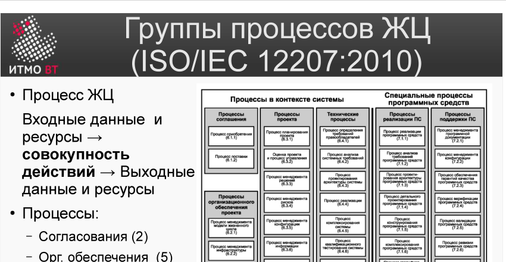

# Билет 1. ISO/IEC 12207:2010: Жизненный цикл ПО. Группы процессов ЖЦ

## Ответ

**Жизненный цикл ПО** — время существования программы от начального замысла до окончательного вывода из эксплуатации.

Стандарт **ISO/IEC 12207:2008** (в России — ГОСТ Р ИСО/МЭК 12207-2010) описывает все процессы ЖЦ, которым должна следовать компания, желающая быть сертифицированной ISO.

Каждый **процесс** описывается единообразно: *Входные данные и ресурсы → совокупность действий → Выходные данные/ресурсы*. Всего в стандарте **43 процесса**, объединённых в 7 групп:

| Группа | Кол-во процессов |
|---|---|
| Согласования | 2 |
| Организационного обеспечения | 5 |
| Проектов | 7 |
| Технических процессов | 11 |
| Реализации ПС | 7 |
| Поддержки ПС | 8 |
| Повторного использования ПС | 3 |

Помимо написания кода (7 процессов реализации) стандарт включает процессы приобретения ПО, регистрации изменений, менеджмента, повторного использования и т.д.

---

## Подробно

### Основные этапы ЖЦ

Ещё до появления стандарта Герберт Бенингтон в 1956 году описал, что все задачи разработки больших систем можно свести к определённым группам (этапам):

- **Разработка требований** → **Анализ**
- **Проектирование** → **Разработка**
- **Тестирование** → **Внедрение**
- **Эксплуатация** → **Вывод из эксплуатации**

### Что такое процесс ЖЦ

Процесс — это набор взаимосвязанных действий, преобразующих входные данные в выходные. В стандарте не написано *как именно* выполнять действия — только *что* нужно иметь на входе и что появляется на выходе. Это сделано намеренно: компании адаптируют процессы под себя.

### Группы процессов

**Процессы в контексте системы** (левая часть схемы):
- *Согласования* — контракты с заказчиком и поставщиком.
- *Проектов* — планирование, управление, принятие решений, управление рисками и конфигурацией, обеспечение качества.
- *Технические* — определение требований, архитектура, реализация, тестирование, интеграция, передача, эксплуатация, сопровождение, вывод.

**Специальные процессы ПС** (правая часть схемы):
- *Реализации ПС* — специфика разработки программного кода.
- *Поддержки ПС* — документирование, верификация, валидация, совместный анализ, аудит, разрешение проблем.
- *Повторного использования ПС* — управление, оценка пригодности, программная инженерия повторного использования.

### Зачем это нужно на практике

Любой крупной компании-разработчику следует следовать этой схеме. Если компания проходит сертификацию ISO, аудиторы проверяют наличие и исполнение каждого из 43 процессов. Малым командам реализовать все процессы нереально — стандарт предназначен для средних и крупных проектов.
