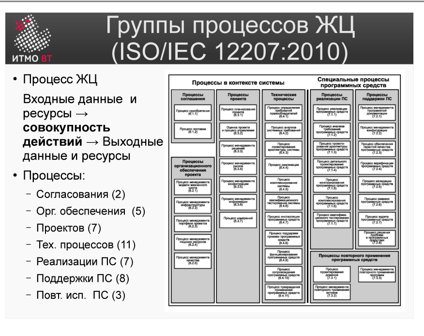

# Билет 1. ISO/IEC 12207:2010: Жизненный цикл ПО. Группы процессов ЖЦ

## Ответ

**Жизненный цикл ПО (ЖЦ)** — время существования программы от начального замысла до вывода из эксплуатации.

Международный стандарт жизненного цикла ПО описывает все процессы, которые должна выполнять компания при разработке. Всего определено **43 процесса**, объединённых в 7 групп:

| Группа | Кол-во |
|---|:---:|
| Согласования | 2 |
| Организационного обеспечения | 5 |
| Проектов | 7 |
| Технических процессов | 11 |
| Реализации ПС | 7 |
| Поддержки ПС | 8 |
| Повторного использования ПС | 3 |

Каждый процесс описывается по единой схеме: **входные данные и ресурсы → совокупность действий → выходные данные и ресурсы**. Стандарт говорит *что* должно быть на входе и выходе, но не диктует *как именно* это делать — компании адаптируют процессы под себя.

Само написание кода — это лишь 7 процессов из 43 (группа «Реализации ПС»). Остальные покрывают приобретение ПО, управление изменениями, менеджмент проекта, повторное использование и т.д.

---

## Подробно

### Что такое процесс ЖЦ

Процесс — это «чёрный ящик»: на вход подаются данные и ресурсы, внутри выполняются действия, на выходе появляются новые данные или ресурсы. Например, процесс тестирования получает на вход код и требования, а выдаёт отчёт о дефектах.

### Группы процессов — подробно по каждой

#### 1. Согласования (2 процесса)

**Суть:** юридически и организационно оформляют отношения между теми, кто заказывает ПО, и теми, кто его делает.

Два процесса: *приобретение* (со стороны заказчика — выбрать поставщика, заключить контракт, принять работу) и *поставка* (со стороны исполнителя — предложить решение, выполнить контракт, передать продукт).

**Зачем:** без этой группы непонятно, кто кому что должен. Контракт и приёмка — основа любого коммерческого проекта.

#### 2. Организационного обеспечения (5 процессов)

**Суть:** внутренние процессы компании-разработчика, которые обеспечивают саму возможность работать.

Включают: управление персоналом, управление инфраструктурой (серверы, инструменты), управление знаниями и реестром активов компании, управление моделью ЖЦ (выбор методологии), аудит процессов.

**Зачем:** чтобы компания могла вести несколько проектов одновременно и не терять накопленный опыт. Это «фундамент» для всего остального.

#### 3. Проектов (7 процессов)

**Суть:** управление конкретным проектом от начала до конца.

Включают: планирование (сроки, бюджет, ресурсы), контроль исполнения плана, управление рисками, управление конфигурацией (версии, релизы), обеспечение качества, принятие решений (на ключевых точках) и управление изменениями.

**Зачем:** без этой группы проект едет без руля — никто не следит за дедлайнами, рисками и тем, что происходит с требованиями.

#### 4. Технических процессов (11 процессов)

**Суть:** то, что делается непосредственно для создания системы — от требований до вывода из эксплуатации.

Последовательность: сбор требований к системе → анализ → архитектура → детальное проектирование → реализация → интеграция → тестирование → передача заказчику → эксплуатация → сопровождение → вывод из эксплуатации.

**Зачем:** это «сердце» стандарта — полный технический цикл создания продукта. Самая крупная группа именно потому, что покрывает весь технический путь.

#### 5. Реализации ПС (7 процессов)

**Суть:** уточнение технических процессов специально для программных средств (а не для железа или систем в целом).

Включают: анализ требований к ПО, проектирование архитектуры ПО, детальное проектирование, кодирование, тестирование модулей, интеграцию и тестирование системы ПО.

**Зачем:** технические процессы описывают систему в целом (может включать железо). Эта группа говорит: «а вот как именно это делается для программного кода». Здесь живёт привычная разработчику работа.

#### 6. Поддержки ПС (8 процессов)

**Суть:** параллельные процессы, которые повышают качество и контролируют работу в ходе разработки.

Включают: документирование, управление конфигурацией, верификацию (правильно ли реализовано то, что заложено), валидацию (то ли вообще мы делаем), совместные проверки, аудит, разрешение проблем и обеспечение юзабилити.

**Зачем:** без этой группы ошибки в требованиях или коде находят слишком поздно — когда исправить их дорого. Эти процессы — «страховая сетка».

#### 7. Повторного использования ПС (3 процесса)

**Суть:** управление компонентами, которые можно использовать в нескольких проектах.

Включают: управление библиотекой многократно используемых активов, разработку компонентов с расчётом на переиспользование, управление программой повторного использования.

**Зачем:** разрабатывать одно и то же с нуля для каждого проекта — расточительство. Эта группа помогает компании накапливать и переиспользовать наработки.

### Зачем нужен стандарт

Крупные компании, желающие пройти сертификацию, обязаны доказать аудиторам наличие и исполнение всех 43 процессов. Малым командам реализовывать их все нереально — стандарт ориентирован на средние и крупные проекты.
