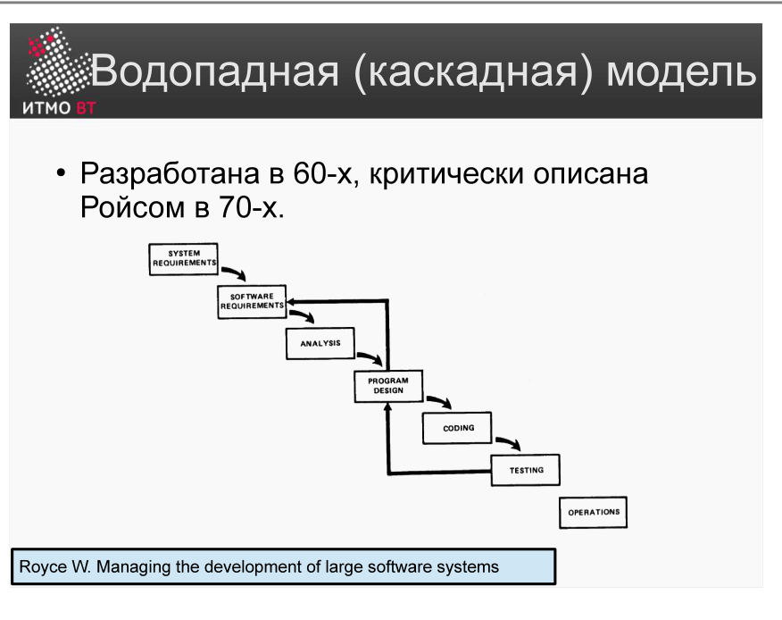
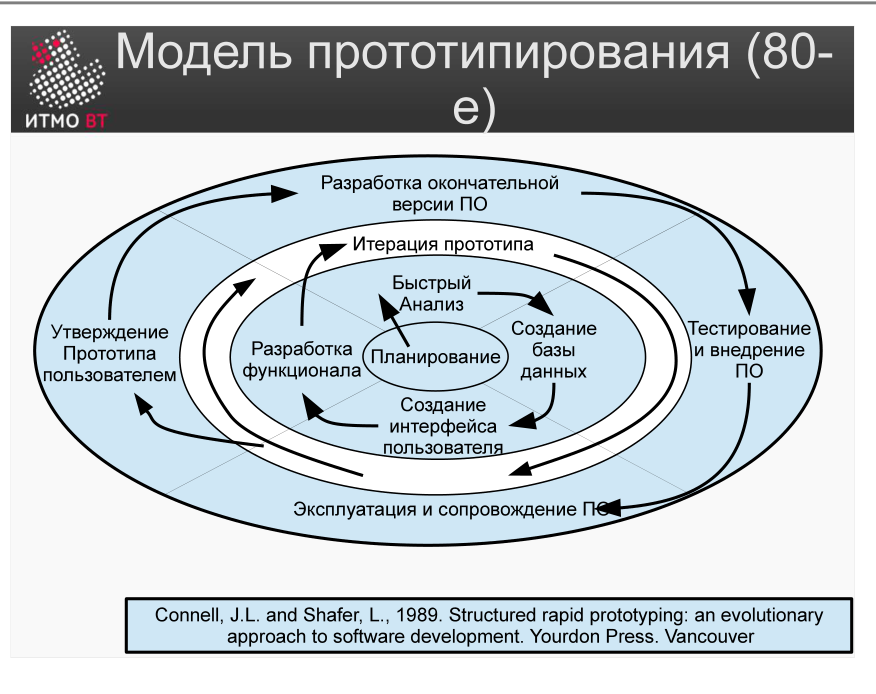

# Билет 2. Модели ЖЦ (последовательная, инкрементная, эволюционная)

## Ответ

**Модель ЖЦ** — структура, определяющая порядок выполнения и взаимосвязи процессов на протяжении всего жизненного цикла.

Различают три основных класса моделей:


### Последовательная

Все требования фиксируются в начале, разработка проходит **один раз** через все этапы подряд. Называется также водопадной. Легко планировать сроки и стоимость. Уязвимость — обратная связь от заказчика появляется только в самом конце.

### Инкрементная

Требования тоже определены заранее, но продукт строится **несколькими проходами (инкрементами)**. Каждый инкремент добавляет новый функционал к уже работающей системе. Заказчик видит прогресс раньше и может давать обратную связь по ходу.

### Эволюционная

Требования **не полностью определены** с самого начала. Разрабатывается прототип, который с каждой итерацией архитектурно и функционально уточняется. Подходит, когда заказчик сам до конца не знает, чего хочет. Scrum — пример эволюционной модели с коротким производственным циклом.

На практике чаще применяют **смешанную инкрементно-эволюционную** модель.

---

## Подробно

### Последовательная модель

Этапы выполняются строго один за другим и **только один раз**. Переход к следующему этапу — только после завершения предыдущего. Возврат назад формально возможен, но на практике крайне дорог.

```
Требования → Анализ → Проектирование → Разработка → Тестирование → Эксплуатация
```



**Когда применять:** требования жёстко зафиксированы и точно не изменятся (ПО для конкретной модели оборудования, оборонные контракты).

**Проблема:** первая точка, где можно обнаружить несоответствие ожиданиям заказчика — тестирование, то есть почти в самом конце. Возврат к этапу требований на этой стадии удваивает сроки и стоимость.

### Инкрементная модель

Продукт делится на части примерно одинаковые с архитектурной точки зрения. Каждая часть проходит полный мини-цикл:


```
Инкремент 1: Детальный дизайн → Кодирование → Интеграция прототипа
Инкремент 2: Детальный дизайн → Кодирование → Интеграция прототипа
Инкремент 3: Детальный дизайн → Кодирование → Интеграция прототипа
```

**Достоинства:** прогресс виден заказчику, стоимость изменений требований снижается.

**Недостатки:** архитектура со временем деградирует и требует рефакторинга; сложно поддерживать контракт с фиксированной суммой.

### Эволюционная модель

Разрабатывается серия прототипов. Каждый прототип — это полноценная работающая версия, но неполная. На каждой итерации: планирование → анализ → разработка функционала → оценка пользователем → переход к следующей итерации или к финальной версии.



**Когда применять:** нечёткие требования, исследовательские проекты, стартапы.

**Отличие от инкрементной:** в инкрементной архитектура стабильна с самого начала, в эволюционной — уточняется с каждой итерацией.

### Сравнение

| | Последовательная | Инкрементная | Эволюционная |
|---|---|---|---|
| Требования | Полностью известны | Полностью известны | Не полностью известны |
| Этапов разработки | Один | Несколько | Несколько |
| Архитектура | Фиксирована | Стабильна с начала | Уточняется итерационно |
| Обратная связь | В конце | По инкрементам | На каждой итерации |
