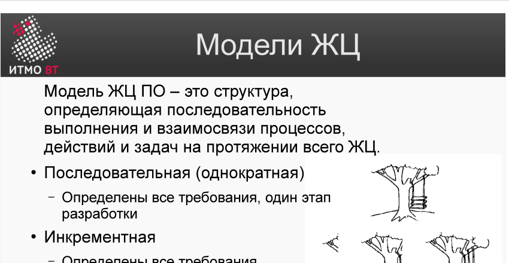

# Билет 2. Модели ЖЦ (последовательная, инкрементная, эволюционная)

## Ответ

**Модель ЖЦ ПО** — структура, определяющая последовательность выполнения и взаимосвязи процессов, действий и задач на протяжении всего жизненного цикла.

Существуют четыре класса моделей:

**Последовательная (однократная)** — все требования определены заранее, один большой этап разработки. Результаты разработки не меняются. Называется *водопадной*, легко поддаётся планированию и оценке стоимости. Применяется там, где требования стабильны (например, ПО для одной модели марсохода).

**Инкрементная** — все требования определены заранее, но продукт строится несколькими проходами (инкрементами). Каждый инкремент добавляет новый функционал к уже работающей версии. Части системы примерно одинаковы с архитектурной точки зрения.

**Эволюционная** — требования определены *не полностью*, несколько итераций. На каждом витке архитектура и функционал уточняются. Подходит, когда заказчик сам не знает, чего хочет. SCRUM — эволюционная модель с коротким циклом производства.

**Формальных преобразований** — создаются математические модели ПО, которые последовательно преобразуются друг в друга, а затем в программный код по формальным принципам. Слабо представлена на рынке.



На практике чаще применяют **инкрементно-эволюционную** смешанную модель.

---

## Подробно

### Последовательная модель

Стадии (анализ, разработка, тестирование) выполняются **один раз** и **последовательно**. Уязвимость: требования заказчика могут измениться, а обратная связь появляется поздно — только на тестировании. Возврат к предыдущей фазе рискован и дорог. Оправдана для систем с жёстко фиксированными требованиями.

```
Требования → Анализ → Проектирование → Разработка → Тестирование → Эксплуатация
```

### Инкрементная модель

Продукт разбивается на части по **функциональным требованиям**. Каждый инкремент проходит полный цикл (проектирование → кодирование → интеграция). Заказчик может пользоваться ранними инкрементами и давать обратную связь.

**Достоинства:** прогресс виден заказчику, снижается стоимость изменений требований.  
**Недостатки:** архитектура со временем деградирует, требует рефакторинга; сложно поддерживать контракт с фиксированной суммой.

```
Инкремент 1: [Дизайн → Код → Интеграция]
Инкремент 2: [Дизайн → Код → Интеграция]
Инкремент 3: [Дизайн → Код → Интеграция]
```

### Эволюционная модель

Разрабатывается **прототип**, который с каждой итерацией архитектурно и функционально уточняется. Первые версии могут быть неполными или неоптимальными — это нормально. Каждая итерация проходит через: анализ → проектирование → разработка → оценка.

**Когда применять:** нечёткие требования, исследовательские проекты, стартапы.

### Инкрементная vs Эволюционная

| | Инкрементная | Эволюционная |
|---|---|---|
| Требования | Полностью известны | Не полностью известны |
| Архитектура | Стабильна с начала | Уточняется итерационно |
| Пример | Построение дома по этажам | SCRUM-разработка |
