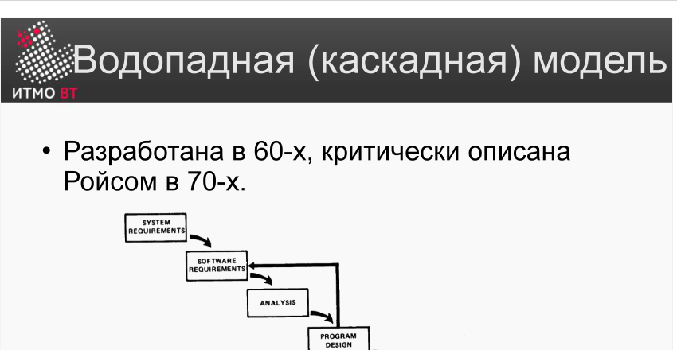

# Билет 3. Водопадная (каскадная) модель

## Ответ

**Водопадная модель** — последовательная модель ЖЦ, в которой каждый этап начинается только после завершения предыдущего. Разработана в 1960-х, критически описана Уинстоном Ройсом в 1970-х. Авторство часто ошибочно приписывают Ройсу — он лишь описал модель, а не создал её.

Стандартная последовательность шагов:

1. Определение системных требований
2. Определение требований к ПО
3. Анализ требований
4. Проектирование программы
5. Разработка (кодирование)
6. Тестирование
7. Ввод в эксплуатацию



**Главное достоинство:** лёгкое планирование сроков и стоимости — все этапы и объём работ известны заранее.

**Главный недостаток:** негибкость. Изменение требований после старта обходится очень дорого: тестирование — первая фаза, на которой может быть обнаружено несоответствие ожиданиям, а возврат к проектированию или требованиям удваивает сроки и стоимость.

---

## Подробно

### Как появилась модель

В статье «Managing the Development of Large Software Systems» (1970) Ройс анализирует несколько подходов к построению программных систем. Первая из рассматриваемых моделей — простая двухфазная (анализ + кодирование) для небольших программ. Вторая включает полный набор стадий, выполняемых в фиксированном порядке — это и есть водопадная модель.

Ройс не рекомендует её как лучшее решение — он показывает её недостатки и предлагает расширение (методология Ройса, билет 4).

### Схема модели

```
System Requirements
       ↓
Software Requirements
       ↓
     Analysis
       ↓
  Program Design
       ↓
     Coding
       ↓
     Testing
       ↓
   Operations
```

Каждый этап производит документ или артефакт, который служит входом для следующего. Стрелки идут строго вниз — отсюда название «водопад».

### Итерации внутри модели

В более поздних интерпретациях водопадной модели добавляют обратные стрелки — возможность вернуться на предыдущий этап. Однако на практике возврат к удалённым фазам:
- Рискован (изменения могут противоречить уже принятым решениям).
- Дорог (переделка артефактов всех промежуточных этапов).
- Может привести к 100%-му удвоению сроков и стоимости.

### Когда применять

Водопадная модель оправдана, когда:
- Требования чётко определены и не изменятся.
- Проект выполняется по жёсткому государственному/оборонному контракту.
- Разрабатывается ПО для конкретного физического устройства (например, система управления марсоходом одной модели).

### Когда НЕ применять

- Требования могут меняться по ходу разработки.
- Заказчик хочет видеть промежуточные результаты.
- Рыночные условия заставляют быстро реагировать на изменения.

Именно из-за этих недостатков в 1980–90-е появились инкрементные, эволюционные и гибкие методологии.
