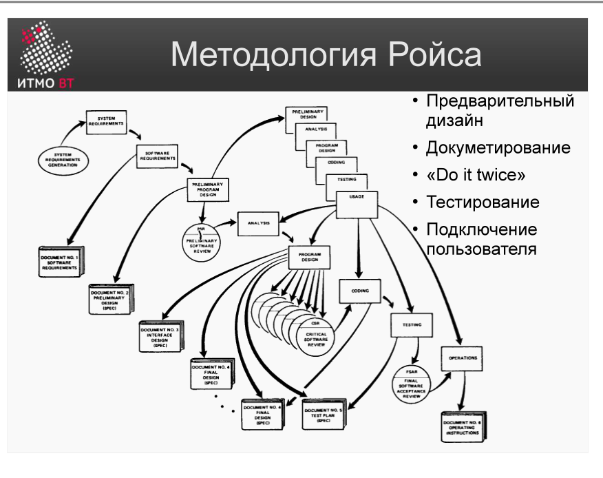

# Билет 4. Методология Ройса

## Ответ

Ройс проанализировал водопадную модель и выявил её главный риск: первое столкновение с реальностью происходит на этапе тестирования — слишком поздно. Он предложил **5 шагов расширения** водопада, которые снижают этот риск:

1. **Полный дизайн программ до анализа** — прежде чем фиксировать требования, сделать эскиз архитектурного решения. Это выявляет противоречия и неясности на бумаге, а не в коде.
2. **«Сделать дважды»** — разработать пилотную (предварительную) версию системы, оценить её, а потом создать финальную. Пилот — это управляемая ошибка: дешевле найти проблемы в пилоте, чем переделывать готовый продукт.
3. **Полная документация на каждом этапе** — каждый переход между этапами сопровождается документом, который проверяется и утверждается.
4. **Раннее планирование тестирования** — тесты планируются параллельно разработке, а не после неё.
5. **Вовлечение пользователей** — заказчик включается в процесс на контрольных точках и даёт обратную связь до финального тестирования.

---

## Подробно

### Почему водопад опасен

Водопадная модель предполагает, что требования точны и полны с самого начала. Ройс показал: это почти никогда не так. Ошибки в требованиях обнаруживаются в конце, когда исправлять их в 10–100 раз дороже, чем в начале.

### Шаг 1: Дизайн до анализа

Звучит парадоксально, но смысл в следующем: прежде чем начать детально прорабатывать требования, архитектор делает набросок технического решения. Это позволяет задать правильные вопросы заказчику («если мы сделаем X, это решит вашу задачу?») и найти несоответствия до старта полноценной разработки.

### Шаг 2: «Сделать дважды»

Пилотная версия — это не прототип в обычном смысле: она проходит полный цикл разработки, но меньшего масштаба. Задача — обнаружить архитектурные ошибки до того, как они заморожены в финальной системе. После оценки пилота команда знает, что именно делать неправильно, и финальная версия получается значительно лучше.

### Шаг 3: Документация

Документация у Ройса — не бюрократия, а инструмент коммуникации. Когда каждый переход закреплён документом с подписями, ответственных проще найти, а проблемы — локализовать.

### Шаги 4 и 5: Тестирование и пользователи

Раннее планирование тестов заставляет команду думать о критериях приёмки с самого начала. Вовлечение пользователей на контрольных точках («нам нужно ваше мнение прямо сейчас, пока не поздно менять») — это прообраз современных Agile-ревью.

### Итог

Методология Ройса не отменяет водопад, а делает его безопаснее. Позже эти идеи развились в V-модель (шаг 4), инкрементные модели (шаг 2) и RUP (все 5 шагов в совокупности).
