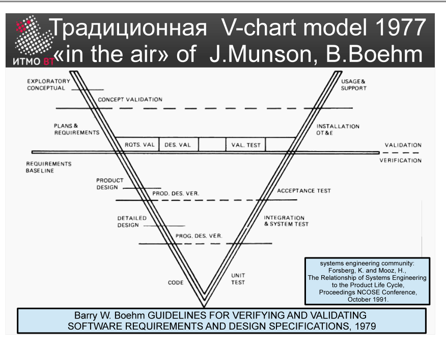

!!! danger "ВНИМАНИЕ"
    Теперь использование данного конспекта является платным. I am Michael from Microsoft support, send 5000$ to my PayPal account

# Билет 5. Традиционная V-chart model

## Ответ

**V-модель** — расширение водопадной модели, в котором каждому этапу разработки явно сопоставлен этап тестирования. Форма буквы V: левая ветвь — разработка (сверху вниз), правая ветвь — тестирование (снизу вверх).

```
Системные требования ──────────────────── Приёмочное тестирование
    Требования к ПО ──────────────── Системное тестирование
        Детальный дизайн ──────── Интеграционное тестирование
              Кодирование ─── Модульное тестирование
```

Горизонтальные стрелки — связь «что разрабатываем — что проверяем»:
- Системные требования → определяют критерии **приёмочного** теста.
- Требования к ПО → определяют критерии **системного** теста.
- Детальный дизайн → определяют критерии **интеграционного** теста.
- Кодирование → определяют критерии **модульного** теста.

**Ключевая идея:** тесты **планируются параллельно разработке**, а не после. Когда код написан — тесты уже готовы к запуску.



---

## Подробно

### Почему именно «V»

Обычный водопад — стрелка строго вниз. V-модель разворачивает процесс: левая ветвь идёт вглубь (от абстрактных требований к конкретному коду), правая ветвь поднимается обратно (от проверки отдельных модулей до приёмки всей системы).

### Левая ветвь — разработка

1. **Системные требования** — что должна делать система в целом (включая взаимодействие с внешними системами и людьми).
2. **Требования к ПО** — что именно должна делать программная часть.
3. **Детальный дизайн** — как реализовать каждый модуль.
4. **Кодирование** — сам код.

### Правая ветвь — тестирование

4. **Модульное тестирование** — проверка каждого модуля изолированно (соответствует детальному дизайну).
3. **Интеграционное тестирование** — проверка взаимодействия модулей (соответствует требованиям к ПО).
2. **Системное тестирование** — проверка системы целиком (соответствует системным требованиям).
1. **Приёмочное тестирование** — проверка заказчиком, что его потребности удовлетворены.

### Связь между ветвями

Связь — не просто «проверить то, что написали». Правильный порядок: на этапе написания требований параллельно составляются **тест-кейсы**. Когда разработчик пишет системные требования, тестировщик рядом пишет сценарии приёмочного тестирования. Это заставляет обоих говорить на одном языке с самого начала.

### Отличие от водопада

В водопаде тестирование — последний этап, и о тест-кейсах думают постфактум. В V-модели тестирование параллельно разработке: правая ветвь «растёт» одновременно с левой. Это раньше выявляет неоднозначности в требованиях.

### Ограничение V-модели

V-модель, как и водопад, предполагает, что требования зафиксированы в начале и не меняются. Если требования нестабильны — модель ломается, потому что тест-кейсы становятся устаревшими.
