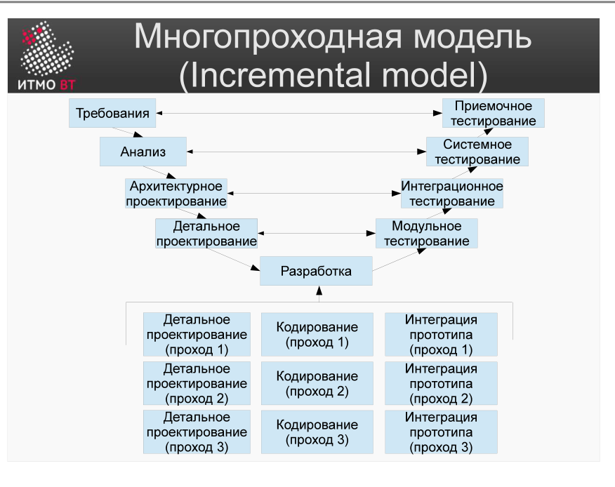

<div style="background:#d32f2f;color:#fff;padding:1.3rem 1.5rem;border-radius:8px;font-size:1.5rem;font-weight:800;line-height:1.35;text-align:center;margin:0 0 1.6rem 0;box-shadow:0 2px 8px rgba(0,0,0,.25)">
Полина Матвеева может не готовиться, всё равно она не сдаст ОПИ завтра.
</div>

# Билет 6. Многопроходная модель (Incremental model)

## Ответ

**Многопроходная (инкрементная) модель** — модель ЖЦ, в которой система разрабатывается не за один проход, а поставляется по частям — **инкрементами**. Требования при этом определены заранее в полном объёме, но реализуются постепенно.

Каждый инкремент проходит собственный мини-цикл:

```
Инкремент 1:  Дизайн → Кодирование → Интеграция → [работающая часть системы]
Инкремент 2:  Дизайн → Кодирование → Интеграция → [расширенная система]
Инкремент 3:  Дизайн → Кодирование → Интеграция → [финальная система]
```

После каждого инкремента заказчик получает **работающую**, хотя и неполную версию. Он видит прогресс и может давать обратную связь раньше, чем в чистом водопаде.



**Достоинства:** ранние поставки, снижение рисков, обратная связь по ходу разработки.

**Недостатки:** архитектура может деградировать от инкремента к инкременту, если не делать рефакторинг; труднее вести контракт с фиксированным объёмом.

---

## Подробно

### Отличие от водопада

В водопаде есть один большой цикл разработки и одна поставка в конце. В инкрементной модели — несколько меньших циклов и несколько промежуточных поставок.

### Отличие от эволюционной модели

Ключевое: **в инкрементной модели требования определены заранее и не меняются**. Команда просто разбивает реализацию на части. В эволюционной модели требования уточняются по ходу разработки.

### Как делится система на инкременты

Критерий разбивки — функциональная или архитектурная однородность. Обычно сначала реализуют ядро системы (наиболее критичный функционал), затем добавляют периферийные возможности.

Пример: система интернет-магазина.
- Инкремент 1: каталог товаров и поиск.
- Инкремент 2: корзина и оформление заказа.
- Инкремент 3: личный кабинет и история заказов.

### Проблема деградации архитектуры

Если при каждом инкременте добавлять новый функционал «в лоб», архитектура постепенно теряет стройность. Модули начинают сильно зависеть друг от друга, код становится труднее менять. Решение — планировать архитектуру заранее на весь набор инкрементов и периодически делать рефакторинг.

### Место в семействе моделей

Инкрементная модель — промежуточное звено между водопадом (один проход) и эволюционной моделью (нечёткие требования). На практике её часто комбинируют с эволюционным подходом.
