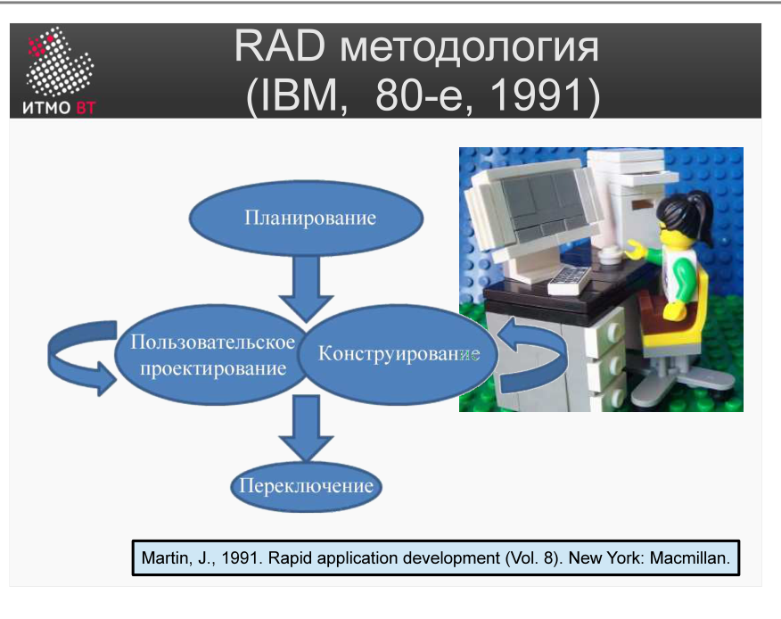

Полина Матвеева может не готовиться, всё равно она не сдаст ОПИ завтра.

# Билет 8. RAD методология

## Ответ

**RAD (Rapid Application Development)** — методология быстрой разработки, созданная в IBM. Главная идея: сделать требования гибкими, а сроки — жёсткими, и постоянно показывать пользователю живой прототип вместо документов.

### Почему RAD быстрее водопада

Водопад медленный, потому что требования фиксируются на бумаге в самом начале, потом разрабатывается всё сразу, и пользователь видит результат только в конце — когда уже поздно что-то менять. RAD переворачивает это:

- Вместо длинной спецификации — **прототип**, который пользователь видит сразу и правит руками.
- Вместо переписки месяцами — **совместные сессии** (JAD), где разработчики и пользователи сидят в одной комнате.
- Вместо «сдвинем дедлайн» — **таймбокс**: дата не двигается, режется объём.

### Четыре фазы RAD

1. **Requirements Planning (Планирование)** — JRP-сессия: руководство бизнеса и IT за 1–3 дня фиксируют цели и ограничения. Результат — согласованный список функций, приоритизированный по важности.

2. **User Design (Дизайн с пользователем)** — JAD-сессии: пользователи и разработчики вместе лепят интерфейсы и прототипы. Разработчик показывает экран — пользователь говорит «вот здесь не так» — исправляется прямо на месте.

3. **Construction (Конструирование)** — разработчики строят финальную систему итерациями. Пользователи продолжают участвовать: видят промежуточные версии, дают правки. Scope уже зафиксирован, поэтому не разрастается.

4. **Cutover (Переход)** — тестирование, обучение, миграция данных, запуск.

### Ключевые условия успеха

- Заказчик выделяет людей **на полное время** участия в сессиях — без этого JAD не работает.
- Команда маленькая: **4–6 разработчиков**; рост числа людей ломает скорость коммуникации.
- Таймбоксы **не переносятся** — это главный механизм, дисциплинирующий scope.

---

## Подробно

### Корень проблемы: почему водопад медленный

В классическом водопаде цикл такой: написать требования → согласовать → спроектировать → написать код → показать пользователю. Этот цикл занимает месяцы, и в конце почти всегда выясняется, что требования поняли неправильно или они успели устареть. Переделка на поздних этапах стоит дорого.

RAD отвечает на это вопросом: **а зачем вообще ждать конца, чтобы показать пользователю?**

### Прототипирование вместо спецификации

Вместо того чтобы писать 100-страничный документ требований и потом его согласовывать, RAD строит **прототип** — черновую версию интерфейса и логики — и сразу показывает пользователю. Пользователь видит реальный экран и говорит «вот это не так, вот это лишнее, а вот этого не хватает». Это работает принципиально точнее, чем читать требования в документе: люди лучше понимают, что им нужно, когда видят конкретный пример.

Прототипы в RAD — не одноразовые, а **эволюционные**: каждая итерация уточняет предыдущую, пока прототип не превращается в готовую систему.

### JAD-сессии: убрать задержку коммуникации

Обычно разработчик задаёт вопрос аналитику → аналитик пишет письмо заказчику → заказчик отвечает через три дня → аналитик передаёт ответ разработчику. Неделя на один вопрос.

**JAD (Joint Application Design)** убирает эту цепочку: в одной комнате на 2–5 дней собираются пользователи, аналитики и разработчики. Фасилитатор ведёт обсуждение, кто-то рисует на доске, кто-то сразу делает прототип в инструменте. Вопрос — ответ — прототип — правка, всё за один сеанс. Это ключевой источник скорости в RAD.

### Таймбокс: дата священна, scope — нет

Таймбокс — жёсткий дедлайн, который **не двигается**. Если к нему не успели сделать всё задуманное, убирают наименее важные функции (scope reduction), но дату не переносят.

Это принципиально отличается от типичного водопадного проекта, где дедлайн постоянно «немного» сдвигается вправо. Таймбокс заставляет команду в каждую итерацию спрашивать: «что здесь самое важное?» — и делать именно это.

### Малые команды

RAD рассчитан на команду из **4–6 разработчиков**. При таком размере все знают, что делает каждый, координация почти не требует накладных расходов. Если команда вырастает до 15+ человек — скорость коммуникации падает настолько, что преимущества RAD исчезают.

### Ограничения

- Плохо работает без реального участия пользователей: если заказчик не выделяет людей — JAD-сессии бесполезны.
- Плохо масштабируется: больше 6–8 разработчиков — методология ломается.
- Не подходит для систем с критическими требованиями к надёжности (авиация, медицина): там быстрый прототип «по ощущениям» неприемлем, нужна строгая спецификация.
