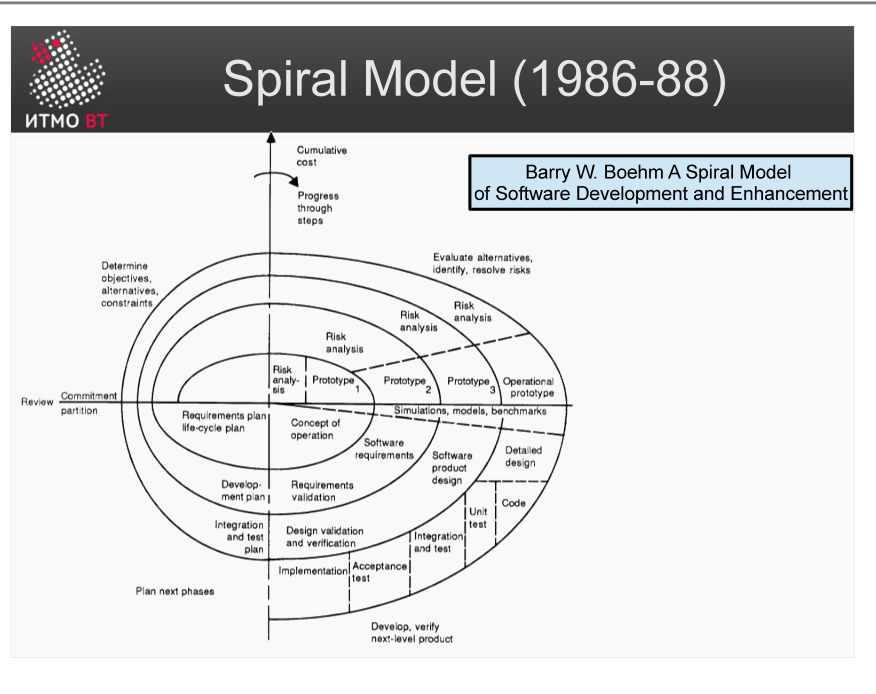

# Билет 9. Спиральная модель

## Ответ

**Спиральная модель** — итеративная модель ЖЦ, в которой каждая итерация (виток спирали) состоит из 4 квадрантов. Главная особенность — **явное управление рисками** на каждом витке.

Каждый виток спирали:

```
┌─────────────────────┬─────────────────────┐
│  1. Определение     │  2. Анализ рисков   │
│  целей и           │  и их устранение    │
│  альтернатив        │  (прототипирование) │
├─────────────────────┼─────────────────────┤
│  4. Планирование    │  3. Разработка      │
│  следующей          │  и верификация      │
│  итерации           │  (водопад или иное) │
└─────────────────────┴─────────────────────┘
```

С каждым витком масштаб системы и вложения растут — спираль разворачивается наружу. Ранние витки — прототипы и исследования; поздние — полноценная разработка.



**Достоинства:** риски обрабатываются явно и на раннем этапе; модель гибкая — внутри витка можно применять любой процесс (водопад, прототипирование).

**Недостатки:** сложно планировать сроки и стоимость; требует экспертизы в анализе рисков.

---

## Подробно

### Четыре квадранта подробнее

**Квадрант 1 — Определение целей, альтернатив и ограничений**

Команда формулирует: чего хотим достичь в этой итерации? Какие альтернативные подходы существуют? Какие ограничения (бюджет, время, технологии)?

**Квадрант 2 — Анализ и устранение рисков**

Для каждой альтернативы оцениваются риски. Самые опасные риски устраняются немедленно, часто через прототипирование или дополнительные исследования. Если риски слишком высоки — проект может быть остановлен. Это защита от трат денег на заведомо неосуществимые идеи.

**Квадрант 3 — Разработка и верификация**

Когда риски устранены, начинается непосредственная разработка. Внутри этого квадранта команда может применять любую модель — водопад, прототипирование, инкрементную. Результат — работающая версия продукта или исследовательский артефакт.

**Квадрант 4 — Планирование следующего витка**

Результаты итерации оцениваются, планируется следующий виток с учётом полученного опыта.

### Аналогия

Спираль — как разведка перед стройкой. Сначала небольшой шурф: проверили грунт, убедились, что не провалимся (квадрант 2). Потом закладываем фундамент (квадрант 3). Потом оцениваем, что узнали, и планируем следующий этаж.

### Управление рисками как центральная идея

В водопаде риски обнаруживают только на тестировании. В спиральной модели второй квадрант каждого витка — это специальная «противорисковая» активность. Риски идентифицируют, расставляют по приоритетам и устраняют *до* того, как тратить большие деньги на разработку.

### Применение

Спиральная модель подходит для крупных, длительных и технически сложных проектов, где неопределённость высока. Для малых команд накладные расходы на анализ рисков могут быть неоправданными.
