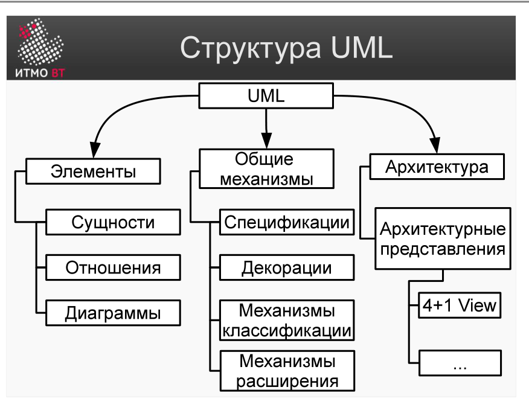
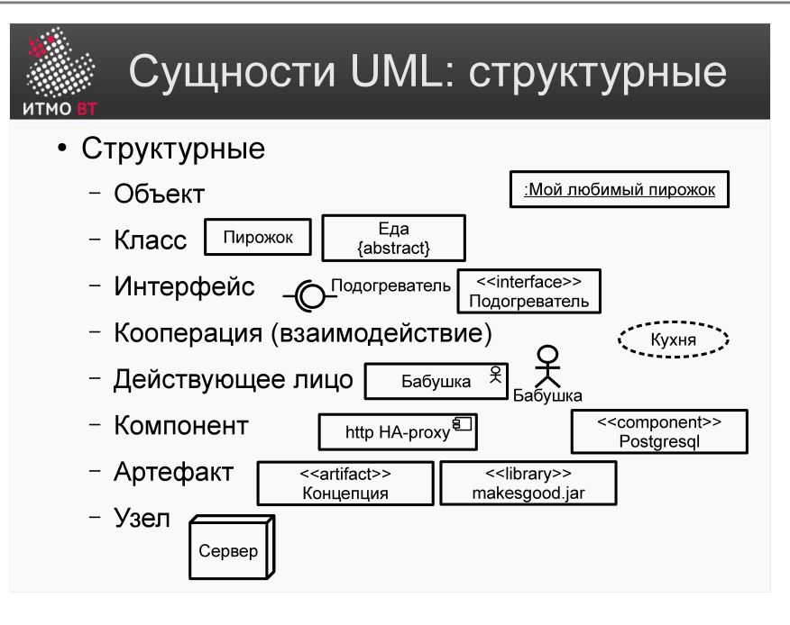
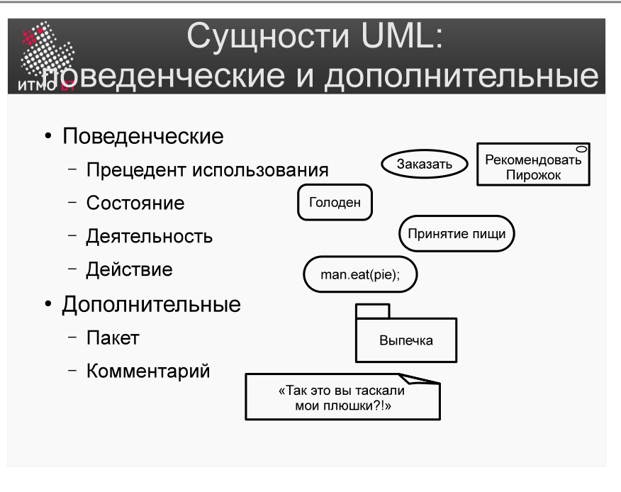
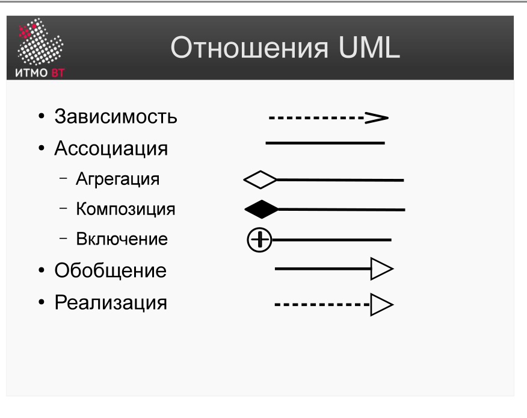

!!! danger "ВНИМАНИЕ"
    Теперь использование данного конспекта является платным. I am Michael from Microsoft support, send 5000$ to my PayPal account

# Билет 10. UML Диаграммы: Структурные и поведенческие

## Ответ

**UML (Unified Modeling Language)** — стандартный язык визуального моделирования программных систем. Все диаграммы UML делятся на два класса:

### Структурные диаграммы

Показывают **статическую структуру** системы — из каких элементов она состоит и как они связаны. Отвечают на вопрос «из чего состоит система?»

Примеры:
- **Диаграмма классов** — классы, их атрибуты, операции и отношения между ними.
- **Диаграмма компонентов** — программные модули и зависимости между ними.
- **Диаграмма размещения** — физические узлы (серверы, устройства) и развёртывание на них.
- **Диаграмма объектов** — конкретные экземпляры классов в определённый момент.

### Поведенческие диаграммы

Показывают **динамическое поведение** системы — как элементы взаимодействуют и как система реагирует на события. Отвечают на вопрос «как система работает?»

Примеры:
- **Use-case диаграмма** — сценарии взаимодействия пользователей с системой.
- **Диаграмма состояний** — состояния объекта и переходы между ними.
- **Диаграмма деятельности** — поток управления, аналог блок-схемы.
- **Диаграмма последовательности** — порядок обмена сообщениями между объектами.

---

## Подробно

### Четыре вида сущностей в UML

UML описывает систему через четыре вида строительных блоков:

**Структурные сущности** — «существительные» модели: класс, объект, интерфейс, компонент, узел.

**Поведенческие сущности** — «глаголы» модели: прецедент (use case), состояние, деятельность, взаимодействие.

**Группирующие сущности** — пакеты, которые объединяют другие элементы в логические группы.

**Аннотационные сущности** — примечания и комментарии (notes).

### Четыре вида отношений

Отношения соединяют сущности:

- **Зависимость** — изменение одного элемента влияет на другой (пунктирная стрелка).
- **Ассоциация** — структурная связь между экземплярами; может быть двунаправленной (линия).
- **Агрегация / Композиция** — отношение «часть–целое»; ромб у «целого».
- **Обобщение (наследование)** — отношение «общее–частное»; треугольник у родителя.

### Диаграммы как «окна» в модель

Одна и та же система описывается набором диаграмм — каждая показывает систему с определённой точки зрения. Все диаграммы вместе дают полную картину, но ни одна по отдельности не исчерпывает модель.

Выбор диаграммы зависит от аудитории:
- Заказчику — use-case диаграмму (понятно без технических знаний).
- Архитектору — диаграмму классов и компонентов.
- Системному администратору — диаграмму размещения.
- Тестировщику — диаграмму состояний и последовательности.
