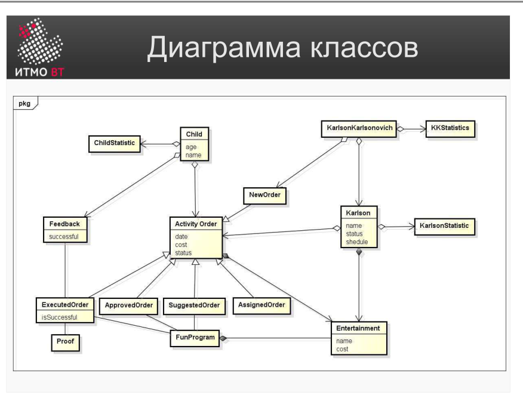

# Билет 12. UML: Диаграмма классов

## Ответ

**Диаграмма классов** — структурная UML-диаграмма, показывающая классы системы, их атрибуты и операции, а также отношения между классами.

### Элементы диаграммы

**Класс** — прямоугольник из трёх секций:
```
┌──────────────────┐
│   ИмяКласса      │  ← секция имени
├──────────────────┤
│ - атрибут: Тип   │  ← атрибуты
│ # атрибут2: Тип  │
├──────────────────┤
│ + операция(): T  │  ← операции
│ - приватный()    │
└──────────────────┘
```

Видимость: `+` публичный, `-` приватный, `#` защищённый, `~` пакетный.

**Отношения:**

| Отношение | Обозначение | Смысл |
|-----------|-------------|-------|
| Ассоциация | Линия | Классы связаны, экземпляры знают друг о друге |
| Агрегация | Линия с пустым ромбом у «целого» | «Часть–целое», часть существует без целого |
| Композиция | Линия с закрашенным ромбом | «Часть–целое», часть без целого не существует |
| Наследование | Линия с треугольником у родителя | Класс B является разновидностью класса A |
| Реализация | Пунктир с треугольником | Класс реализует интерфейс |
| Зависимость | Пунктирная стрелка | Изменение A влияет на B |

На линиях можно указывать **мощность** (кратность): `1`, `0..1`, `1..*`, `*`.

### Пример диаграммы



---

## Подробно

### Атрибуты и операции

**Атрибут** описывает свойство объекта. Формат: `видимость имя : Тип = значениеПоУмолчанию`. Например: `- возраст : int = 0`.

**Операция** описывает поведение. Формат: `видимость имя(параметры) : ТипВозврата`. Например: `+ летать() : void`.

Статические члены (принадлежащие классу, не экземпляру) подчёркиваются.

### Ассоциация vs Агрегация vs Композиция

Все три — отношения «знает о» или «содержит», отличаются степенью связанности:

- **Ассоциация** — самая слабая: объекты просто ссылаются друг на друга. Двигатель автомобиля ссылается на систему управления.
- **Агрегация** — «часть–целое», но части самостоятельны: студент входит в группу, но группа может прекратить существование, а студент останется.
- **Композиция** — «часть–целое», части не живут без целого: комната существует только как часть квартиры. Если квартира уничтожена, комнаты тоже.

### Кратность (мощность)

Кратность указывается на концах линии связи:
- `1` — ровно один экземпляр.
- `0..1` — ноль или один (опциональный).
- `1..*` — один или более.
- `*` — ноль или более.

Пример: Заказ `1` — `1..*` ТоварВЗаказе. Один заказ содержит один или более товаров.

### Интерфейсы

Интерфейс изображается как класс со стереотипом `«interface»` — без атрибутов, только операции. Класс, реализующий интерфейс, связан с ним пунктирной линией с треугольником.
