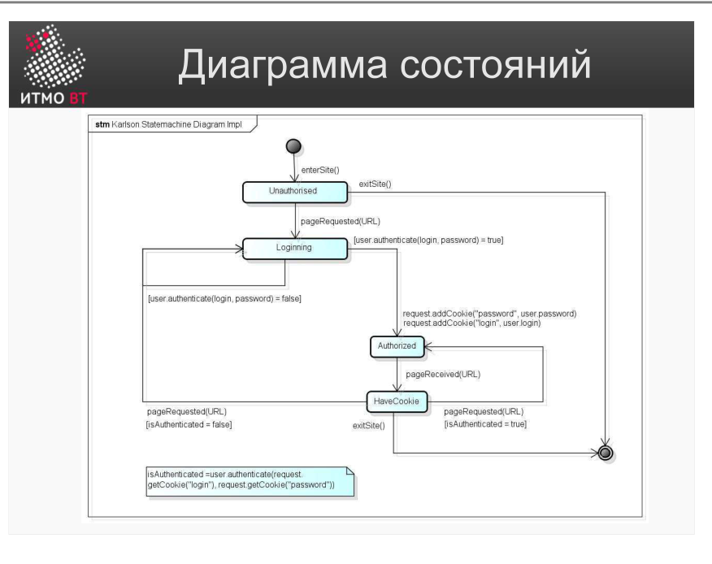

!!! danger "ВНИМАНИЕ"
    Теперь использование данного конспекта является платным. I am Michael from Microsoft support, send 5000$ to my PayPal account

# Билет 13. UML: Диаграмма состояний

## Ответ

**Диаграмма состояний (State Machine Diagram)** — поведенческая UML-диаграмма, описывающая жизненный цикл одного объекта: в каких состояниях он может находиться и при каких событиях переходит из одного состояния в другое.

### Элементы диаграммы

- **Состояние** — прямоугольник со скруглёнными углами. Внутри — имя состояния. Объект находится в состоянии, пока не произошло событие-триггер.
- **Начальное псевдосостояние** — закрашенный круг (●). Точка входа при создании объекта. Без имени.
- **Конечное псевдосостояние** — закрашенный круг в окружности (◎). Объект завершил жизненный цикл.
- **Переход (Transition)** — стрелка между состояниями. На стрелке пишут: `событие [условие] / действие`.
  - **Событие** — что произошло (например, `нажата_кнопка`).
  - **Условие (guard)** — в квадратных скобках, проверяется при наступлении события.
  - **Действие** — что выполняется в момент перехода.

```
● ──→ [Ожидание] ──нажатие кнопки──→ [Обработка] ──готово──→ [Завершено] ──→ ◎
```



---

## Подробно

### Что моделирует диаграмма состояний

Не любой объект нужно моделировать диаграммой состояний — только тот, чьё поведение **зависит от текущего состояния**. Пример: объект «Заказ» ведёт себя по-разному в зависимости от того, новый он, оплаченный, отменённый или доставленный. Диаграмма состояний делает эту логику явной и наглядной.

### Действия внутри состояния

Кроме имени, в состоянии можно указать:
- `entry / действие` — что выполняется при входе в состояние.
- `exit / действие` — что выполняется при выходе.
- `do / действие` — что выполняется непрерывно, пока объект в этом состоянии.

Пример:
```
┌────────────────────────┐
│    Аутентификация      │
│ entry / показать форму │
│ exit / скрыть форму    │
└────────────────────────┘
```

### Пример: аутентификация пользователя

Типичный жизненный цикл формы входа:

```
● → [Ожидание ввода]
      ──нажат_войти [данные_введены]──→ [Проверка]
              ──успех──→ [Авторизован] → ◎
              ──ошибка──→ [Ожидание ввода]
      ──нажат_отмена──→ ◎
```

### Составные состояния

Состояние может содержать внутри вложенную диаграмму состояний — это **составное (composite) состояние**. Применяется, чтобы не усложнять верхний уровень диаграммы. Например, состояние «Оплата» может внутри иметь свои состояния: «Ввод карты», «Проверка CVV», «Подтверждение банком».

### Отличие от диаграммы деятельности

Диаграмма деятельности описывает поток шагов процесса (алгоритм). Диаграмма состояний описывает режимы существования одного объекта. Граница: если вы моделируете «что делает система» — деятельность; если «каким бывает объект» — состояния.
