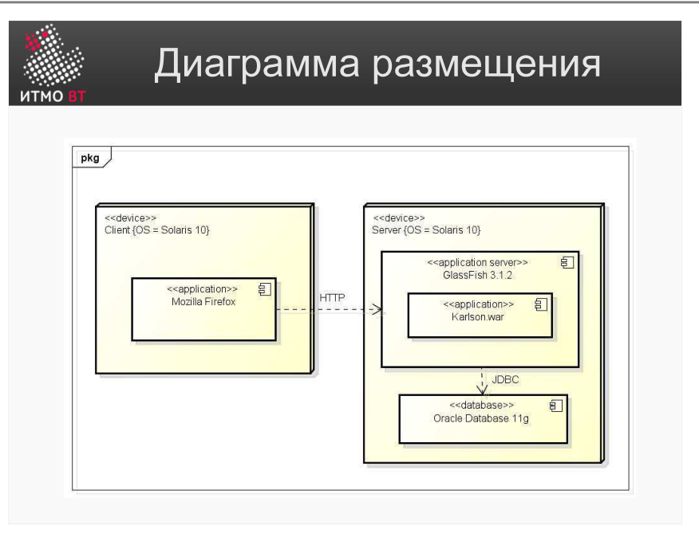
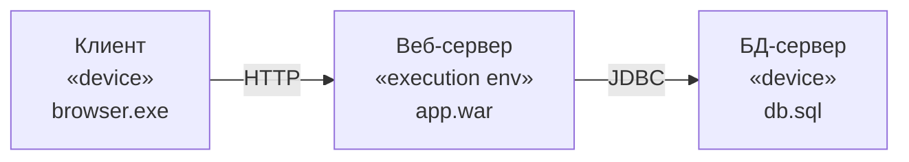

# Билет 14. UML: Диаграмма размещения

## Ответ

**Диаграмма размещения (Deployment Diagram)** — структурная UML-диаграмма, показывающая физическую инфраструктуру системы: на каких серверах и устройствах развёрнуты компоненты ПО и как эти устройства связаны между собой.

### Элементы диаграммы

- **Узел (Node)** — физическое или виртуальное устройство: сервер, компьютер, смартфон, облачный инстанс. Изображается трёхмерным прямоугольником (куб). Имеет имя и стереотип (`«device»`, `«execution environment»`).
- **Артефакт (Artifact)** — физический файл, развёрнутый на узле: `.jar`, `.war`, `.exe`, конфигурационный файл. Изображается прямоугольником со стереотипом `«artifact»`.

- **Связь-коммуникация** — линия между узлами, показывающая сетевое соединение или иной канал связи. На линии можно указать протокол (`HTTP`, `TCP/IP`).
- **Развёртывание (Deployment)** — отношение между артефактом и узлом: артефакт «живёт» на узле.

---

## Подробно

### Зачем нужна диаграмма размещения

Код работает не в вакууме — он запускается на конкретном железе. Диаграмма размещения отвечает на вопросы:
- Сколько серверов нужно?
- Что на каком сервере запускается?
- Как компоненты общаются по сети?

Она нужна системным администраторам при развёртывании, архитекторам при проектировании инфраструктуры и заказчику для понимания масштаба системы.

### Типичная трёхуровневая архитектура

### Узел vs Артефакт

**Узел** — физическая единица исполнения (hardware или виртуальная машина). Узлы не «пишутся» — они существуют как среда.

**Артефакт** — то, что вы поставляете: скомпилированный код, конфиг, скрипт. Артефакты создаются командой разработки и развёртываются на узлах.

Аналогия: узел — это здание, артефакт — оборудование внутри.

### Стереотипы узлов

- `«device»` — физическое устройство (сервер, роутер, телефон).
- `«execution environment»` — программная среда выполнения (JVM, контейнер Docker, браузер).

Узлы вкладываются: физический сервер содержит Docker-контейнер, который содержит JVM, которая запускает `.jar`.

### Отличие от диаграммы компонентов

Диаграмма компонентов показывает логические программные блоки и зависимости между ними. Диаграмма размещения показывает, где эти блоки физически находятся. Их часто совмещают: на диаграмму размещения накладывают компоненты, которые разворачиваются на каждом узле.
