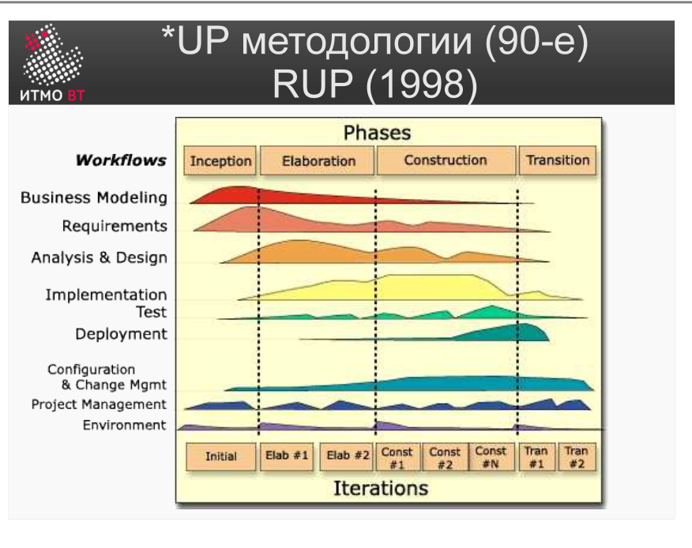
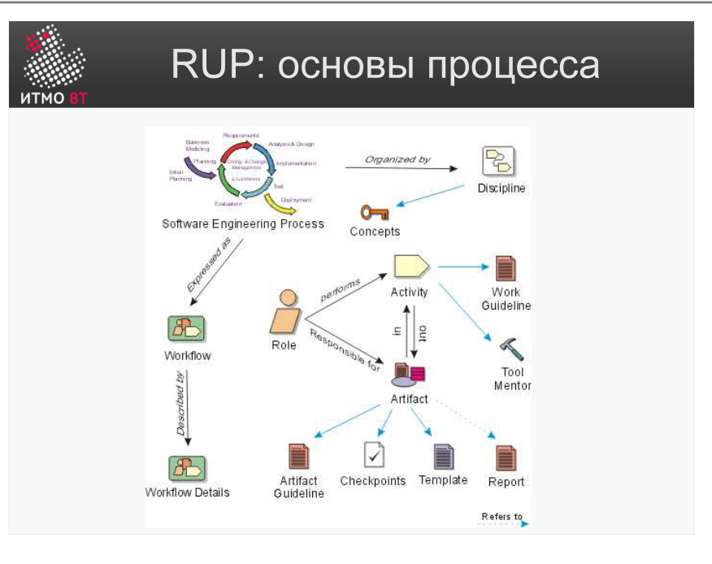
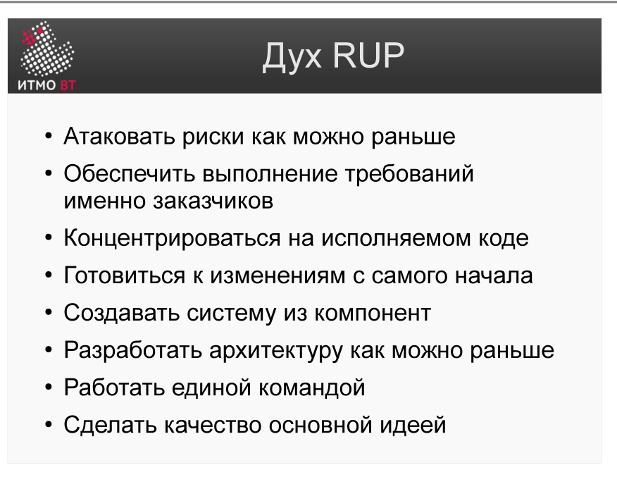

# Билет 15. *UP методологии. RUP: основы процесса

## Ответ

**\*UP (Unified Process)** — семейство итеративных объектно-ориентированных методологий, основанных на UML. Самый известный представитель — **RUP (Rational Unified Process)**, разработанный компанией Rational Software (позднее поглощённой IBM).

### Суть RUP в трёх словах

RUP строится на трёх ключевых идеях:

- **Use-case driven** — вся разработка управляется прецедентами. Требования описываются через use-case, архитектура проектируется под их реализацию, тесты проверяют их выполнение.
- **Architecture-centric** — в центре процесса находится архитектура системы. К концу второй фазы (Elaboration) архитектура должна быть стабильной; всё остальное — наполнение.
- **Iterative and incremental** — проект не делается «водопадом». Каждая итерация (2–6 недель) — полный мини-цикл: требования → проектирование → реализация → тестирование. Риски снижаются итерация за итерацией.

### Четыре фазы RUP

RUP делит проект на 4 последовательные фазы:

| Фаза | Английское название | Основная задача |
|------|---------------------|-----------------|
| Начало | Inception | Определить scope и обоснование проекта |
| Проектирование | Elaboration | Сформировать устойчивую архитектуру |
| Построение | Construction | Реализовать систему итеративно |
| Внедрение | Transition | Передать систему пользователям |

Каждая фаза заканчивается **контрольной точкой (milestone)** — решением «продолжать или остановить проект».



### Дисциплины RUP

Внутри каждой фазы идут **дисциплины** (виды работ): Бизнес-моделирование, Требования, Анализ и проектирование, Реализация, Тестирование, Развёртывание, Управление проектом и др. Диаграмма горбов показывает, что каждая дисциплина присутствует во всех фазах, но с разной интенсивностью.

### Структура процесса



- **Роль** — кто выполняет работу (архитектор, аналитик, тестировщик).
- **Деятельность** — что делается (написание use-case, ревью архитектуры).
- **Артефакт** — что создаётся (документ, модель, код).
- **Дисциплина** — логическая группа деятельностей (например, «Требования»).

### 8 принципов духа RUP



1. Разрабатывать ПО итеративно
2. Управлять требованиями
3. Использовать компонентные архитектуры
4. Визуально моделировать (UML)
5. Проверять качество постоянно
6. Управлять изменениями
7. Адаптировать процесс под нужды проекта
8. Сотрудничать с заказчиком

---

## Подробно

### Откуда взялся RUP и что он из себя представляет

RUP — коммерческий «тяжёлый» процесс. Это не фреймворк из 5 страниц, а полный каталог: более 1000 руководств, шаблонов документов, определений ролей и артефактов. Команда не применяет RUP целиком — она **конфигурирует** его: выбирает из каталога нужные роли, деятельности и артефакты под размер и специфику своего проекта.

Пример конфигурации: маленькая команда из 5 человек выбирает 15 из 50+ ролей, 20 из 100+ деятельностей и 10 из 90+ артефактов. Большая корпоративная команда — берёт больше.

### Как выглядит итерация в RUP

```
Итерация (2–6 недель):
  1. Выбрать use-case'ы для реализации в этой итерации
  2. Уточнить требования к ним
  3. Спроектировать и реализовать
  4. Протестировать
  5. Получить feedback → скорректировать следующую итерацию
```

Каждая итерация производит работающий (пусть и неполный) продукт. Это принципиально отличает RUP от водопада, где работающий продукт появляется только в самом конце.

### Как RUP снижает риски

Наиболее опасные риски (технические, архитектурные) закрываются в первых двух фазах — Inception и Elaboration. К Construction-фазе архитектура доказана, ключевые технические вопросы решены, и команда просто «достраивает» систему по проверенной схеме. Это называют **risk-driven** подходом.

### Диаграмма горбов

Характерная схема RUP — «водопад» фаз по горизонтали, дисциплины по вертикали. Интенсивность каждой дисциплины в каждой фазе показана горбообразной кривой. Это ключевое отличие от чистого водопада: в RUP тестирование не откладывается до конца, а идёт с первой итерации.

### Итеративность внутри фаз

Каждая фаза делится на **итерации** (обычно 2–6 недель). Итерация — это мини-проект: планирование, анализ, реализация, тестирование. Результат итерации — работающий прирост к системе. Это делает RUP итеративным процессом, а не просто поэтапным.

### Отличие от Scrum

RUP — «тяжёлый» процесс с детализированными ролями и артефактами. Scrum — лёгкий фреймворк с минимальными предписаниями. RUP больше подходит для крупных корпоративных проектов с контрактной разработкой; Scrum — для небольших гибких команд.
