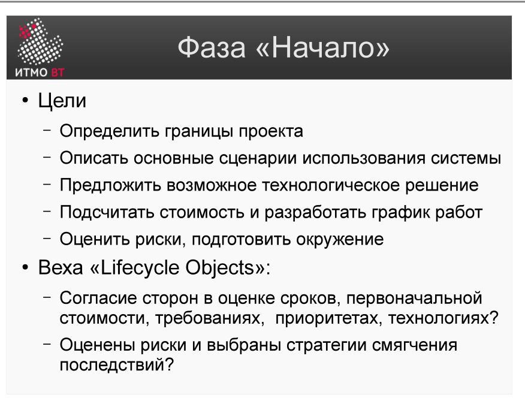

# Билет 16. RUP: Фаза «Начало»

## Ответ

**Фаза «Начало» (Inception)** — первая фаза RUP. Цель: убедиться, что проект вообще имеет смысл реализовывать, и получить согласие всех заинтересованных сторон.

### Ключевые задачи фазы

- Определить **scope** — что войдёт в систему, что останется за её границами.
- Сформировать **бизнес-кейс** — обосновать, что затраты на проект оправданы.
- Выявить основных акторов и прецеденты.
- Оценить риски и жизнеспособность архитектуры (на высоком уровне).
- Подготовить план проекта с укрупнёнными оценками.

### Артефакты фазы

- **Vision** — описание системы глазами заказчика: цели, ограничения, ключевые функции.
- **Use-Case Model** (предварительный) — список акторов и прецедентов.
- **Business Case** — обоснование затрат, ожидаемая прибыль, альтернативы.
- **Project Plan** — черновой план итераций.

### Milestone: LCO (Lifecycle Objectives)

Фаза завершается контрольной точкой **LCO**. Принимается решение: продолжать проект или остановиться. Для продолжения нужно достичь согласия по scope, бюджету, срокам и рискам.

---

## Подробно

### Сколько длится фаза

Inception обычно занимает 1–2 итерации (несколько недель). Для малых проектов — один рабочий день. Ошибка — затянуть Inception: некоторые команды проводят в ней месяцы, детализируя требования на уровне Elaboration. Это нарушает назначение фазы.

### Чего не делать в Inception

- Не писать детальные спецификации.
- Не проектировать архитектуру.
- Не начинать кодирование.

Цель Inception — ответить на вопрос «стоит ли вообще начинать?», а не «как именно строить?».

### Что происходит если LCO не достигнут

Если ни одна из сторон не согласна с целями, бюджетом или рисками — проект закрывается или начинается новая итерация в фазе Inception. Это нормально: лучше потратить неделю сейчас, чем полгода потом.

### Уровень детализации use-cases

В Inception список прецедентов неполный и неточный — это нормально. Достаточно 20–30% прецедентов на детальном уровне, остальные — на уровне имён. Полную проработку откладывают на Elaboration.

### Связь с другими фазами

Inception создаёт «входные данные» для Elaboration: Vision и Business Case уточняются на протяжении всего проекта, но впервые появляются именно здесь.
