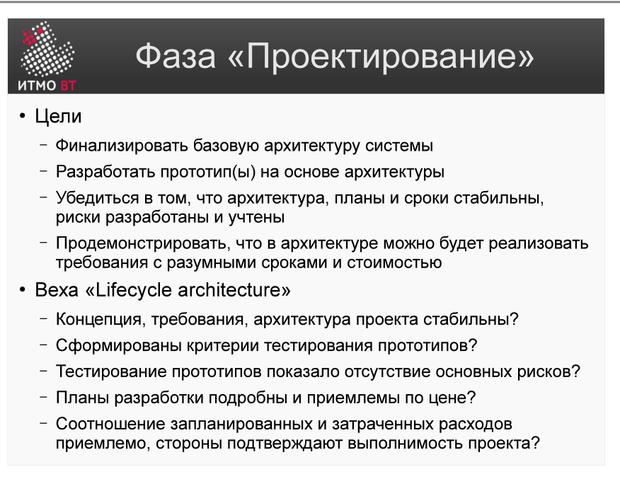

# Билет 17. RUP: Фаза «Проектирование»

## Ответ

**Фаза «Проектирование» (Elaboration)** — вторая фаза RUP. Цель: создать устойчивую базовую архитектуру системы и снять ключевые технические риски.

### Ключевые задачи фазы

- Детально проработать большинство прецедентов (около **80%**).
- Спроектировать и реализовать **базовую архитектуру** — каркас системы, на котором будет строиться всё остальное.
- Устранить наиболее опасные технические риски через прототипы.
- Уточнить план проекта: оценки стали достаточно надёжными.

### Артефакты фазы

- **Software Architecture Document (SAD)** — описание ключевых архитектурных решений.
- **Use-Case Model** — проработан на 80%.
- **Исполняемый архитектурный прототип** — работающий каркас системы.
- **Уточнённый план** — расписание итераций Construction и Transition.

### Milestone: LCA (Lifecycle Architecture)

Фаза завершается контрольной точкой **LCA**. Критерии:
- Архитектура стабильна и покрывает все технические риски.
- 80% прецедентов детально проработаны.
- Оценки трудоёмкости Construction достаточно точны.

---

## Подробно

### Почему архитектура так важна

Ошибка в архитектуре — самый дорогой вид ошибки. Если в Inception ошиблись с целями, стоимость исправления — дни. Если в Elaboration ошиблись с архитектурой, стоимость — недели и месяцы. Если ошибка в архитектуре выявлена на этапе Construction — пересобирать всё.

Поэтому вся Elaboration посвящена одному: убедиться, что архитектурные решения правильны, пока это ещё можно исправить дёшево.

### «80% прецедентов» — что это значит

Не нужно к концу Elaboration иметь готовый код для 80% функций. Нужно иметь **детализированные текстовые описания** прецедентов: основные потоки, альтернативные потоки, предусловия и постусловия. Оставшиеся 20% — второстепенные, их детализируют в Construction.

### Архитектурный прототип

В отличие от Inception, в Elaboration создаётся **работающий код** — не документ. Прототип реализует наиболее рискованные части системы: взаимодействие с внешними системами, производительность, сложную бизнес-логику. Он не обязан быть полным, но обязан отвечать на ключевые архитектурные вопросы.

### Частая ошибка

Команды иногда проводят слишком много времени в Elaboration, пытаясь детализировать все 100% требований до начала разработки. Это превращает RUP в водопад. Elaboration должна заканчиваться, как только архитектурные риски устранены — даже если остались открытые вопросы.
