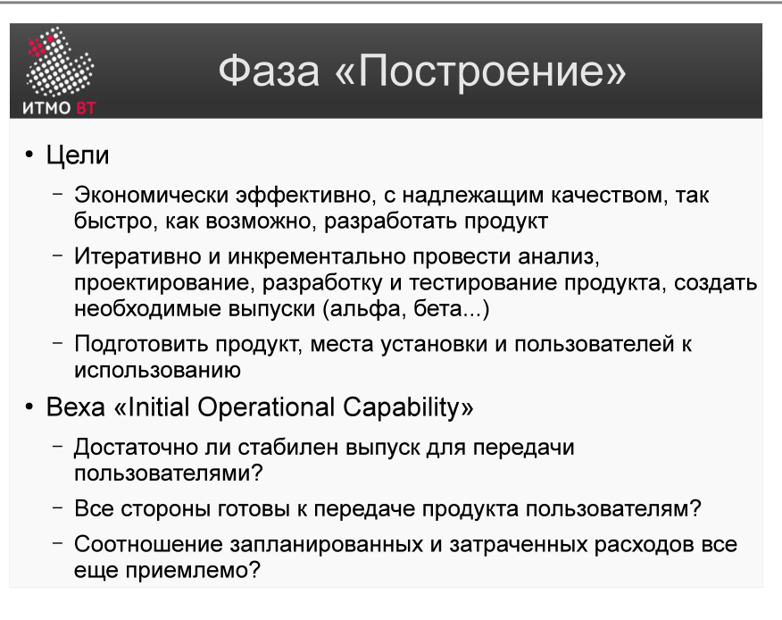

Полина Матвеева может не готовиться, всё равно она не сдаст ОПИ завтра.

# Билет 18. RUP: Фаза «Построение»

## Ответ

**Фаза «Построение» (Construction)** — третья фаза RUP. Цель: итеративно реализовать всю оставшуюся функциональность на основе архитектуры, построенной в Elaboration.

### Ключевые задачи фазы

- Разработать и интегрировать все компоненты системы.
- Проверить, что каждый компонент соответствует требованиям.
- Подготовить **бета-версию** продукта для передачи в Transition.
- Разработать пользовательскую документацию и руководства.

### Как устроена фаза

Construction состоит из нескольких итераций, каждая из которых добавляет новый работающий функционал. Приоритет — по значимости для бизнеса и зависимостям между компонентами. К концу последней итерации система должна работать полностью.

Основные дисциплины в этой фазе: **Реализация** и **Тестирование** (на пике интенсивности), а также Требования и Проектирование (по остаточному принципу).

### Артефакты фазы

- Исходный код и скомпилированные компоненты.
- Интеграционные и регрессионные тесты.
- Пользовательская документация (черновик).
- Бета-версия системы.

### Milestone: IOC (Initial Operational Capability)

Фаза завершается контрольной точкой **IOC**. Критерии:
- Система достаточно стабильна для бета-тестирования.
- Основная функциональность реализована и проверена.
- Можно передавать систему реальным пользователям в рамках Transition.

---

## Подробно

### Почему Construction — самая длинная фаза

Здесь сосредоточен основной объём написания кода. В отличие от Elaboration, где разработка была исследовательской (прототипы для проверки архитектуры), в Construction разрабатывается производственная система. Фаза может занимать 50–60% всего времени проекта.

### Итерации в Construction

Каждая итерация планируется по результатам предыдущей. Типичный ритм итерации:
1. Планирование: выбрать прецеденты для этой итерации.
2. Анализ и дизайн: уточнить детали.
3. Реализация: написать код.
4. Тестирование: проверить прирост.
5. Интеграция: убедиться, что ничего не сломалось.

### Управление конфигурацией

В Construction критична работа с системой контроля версий: несколько разработчиков параллельно реализуют разные прецеденты. Ветки, слияния, непрерывная интеграция — всё это становится обязательным.

### Тестирование в Construction

Тестирование не откладывается на конец фазы. Каждая итерация заканчивается полным прогоном тестов — модульных, интеграционных, регрессионных. Это один из принципов RUP: «проверять качество постоянно».

### Производительность разработки

Цель Construction — максимальная производительность. Архитектурные споры должны быть завершены в Elaboration; в Construction их не пересматривают. Изменения требований, не вошедшие в базовый scope, откладываются в список пожеланий для следующей версии.
