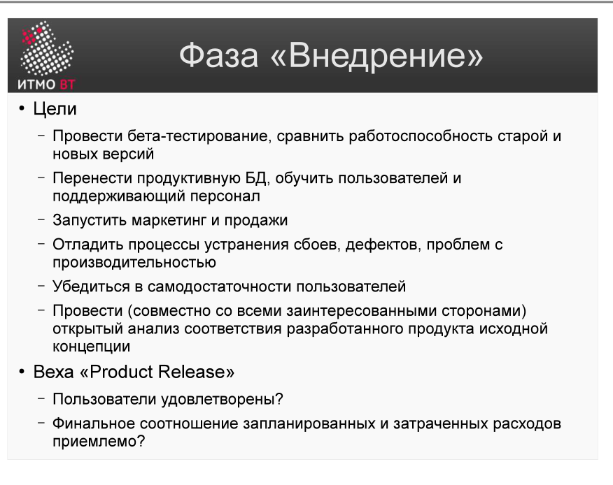

# Билет 19. RUP: Фаза «Внедрение»

## Ответ

**Фаза «Внедрение» (Transition)** — четвёртая, завершающая фаза RUP. Цель: передать готовую систему пользователям и убедиться, что они могут с ней работать.

### Ключевые задачи фазы

- Провести **бета-тестирование** с реальными пользователями.
- Исправить дефекты, выявленные при бета-тестировании.
- Обучить пользователей и администраторов.
- Мигрировать данные из старой системы (если она была).
- Развернуть систему на продуктивной инфраструктуре.

### Артефакты фазы

- Финальная версия системы.
- Руководства пользователя и администратора.
- Материалы для обучения.
- Отчёт об итогах проекта (lessons learned).

### Milestone: PR (Product Release)

Фаза завершается контрольной точкой **PR**. Критерии:
- Пользователи удовлетворены качеством системы.
- Известные дефекты либо исправлены, либо приняты с документированием.
- Поддержка перешла к операционной команде.

---

## Подробно

### Чем Transition отличается от Construction

В Construction всё тестирование выполняется командой разработчиков на тестовых данных. В Transition систему тестируют **реальные пользователи** на реальных данных в реальной среде — и находят совершенно другие проблемы.

### Бета-тестирование в RUP

Бета-версия передаётся ограниченной группе пользователей. Они работают с системой в обычном режиме и сообщают о проблемах. Команда собирает обратную связь, расставляет приоритеты и исправляет критичные дефекты. Некритичные могут быть отложены в следующий релиз.

### Обучение пользователей

Даже идеально работающая система провалится, если пользователи не понимают, как ею пользоваться. Transition включает:
- Написание руководств (пользовательских и административных).
- Проведение тренингов или видеоуроков.
- Создание службы поддержки (helpdesk).

### Миграция данных

Если система заменяет существующую, нужно перенести данные из старой. Это часто недооценивают: данные в старой системе могут быть неполными, неконсистентными, в другом формате. Миграция — отдельный трудоёмкий проект внутри Transition.

### После Transition

По завершении фазы проект в RUP «закрывается», но начинается **сопровождение**. Если запланирована следующая версия системы, она начинается с новой Inception. Так формируются продуктовые релизы.
