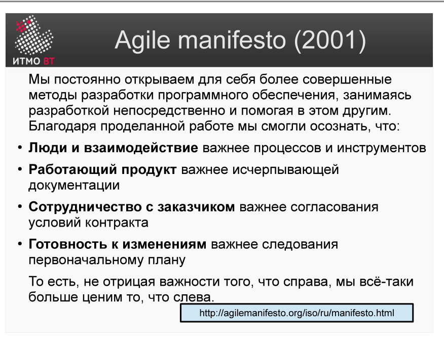
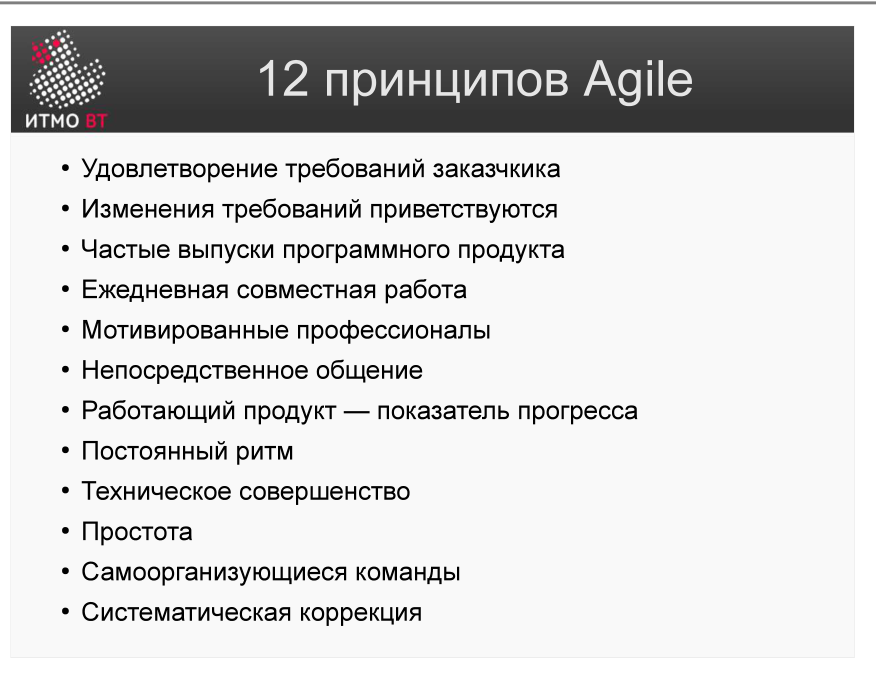

Полина Матвеева может не готовиться, всё равно она не сдаст ОПИ завтра.

# Билет 20. Манифест Agile (2001)

## Ответ

**Манифест Agile** — декларация, сформулированная группой из 17 разработчиков. В ней зафиксированы 4 ценности и 12 принципов гибкой разработки.

### 4 ценности

В каждой паре первое ценится **выше**, чем второе (но второе тоже важно):

1. **Люди и взаимодействие** важнее процессов и инструментов.
2. **Работающий продукт** важнее исчерпывающей документации.
3. **Сотрудничество с заказчиком** важнее согласования условий контракта.
4. **Готовность к изменениям** важнее следования первоначальному плану.

### 12 принципов (кратко)

1. Высший приоритет — удовлетворение заказчика через раннюю поставку ценности.
2. Принимать изменения требований на любом этапе.
3. Поставлять работающий продукт часто (недели, не месяцы).
4. Бизнес и разработчики работают вместе ежедневно.
5. Строить проекты вокруг мотивированных людей.
6. Лучший способ передачи информации — личный разговор.
7. Работающий продукт — главная мера прогресса.
8. Устойчивый темп разработки без авралов.
9. Постоянное внимание к техническому совершенству.
10. Простота — искусство не делать лишней работы.
11. Лучшие архитектуры рождаются в самоорганизующихся командах.
12. Команда регулярно анализирует, как стать эффективнее.

---

## Подробно

### Контекст появления

К концу 90-х традиционные «тяжёлые» процессы (водопад, RUP) давали проекты с опозданием и не то, что хотел заказчик. Проблема была системной: месяцы планирования давали ложную уверенность, а реальность выяснялась слишком поздно. 17 авторов манифеста — практики, каждый из которых независимо разрабатывал лёгкие процессы (XP, Scrum, DSDM и др.) — собрались и зафиксировали общее ядро.

### Разбор 4 ценностей

**«Люди важнее процессов»** — не означает «процессов нет». Означает: процессы должны служить людям, а не наоборот. Если инструмент мешает работе — его меняют, а не подстраиваются под него.

**«Продукт важнее документации»** — не означает «документацию не пишем». Означает: документ ради документа не нужен. Документ полезен, если помогает создать продукт или эксплуатировать его.

**«Сотрудничество важнее контракта»** — не означает «контракт не нужен». Означает: если заказчик захотел изменений — лучше обсудить и адаптироваться, чем прятаться за текст договора.

**«Изменения важнее плана»** — не означает «план не нужен». Означает: план — это инструмент, а не цель. Когда реальность расходится с планом — меняют план, не реальность.

### Чем Agile не является

Agile — не методология и не набор практик. Это **система ценностей и принципов**. Scrum, Kanban, XP — конкретные методологии, построенные на основе этих принципов.

### Почему 4 ценности работают

Манифест фокусирует внимание на **результате** (работающий продукт, удовлетворённый заказчик), а не на процессе ради процесса. Это меняет психологию команды: вопрос «правильно ли мы задокументировали?» заменяется вопросом «работает ли это так, как нужно заказчику?».
