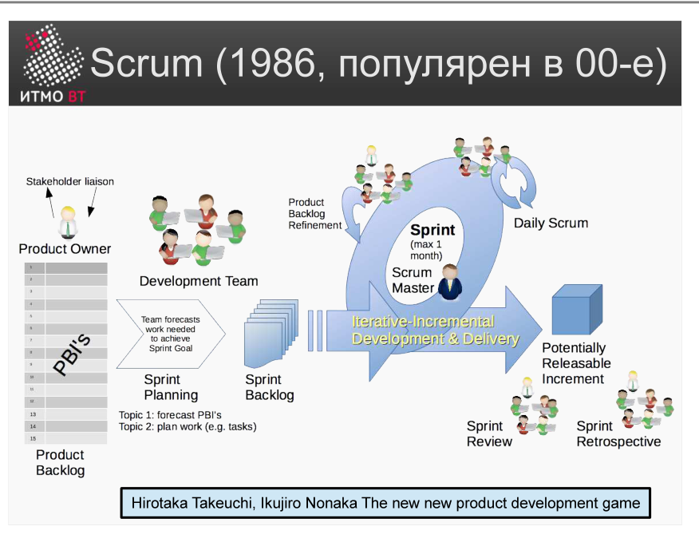

# Билет 21. Scrum

## Ответ

**Scrum** — лёгкий Agile-фреймворк для разработки продуктов в условиях неопределённости. Работа ведётся короткими итерациями — **спринтами** (1–4 недели), каждый из которых завершается работающим инкрементом.

### 3 роли

| Роль | Ответственность |
|------|-----------------|
| **Product Owner (PO)** | Формирует и приоритизирует Product Backlog; отвечает за ценность продукта |
| **Scrum Master (SM)** | Следит за соблюдением фреймворка; устраняет препятствия для команды |
| **Development Team** | Кросс-функциональная команда (3–9 человек); самоорганизуется для создания инкремента |

### 5 событий

| Событие | Участники | Длительность (для 2-нед. спринта) |
|---------|-----------|-----------------------------------|
| **Sprint** | Вся команда | 1–4 недели |
| **Sprint Planning** | Вся команда | До 4 часов |
| **Daily Scrum** | Dev Team | 15 минут |
| **Sprint Review** | Вся команда + стейкхолдеры | До 2 часов |
| **Sprint Retrospective** | Вся команда | До 1,5 часов |

### 3 артефакта

- **Product Backlog** — упорядоченный список всего, что может понадобиться в продукте. Владелец — PO.
- **Sprint Backlog** — задачи, выбранные для текущего спринта. Владелец — Dev Team.
- **Increment** — сумма всей работы, выполненной за спринт и все предыдущие; должен быть «потенциально готов к поставке».



---

## Подробно

### Как устроен спринт

Спринт — это «сердцебиение» Scrum. Все события происходят внутри спринта:

```
[Sprint Planning] → работа → [Daily × N] → [Sprint Review] → [Retrospective]
                                                                    ↓
                                                       следующий Sprint Planning
```

Во время спринта его содержание нельзя менять — это обеспечивает фокус команды.

### Sprint Planning

Команда выбирает задачи из Product Backlog для спринта (Sprint Goal) и декомпозирует их на конкретные задачи. Критерий выбора — **Definition of Done (DoD)**: список критериев, при выполнении которых задача считается завершённой.

### Daily Scrum

Ежедневная 15-минутная синхронизация Dev Team. Три вопроса:
1. Что сделал вчера для достижения Sprint Goal?
2. Что планирую сделать сегодня?
3. Есть ли препятствия?

Daily не является отчётом PO или SM — это инструмент самоорганизации команды.

### Sprint Review vs Retrospective

**Review** — показываем результат **заказчику**. Получаем обратную связь по продукту.

**Retrospective** — обсуждаем **внутри команды**, как улучшить процесс работы. Заказчик не участвует.

### Product Backlog Refinement

Между событиями команда регулярно «шлифует» бэклог: уточняет формулировки задач, расставляет приоритеты, оценивает трудоёмкость. Это не официальное событие Scrum, но обязательная практика.

### Чем Scrum отличается от Kanban

Scrum работает итерациями фиксированной длины (спринты) с планированием заранее. Kanban — поток задач без временных рамок; ограничение — количество задач в работе одновременно (WIP limit). Scrum подходит для продуктовой разработки, Kanban — для операционной поддержки.
