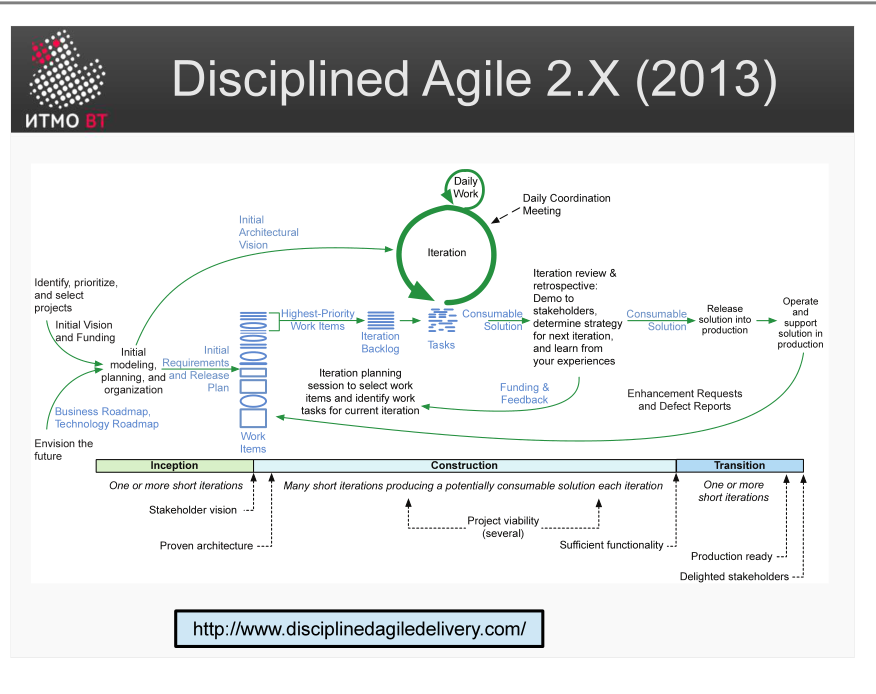

!!! danger "ВНИМАНИЕ"
    Теперь использование данного конспекта является платным. I am Michael from Microsoft support, send 5000$ to my PayPal account

# Билет 22. Disciplined Agile 2.X (2013)

## Ответ

**Disciplined Agile (DA)** — расширение Scrum и других Agile-практик для крупных организаций. Решает проблему масштабирования: Scrum хорошо работает в одной команде, но не описывает, что делать, когда команд десятки.

DA не навязывает один «правильный» процесс — вместо этого предлагает **toolkit** с несколькими жизненными циклами на выбор (Scrum, Kanban, SAFe, Lean и др.) и помогает выбрать подходящий под конкретный контекст.

### Три фазы DA-проекта

| Фаза | Аналог RUP | Содержание |
|------|-----------|------------|
| **Inception** | Начало | Договориться о цели, составе команды, инструментах, базовой архитектуре |
| **Construction** | Построение | Итеративная разработка с регулярными поставками |
| **Transition** | Внедрение | Передать решение в эксплуатацию, обучить пользователей |

### Ключевые идеи DA

- **Context counts** — нет универсального процесса; оптимальный процесс зависит от типа команды, продукта, организации.
- **Choice is good** — DA описывает несколько вариантов для каждой практики и помогает выбрать под ситуацию.
- **Enterprise awareness** — команда работает не в вакууме; она часть организации и должна соответствовать её ограничениям и архитектуре.

---

## Подробно

### Почему Scrum недостаточен для корпораций

Scrum отлично описывает работу одной команды: Sprint, Daily, Review. Но в корпорации 50 команд разрабатывают один продукт. Возникают вопросы, которые Scrum не затрагивает:
- Как согласовывать зависимости между командами?
- Как управлять общей архитектурой?
- Как синхронизировать поставки?
- Как работать с корпоративными стандартами безопасности и compliance?

DA отвечает на эти вопросы.

### Три уровня DA

1. **Team** — одна Agile-команда (Scrum, XP, Kanban).
2. **Program / Solution** — координация нескольких команд.
3. **Portfolio** — стратегическое управление набором проектов и продуктов.

### Жизненные циклы в DA

DA предлагает на выбор несколько жизненных циклов:
- **Agile** (основан на Scrum).
- **Lean** (основан на Kanban).
- **Continuous Delivery** — непрерывная поставка без фиксированных спринтов.
- **Exploratory** — для инновационных и исследовательских проектов.
- **Program** — для программ из нескольких команд.

Выбор зависит от стабильности требований, размера команды, частоты поставок.

### DA vs SAFe

SAFe (Scaled Agile Framework) — более prescriptive: он точно говорит, что делать. DA — более descriptive: он описывает варианты и помогает выбрать. DA гибче, SAFe — проще внедрить «из коробки».

### Связь с PMI

В 2019 году DA был приобретён PMI (Project Management Institute) и включён в его стандарты. Это означает признание DA корпоративным миром как зрелой методологии.
