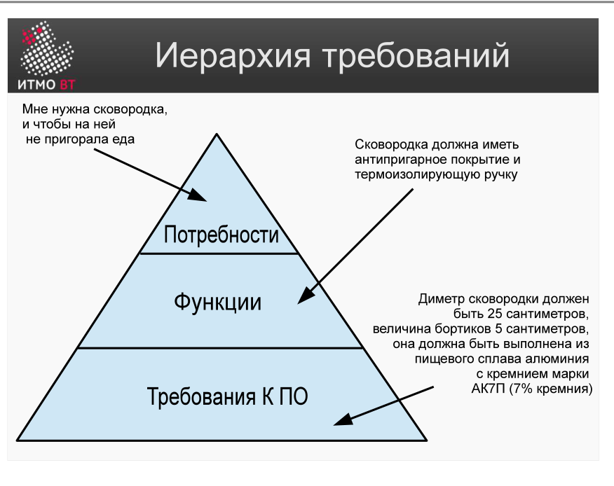

<div style="background:#d32f2f;color:#fff;padding:1.3rem 1.5rem;border-radius:8px;font-size:1.5rem;font-weight:800;line-height:1.35;text-align:center;margin:0 0 1.6rem 0;box-shadow:0 2px 8px rgba(0,0,0,.25)">
Полина Матвеева может не готовиться, всё равно она не сдаст ОПИ завтра.
</div>

# Билет 23. Требования. Иерархия требований. Примеры формулировок на разных уровнях

## Ответ

**Требование** — условие или возможность, которую система должна реализовывать или которой должна соответствовать. Это атомарная, верифицируемая единица: если нельзя проверить выполнение — это не требование.

### Иерархия требований (три уровня)

Требования формируются сверху вниз: от потребностей бизнеса к конкретным свойствам ПО.

```
Потребности (Needs)
  └─ Функции системы (Features)
       └─ Требования к ПО (Software Requirements)
```

| Уровень | Кто формулирует | Пример |
|---------|-----------------|--------|
| **Потребность** | Заказчик / бизнес | «Хочу продавать пирожки через интернет» |
| **Функция** | Аналитик | «Онлайн-оплата банковской картой» |
| **Требование к ПО** | Аналитик / разработчик | «Система должна принимать оплату Visa и Mastercard через платёжный шлюз» |



### Формат формулировки требования

Стандартный формат: **`<id> <система> должна <требование>`**

```
REQ-01  Система  должна  отображать статус заказа в реальном времени.
REQ-02  Система  должна  хранить историю заказов не менее 12 месяцев.
REQ-03  Система  должна  отправить подтверждение на email в течение 60 секунд после оплаты.
```

---

## Подробно

### Почему три уровня?

Потому что у разных участников проекта разный уровень детализации:
- Заказчику не важно, как именно реализована оплата — ему нужно «принимать деньги онлайн» (потребность).
- Руководитель проекта планирует, что для этого нужен модуль оплаты (функция).
- Разработчик пишет конкретную спецификацию: какие карты, какой шлюз, за сколько секунд (требование к ПО).

Каждый уровень декомпозирует предыдущий: одна потребность порождает несколько функций, каждая функция — несколько требований к ПО.

### Что делает требование правильным

Требование должно быть:
- **Корректным** — точно отражает то, чего хочет пользователь.
- **Однозначным** — одна формулировка, одно толкование.
- **Проверяемым** — можно написать тест, который скажет «выполнено / не выполнено».
- **Прослеживаемым** — каждое требование связано с функцией, а та — с потребностью (трассировка).

### Пример разворачивания иерархии

**Потребность:** покупатель хочет получить уведомление о готовности заказа.

**Функции:**
- Уведомление по SMS
- Уведомление по email
- Push-уведомление в приложении

**Требования к ПО для функции «уведомление по email»:**
- REQ-10 Система должна отправить email на адрес покупателя в течение 2 минут после смены статуса заказа.
- REQ-11 Email должен содержать номер заказа, состав и ожидаемое время доставки.
- REQ-12 Система должна повторить отправку 3 раза в случае ошибки доставки.

### Почему важна трассировка

Если требование не связано ни с одной функцией — скорее всего, оно лишнее. Если функция не покрыта ни одним требованием — её не реализуют. Трассировка позволяет управлять объёмом проекта и оценивать, что произойдёт, если убрать или изменить требование.
