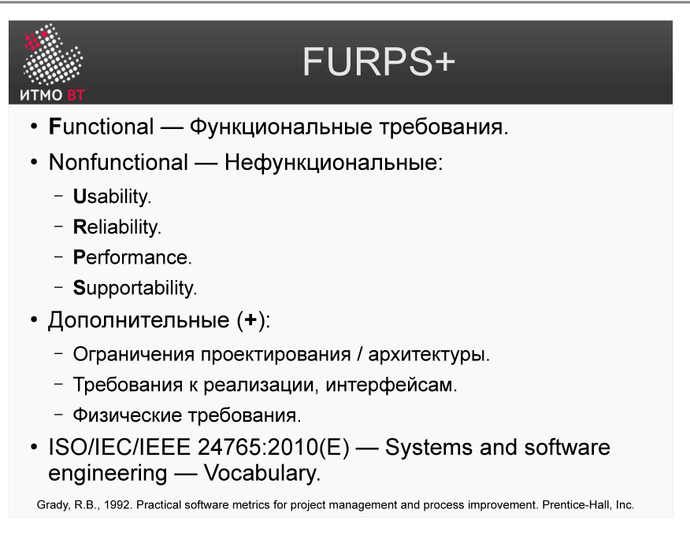

# Билет 24. Свойства и типы требований (FURPS+)

## Ответ

**FURPS+** — классификация типов требований к программному обеспечению. Аббревиатура расшифровывается по первым буквам пяти категорий:

| Буква | Тип | Что описывает |
|-------|-----|---------------|
| **F** | Functionality (Функциональность) | Что система делает: функции, возможности, безопасность |
| **U** | Usability (Удобство использования) | Насколько удобно пользователю: интерфейс, документация, эргономика |
| **R** | Reliability (Надёжность) | Устойчивость к сбоям: MTBF, частота отказов, восстановление |
| **P** | Performance (Производительность) | Скорость, пропускная способность, время отклика, ресурсы |
| **S** | Supportability (Поддерживаемость) | Расширяемость, адаптируемость, тестируемость, локализация |

**«+»** — дополнительные категории: ограничения дизайна, реализации, интерфейса, физические ограничения.

### Деление на функциональные и нефункциональные

- **F** — функциональные требования: определяют поведение системы.
- **U, R, P, S** — нефункциональные: определяют качество поведения.
- **+** — ограничения: сужают пространство решений.

### Свойства требований

Каждое отдельное требование должно обладать рядом качеств:

| Свойство | Суть |
|----------|------|
| **Корректность** | Точно описывает реальную потребность — не противоречит реальности |
| **Однозначность** | Допускает только одну интерпретацию — никаких «удобный интерфейс» без критериев |
| **Полнота** | Описывает все условия, при которых система должна вести себя именно так |
| **Непротиворечивость** | Не конфликтует с другими требованиями |
| **Проверяемость** | Можно написать тест, который подтверждает или опровергает выполнение |
| **Трассируемость** | Привязано к источнику (потребность заказчика, закон, стандарт) и к реализующему коду |
| **Приоритет** | Имеет явный приоритет — команда знает, что делать в первую очередь |

Требование, нарушающее хотя бы одно из этих свойств, — дефектное. Найти и исправить его до начала разработки в разы дешевле, чем после.

---

## Подробно

### Свойства требований — подробнее

**Корректность** — требование отражает то, что реально нужно. Проверяется у заказчика: он должен подтвердить, что именно это имел в виду.

**Однозначность** — формулировка «система должна быть быстрой» не однозначна. Однозначно: «время отклика на запрос не превышает 2 секунды при нагрузке 500 пользователей». Каждый термин в требовании трактуется единственным способом.

**Полнота** — указаны все допустимые входы и ожидаемые реакции, в том числе на ошибочные ситуации. Если написано «система должна авторизовать пользователя», но не сказано что делать при неверном пароле — требование неполное.

**Непротиворечивость** — «система должна отвечать за 1 секунду» и «система должна шифровать все данные AES-256 на лету» могут противоречить друг другу по производительности. Такое нужно разрешать на этапе анализа требований.

**Проверяемость** — для каждого требования должен существовать конкретный тест. Если нет способа проверить выполнение — требование не имеет смысла. «Удобный интерфейс» не проверяемо; «95% пользователей выполняют задачу без подсказок» — проверяемо.

**Трассируемость** — каждое требование связано с источником (зачем оно вообще появилось) и с реализацией (какой код/модуль его закрывает). Позволяет понять влияние изменения и не потерять требование между итерациями.

**Приоритет** — см. [билет 28](28-requirements-attributes.md): MoSCoW (Must / Should / Could / Won't). Без приоритета при нехватке времени непонятно, чем пожертвовать.

### Почему классификация нужна

Без классификации заказчики и разработчики говорят о разном. Заказчик думает о функциях («система должна принимать заказы»), забывая про надёжность («и при этом не падать под нагрузкой»). FURPS+ — это чек-лист для полноты требований: нужно пройтись по всем пяти категориям и убедиться, что ничего не упущено.

### Функциональность (F) подробнее

Всё, что система *делает*:
- Наборы функций (feature sets) — что пользователь может выполнять.
- Безопасность — авторизация, аутентификация, шифрование.

### Нефункциональные категории и их метрики

**Usability** — измеряется временем обучения, количеством ошибок пользователя, результатами юзабилити-тестов.

**Reliability** — измеряется через MTBF (Mean Time Between Failures — среднее время между отказами). Пример: «система должна работать без сбоев не менее 720 часов подряд».

**Performance** — измеряется конкретными цифрами: время отклика < 2 с, пропускная способность > 1000 запросов/мин, утилизация CPU < 70%.

**Supportability** — включает: расширяемость (возможность добавлять модули), сопровождаемость (простота исправления), тестируемость, локализацию (поддержка нескольких языков), совместимость с платформами.

### Категория «+»

- **Ограничения дизайна** — «использовать только реляционную СУБД».
- **Ограничения реализации** — «код на Java 17».
- **Ограничения интерфейса** — «интеграция по протоколу REST API с системой X».
- **Физические ограничения** — «приложение должно работать на устройствах с ОЗУ ≥ 512 МБ».

Эти требования не описывают *что* делает система, а *как* и *в каких условиях* она должна это делать.
