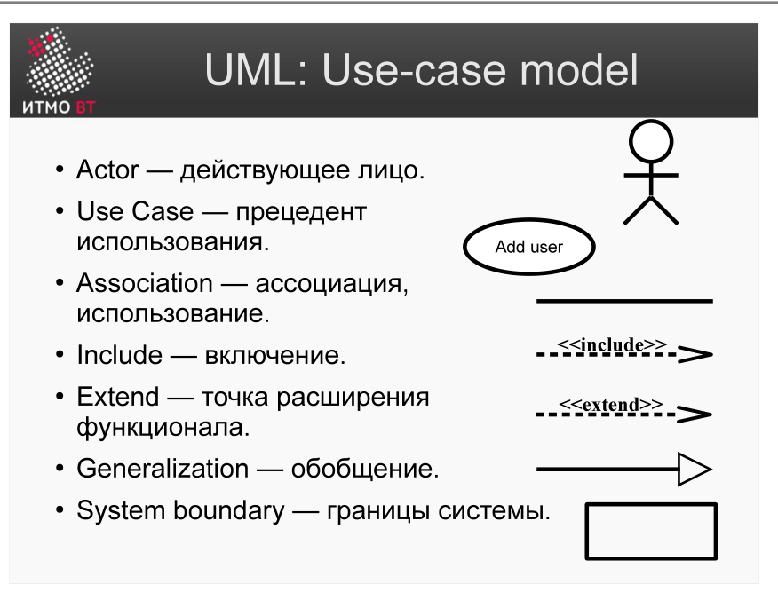
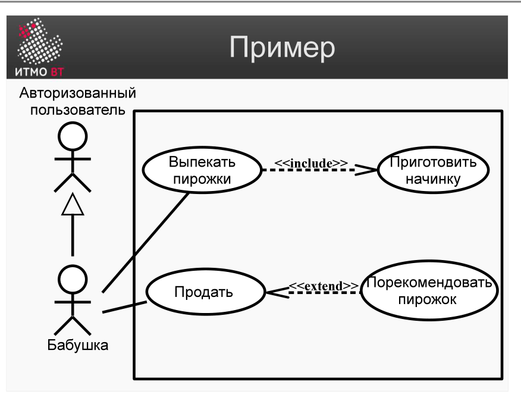
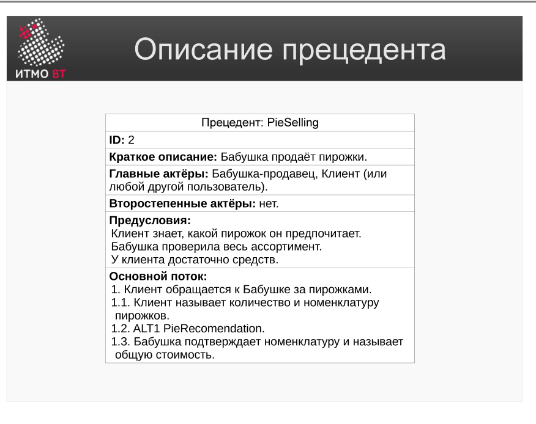

<div style="background:#d32f2f;color:#fff;padding:1.3rem 1.5rem;border-radius:8px;font-size:1.5rem;font-weight:800;line-height:1.35;text-align:center;margin:0 0 1.6rem 0;box-shadow:0 2px 8px rgba(0,0,0,.25)">
Полина Матвеева может не готовиться, всё равно она не сдаст ОПИ завтра.
</div>

# Билет 29. Описание прецедента

## Ответ

**Прецедент (Use case)** — описание взаимодействия актора (пользователя или внешней системы) с системой для достижения конкретной цели. Прецедент фиксирует *что* система делает, но не *как* она это делает внутри.

### Элементы диаграммы Use Case



| Элемент | Нотация | Смысл |
|---------|---------|-------|
| **Актор** | Человечек | Роль пользователя или внешней системы |
| **Прецедент** | Овал | Функциональная возможность системы |
| **include** | Стрелка →, «include» | Обязательное включение другого прецедента |
| **extend** | Стрелка →, «extend» | Необязательное расширение (опциональный поток) |
| **Обобщение** | Стрелка с треугольником | Наследование: специализация актора или прецедента |

### Пример диаграммы



### Текстовое описание прецедента

Диаграмма показывает структуру, но не детализирует поведение. Текстовый шаблон добавляет детали:



**Поля шаблона:**

| Поле | Содержание |
|------|------------|
| **Название** | Кратко суть действия: «Оформить заказ» |
| **Актор** | Кто инициирует: «Покупатель» |
| **Предусловие** | Что должно быть верно до начала |
| **Основной поток** | Шаги нормального выполнения |
| **Альтернативные потоки** | Что происходит при отклонениях |
| **Постусловие** | Состояние системы после успешного завершения |

---

## Подробно

### Зачем use case, если есть список требований

Список требований говорит «что должна система». Use case добавляет контекст: *кто* это делает, *в какой последовательности* и *что происходит, если что-то пошло не так*. Это позволяет обнаружить пропущенные требования — они скрыты в альтернативных потоках.

### Разница include и extend

- **include** — прецедент A *всегда* вызывает B. Пример: «Оформить заказ» всегда включает «Авторизоваться». Используется, чтобы вынести общую часть нескольких прецедентов.
- **extend** — прецедент B *иногда* расширяет A при определённом условии. Пример: «Оформить заказ» может быть расширен «Применить скидочный купон» — только если купон введён. Используется для опциональных потоков, которые не меняют основного сценария.

### Пример текстового описания (PieSelling)

```
Прецедент: Купить пирожок
Актор: Покупатель

Предусловие:
  Покупатель находится на сайте. Пирожки есть в наличии.

Основной поток:
  1. Покупатель выбирает пирожок из каталога.
  2. Система показывает описание и цену.
  3. Покупатель добавляет пирожок в корзину.
  4. Покупатель переходит к оформлению.
  5. Система запрашивает адрес доставки и способ оплаты.
  6. Покупатель вводит данные и подтверждает заказ.
  7. Система создаёт заказ и отправляет подтверждение на email.

Альтернативный поток 3а (нет в наличии):
  3а.1 Система показывает «нет в наличии».
  3а.2 Покупатель выбирает другой товар или выходит.

Постусловие:
  Заказ создан. Покупатель получил подтверждение.
```

### Как из прецедента получить требования

Каждый шаг основного потока порождает одно или несколько функциональных требований. Каждый альтернативный поток — ещё одно требование (обработка ошибки, граничного случая). Это и есть механизм трассировки: требование → прецедент → функция → потребность.
