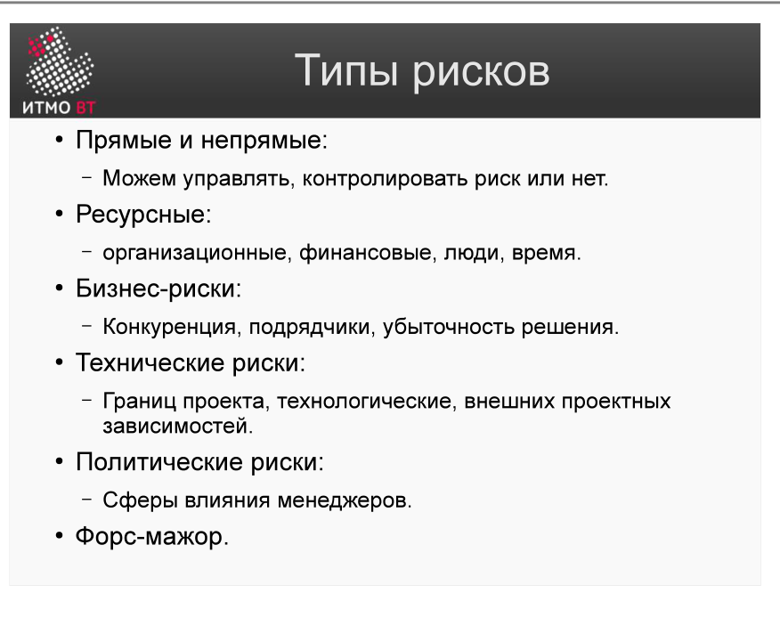

# Билет 30. Риски. Типы рисков

## Ответ

**Риск** — возможное будущее событие с отрицательными последствиями для проекта. Риск характеризуется двумя параметрами:
- **Вероятность** — насколько вероятно, что событие произойдёт (0–1 или проценты).
- **Масштаб потерь** — насколько сильно событие навредит проекту (деньги, время, качество).

### Типы рисков

| Тип | Примеры |
|-----|---------|
| **Ресурсные** | Ключевой разработчик увольняется; бюджет сокращают на 20%; задержка поставки оборудования |
| **Бизнес** | Конкурент выпускает аналогичный продукт раньше; заказчик меняет бизнес-модель; отмена проекта |
| **Технические** | Выбранная технология не масштабируется; интеграция с внешней системой не работает как ожидалось |
| **Политические** | Смена руководства компании; изменение приоритетов организации; конфликт между отделами |
| **Форс-мажор** | Стихийные бедствия; пандемия; законодательные ограничения |

---

## Подробно

### Риск ≠ проблема

Проблема — это событие, которое уже произошло. Риск — то, что *может* произойти. Управление рисками работает до факта: идентифицировать, оценить, спланировать реакцию, мониторить. Если риск материализовался — он стал проблемой.

### Ресурсные риски — самые частые

Люди — главный ресурс в разработке ПО. Уход одного ключевого специалиста может остановить проект на недели. Этот риск управляем: кросс-обучение, документирование знаний, отсутствие «незаменимых» людей.

### Технические риски — самые непредсказуемые

Технический риск часто связан с неизвестностью: никто не пробовал эту комбинацию технологий в таком масштабе. Именно поэтому в спиральной модели ([билет 9](09-spiral-model.md)) и RUP ([билет 15](15-rup-basics.md)) риски устраняются с первых итераций: прототипы и исследовательские спайки снижают техническую неопределённость.

### Почему форс-мажор нельзя игнорировать

Форс-мажорные риски редки, но катастрофичны. Ответная стратегия — не предотвращение (это невозможно), а принятие и подготовка: резервные копии данных в другом регионе, возможность удалённой работы, страхование.

### Риски в контексте проекта

Одно и то же событие может быть риском разного типа для разных проектов. Например, «изменение требований на поздней стадии» — это бизнес-риск (заказчик изменил цели) и технический риск (архитектура не позволяет изменить поведение без переработки). Типизация помогает назначить правильного ответственного.
