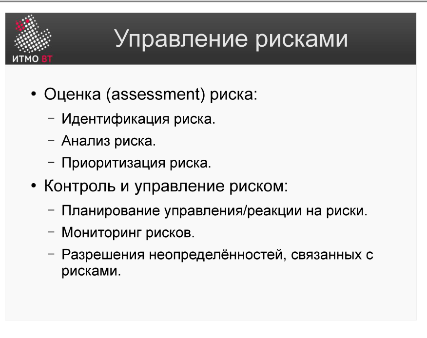
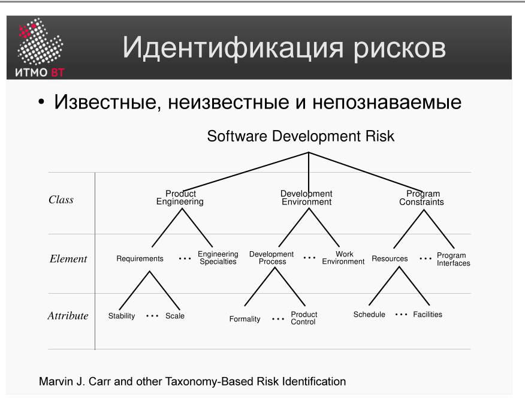
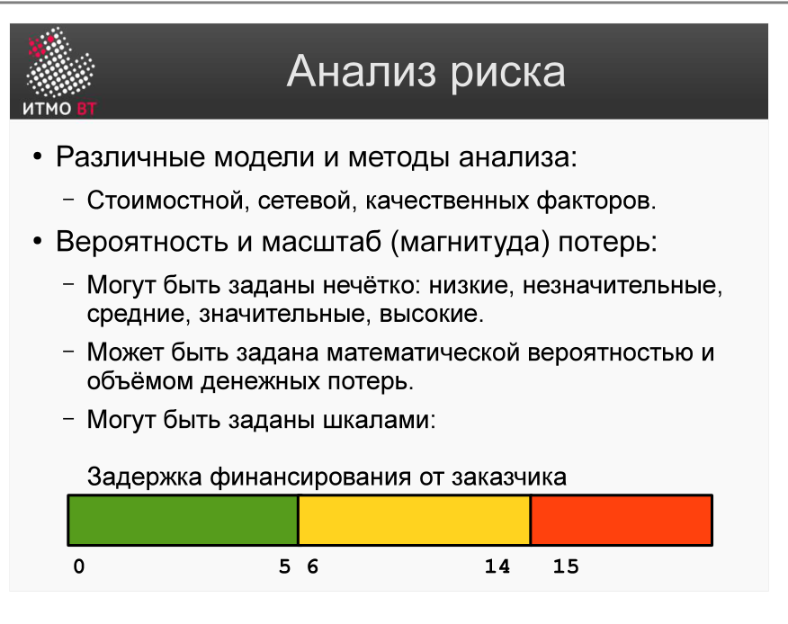
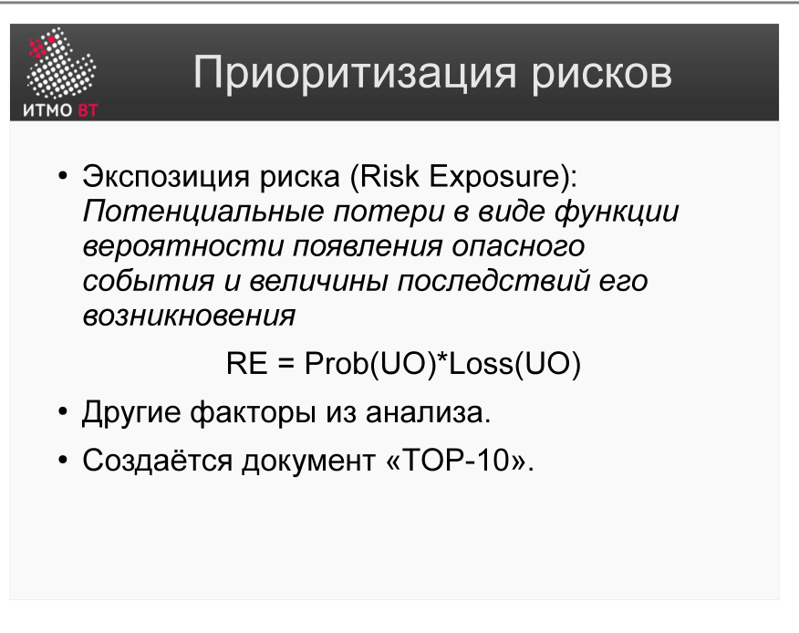

# Билет 31. Управление рисками. Деятельности, связанные с оценкой

## Ответ

Управление рисками делится на две группы деятельностей: **оценка** (что и насколько рискованно) и **контроль** (что с этим делать). Этот билет — про оценку.

Оценка включает три деятельности по порядку:

### 1. Идентификация рисков

Цель — составить список *всех* возможных рисков. Источники:
- Опыт команды и исторические данные прошлых проектов.
- **Таксономия рисков (Carr)** — структурированный каталог по категориям.

Три измерения таксономии Карра:
- **Продукт** — требования, технология, разработка, тестирование.
- **Среда** — ресурсы, программное обеспечение, инструменты.
- **Ограничения** — сроки, бюджет, контракты.

### 2. Анализ рисков

Для каждого риска определяют два параметра:
- **Вероятность (Probability)** — от 0 до 1.
- **Масштаб потерь (Loss)** — от 1 (незначительный) до 5 (катастрофический).

Результат — цветовая матрица: зелёный (низкий риск), жёлтый (умеренный), красный (высокий).

### 3. Приоритизация рисков

Формула: **Risk Exposure = Probability × Loss**

Риски сортируют по RE по убыванию и формируют **TOP-10 рисков** — список наиболее опасных. С ними и работают в первую очередь.

---

## Подробно

### Зачем формализовать оценку

Без формальной оценки риски оцениваются интуитивно, и каждый участник проекта может считать один и тот же риск либо несущественным, либо критическим. Формула RE = P × L переводит субъективные ощущения в сравнимые числа.

### Идентификация: почему нужен систематический подход

Неопытные команды вспоминают риски из головы и упускают целые категории. Таксономия Карра — это чек-лист: пройдись по каждой ячейке и спроси «что может пойти не так здесь?». Это занимает больше времени, но снижает вероятность неожиданностей.

### Анализ: как оценивать вероятность

Вероятность трудно оценить точно. Практические подходы:
- Исторические данные: как часто такое случалось в прошлых проектах?
- Опрос экспертов: Delphi-метод (несколько экспертов оценивают независимо, затем сравнивают).
- Упрощённая шкала: низкая / средняя / высокая (перевести в числа: 0,1 / 0,5 / 0,9).

### TOP-10: управляемый список

Список рисков в реальном проекте может содержать сотни позиций. Управлять всеми одновременно невозможно. TOP-10 — это рабочий фокус: концентрация усилий на том, что реально может сорвать проект. Остальные риски мониторятся пассивно.

### Связь с итерационной разработкой

В спиральной модели ([билет 9](09-spiral-model.md)) и RUP ([билет 15](15-rup-basics.md)) риски с наибольшим RE устраняются в первых итерациях. Логика: лучше столкнуться с проблемой на раннем прототипе, чем на финальном продукте.
