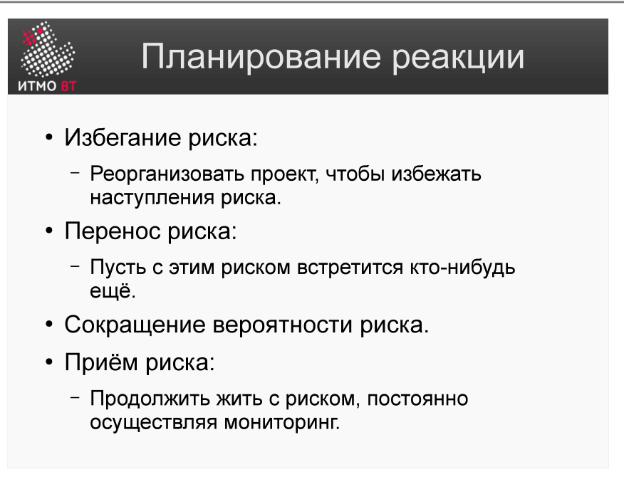
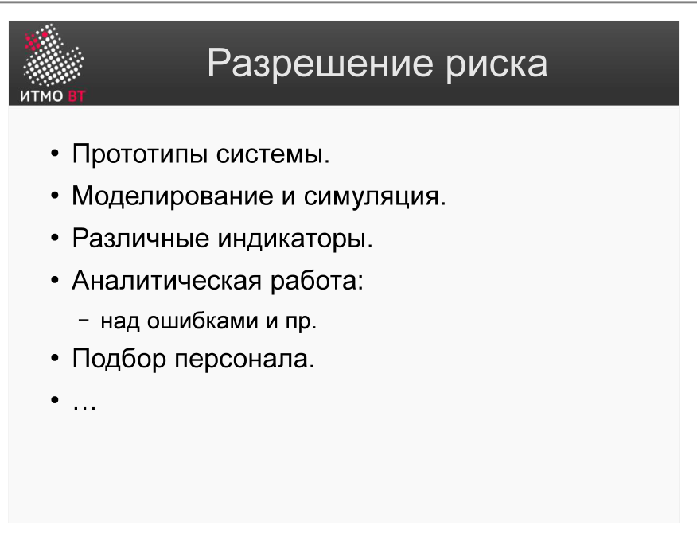
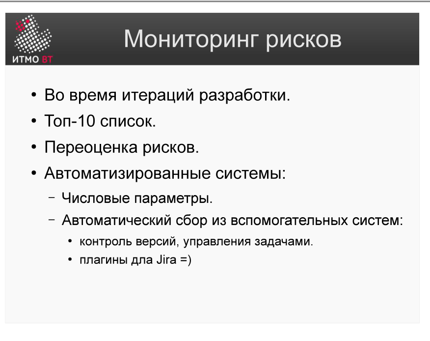

# Билет 32. Управление рисками. Деятельности, связанные с контролем и управлением

## Ответ

После оценки рисков (идентификация → анализ → приоритизация) следует фаза контроля. Она включает три деятельности:

### 1. Планирование реакции на риски

Для каждого риска из TOP-10 выбирается одна из стратегий:

| Стратегия | Суть | Пример |
|-----------|------|--------|
| **Избегание (Avoid)** | Устранить причину риска | Отказаться от нестабильной технологии |
| **Перенос (Transfer)** | Переложить на третью сторону | Страховка, аутсорс, контрактные штрафы |
| **Сокращение (Reduce)** | Снизить вероятность или потери | Прототип для проверки технического риска |
| **Принятие (Accept)** | Признать риск и создать резерв | Буфер по времени / бюджету |

### 2. Разрешение неопределённостей

Некоторые риски возникают из-за неизвестности, а не из-за реальной угрозы. Способы снизить неопределённость:

- **Прототипы** — проверить техническое решение до полной реализации.
- **Моделирование** — оценить поведение системы под нагрузкой без реального запуска.
- **Привлечение экспертов** — получить опыт того, кто уже сталкивался с подобным.

### 3. Мониторинг рисков

- **TOP-10 как регулярный артефакт** — список обновляется на каждой итерации / встрече по статусу.
- **Переоценка** — вероятность и потери меняются по мере выполнения проекта; риск может исчезнуть или появиться новый.
- **Автоматизация** — инструменты отслеживания (метрики сборки, тесты, мониторинг бюджета) дают ранние сигналы о реализации риска.

---

## Подробно

### Какую стратегию выбрать

Выбор стратегии зависит от соотношения стоимости меры и ожидаемого ущерба:
- Если стоимость устранения < ожидаемых потерь — устраняй (Avoid или Reduce).
- Если ущерб редкий, но катастрофический — переноси (Transfer, страховка).
- Если ущерб небольшой и устранение дороже — принимай (Accept) с резервом.

### Прототип как инструмент снижения риска

Технические риски часто связаны с неизвестностью: «сможем ли мы это сделать?» Прототип — это *управляемый эксперимент*: потратить 2–3 дня на проверку сомнительной части архитектуры, прежде чем тратить 2–3 месяца на разработку полного продукта. Если прототип не работает — риск реализовался, но в самом начале и с минимальными потерями.

### Мониторинг: почему TOP-10 обновляется

Риски не статичны. По мере выполнения проекта:
- Высокоприоритетный риск снизился (прототип подтвердил работоспособность) → выпадает из TOP-10.
- Появился новый риск (партнёр задерживает API) → входит в TOP-10.
- Вероятность возросла (бюджет урезают) → переоценка RE → смещение в рейтинге.

Регулярное обновление TOP-10 — это и есть непрерывное управление рисками, а не разовое мероприятие в начале проекта.

### Связь с RUP

В RUP ([билет 15](15-rup-basics.md)) управление рисками — одна из дисциплин, которая активна на протяжении всего проекта. Фаза «Начало» идентифицирует риски, фаза «Проектирование» устраняет наиболее критичные технические риски, фазы «Построение» и «Внедрение» мониторят оставшиеся.
