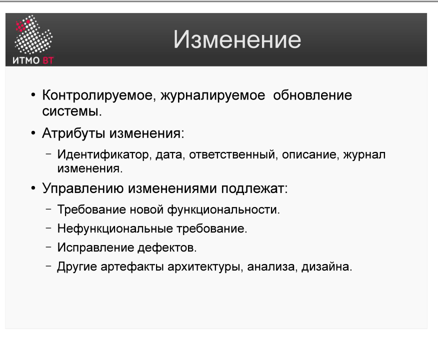
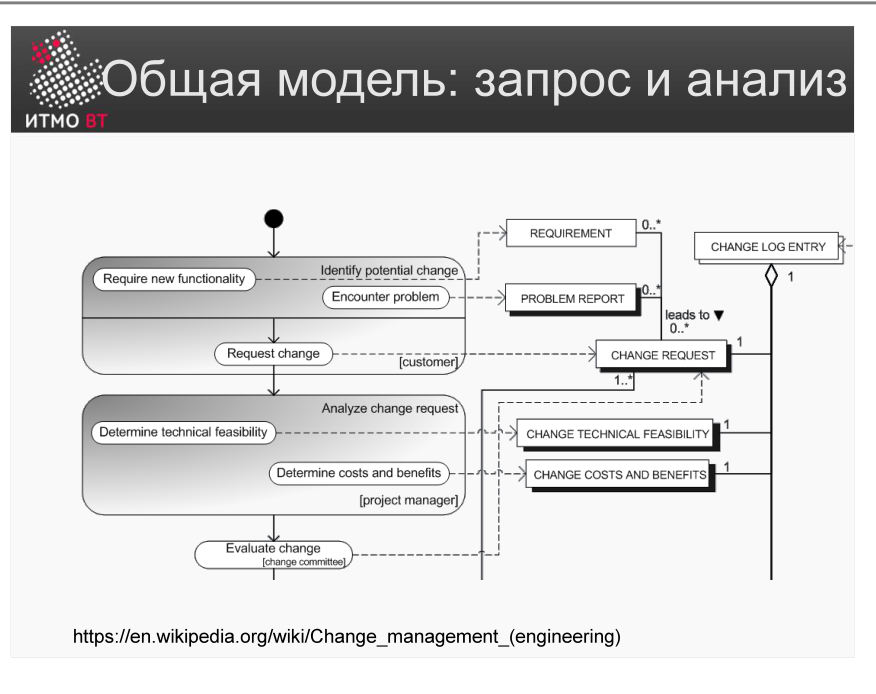
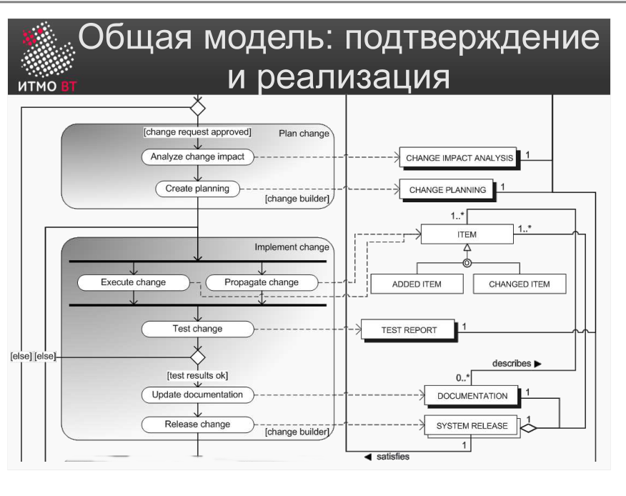
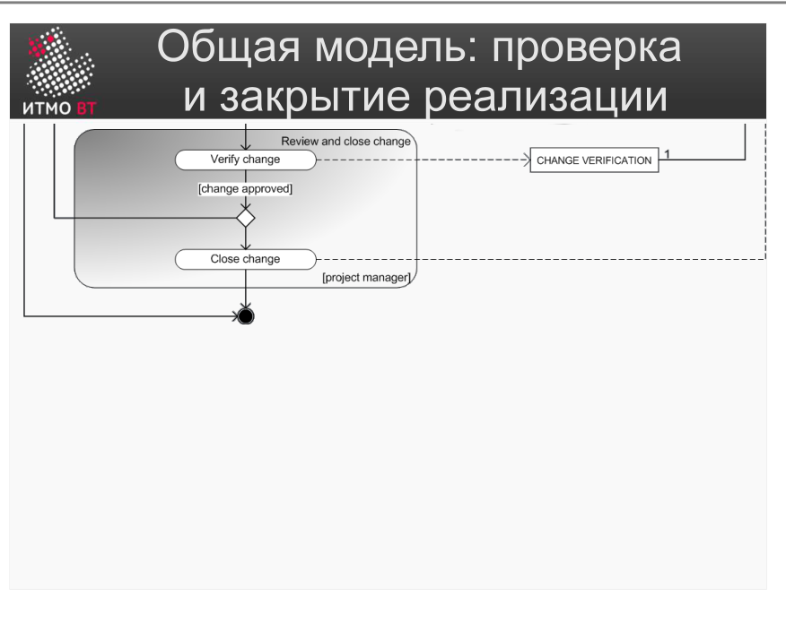

Полина Матвеева может не готовиться, всё равно она не сдаст ОПИ завтра.

# Билет 33. Изменение. Общая модель управления изменениями

## Ответ

**Изменение** — любая модификация требований, архитектуры, кода или плана проекта, инициированная заказчиком, командой или внешними обстоятельствами.

### Атрибуты изменения

Каждое изменение фиксируется как запись с полями:

| Атрибут | Содержание |
|---------|------------|
| **ID** | Уникальный номер: CHG-007 |
| **Дата** | Когда запрошено |
| **Ответственный** | Кто запросил и кто реализует |
| **Описание** | Что именно нужно изменить и зачем |
| **Статус** | Текущее состояние в процессе |
| **Приоритет** | Срочность: критическое / высокое / среднее / низкое |

### Общая модель: три стадии

Управление изменениями — трёхфазный процесс:

**Фаза 1: Запрос и анализ**

Кто-то подаёт запрос на изменение → анализируется влияние на проект (трудоёмкость, риски, зависимости) → принимается решение: одобрить или отклонить.

**Фаза 2: Подтверждение и реализация**

Одобренное изменение планируется и реализуется: обновляются требования, код, тесты, документация.

**Фаза 3: Проверка и закрытие**

Реализованное изменение тестируется и верифицируется. После успешной проверки запись закрывается.

---

## Подробно

### Почему нельзя вносить изменения «на лету»

В небольших проектах разработчики часто вносят изменения сразу при получении просьбы: «окей, добавлю». Проблема в том, что изменение может:
- Конфликтовать с другими требованиями.
- Требовать больше времени, чем кажется (зависимости).
- Сдвинуть дедлайн или выйти за рамки бюджета.

Без анализа влияния («impact analysis») заказчик получает сюрприз в конце проекта: «мы внесли 30 изменений, поэтому опаздываем на 2 месяца».

### Анализ влияния (Impact Analysis)

При поступлении запроса на изменение оцениваются:
- Какие требования затронуты?
- Какой код нужно изменить?
- Какие тесты нужно обновить?
- Сколько времени и ресурсов потребуется?
- Какие риски возникают?

Только после этого заказчику сообщают стоимость изменения и предлагают принять решение.

### Запрос на изменение vs дефект

Это разные категории:
- **Дефект** — система делает не то, что было согласовано. Исправляется бесплатно (в рамках гарантии).
- **Изменение** — заказчик хочет другое поведение. Оценивается и стоит денег/времени.

Путаница между ними — распространённый источник конфликтов с заказчиком.

### Инструменты управления изменениями

- Системы отслеживания задач: Jira, GitHub Issues, YouTrack.
- Change Control Board (CCB) — комитет, принимающий решения по значимым изменениям.
- Версионирование требований: SRS с историей версий.
