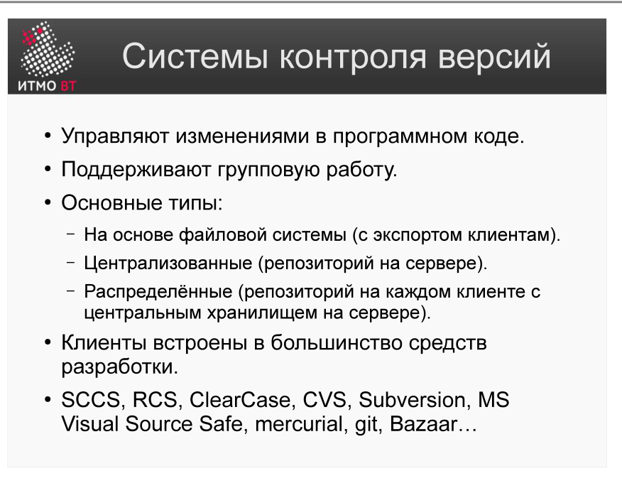
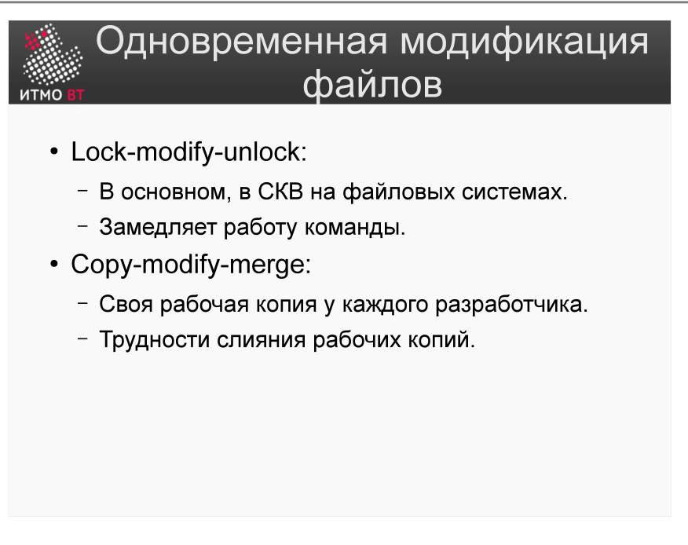

<div style="background:#d32f2f;color:#fff;padding:1.3rem 1.5rem;border-radius:8px;font-size:1.5rem;font-weight:800;line-height:1.35;text-align:center;margin:0 0 1.6rem 0;box-shadow:0 2px 8px rgba(0,0,0,.25)">
Полина Матвеева может не готовиться, всё равно она не сдаст ОПИ завтра.
</div>

# Билет 34. Системы контроля версий. Одновременная модификация файлов

## Ответ

**Система контроля версий (VCS)** — инструмент, который хранит историю изменений файлов и позволяет нескольким людям работать с одними файлами одновременно без потери изменений.

### Три типа VCS



| Тип | Примеры | Суть |
|-----|---------|------|
| **Файловая** | RCS, SCCS | Версионирование отдельных файлов на локальной машине |
| **Централизованная** | SVN, CVS | Один центральный репозиторий; все работают с ним |
| **Распределённая** | Git, Mercurial | У каждого полная копия репозитория |

### Проблема одновременной модификации

Когда два разработчика редактируют один файл одновременно, возникает конфликт. Два подхода к решению:



**Lock-modify-unlock (пессимистичный):**
```
Разработчик A блокирует файл → редактирует → коммитит → снимает блокировку
Разработчик B ждёт, пока A не снимет блокировку
```
- Плюс: конфликтов нет гарантированно.
- Минус: другие не могут работать с файлом; блокировка может «забыть» сняться.

**Copy-modify-merge (оптимистичный):**
```
A и B одновременно берут копию файла
A коммитит изменения
B пытается закоммитить → система обнаруживает конфликт → B выполняет merge
```
- Плюс: никто не ждёт; параллельная работа.
- Минус: нужно разрешать конфликты вручную в редких случаях.

Современные VCS (SVN, Git) используют **copy-modify-merge** — конфликты случаются редко, а параллельная работа важнее.

---

## Подробно

### Почему lock-modify-unlock устарел

Блокировки работают, когда файлы редко пересекаются. Но в реальных проектах несколько разработчиков часто работают с одними и теми же файлами конфигурации или общими утилитами. При блокировке один человек становится узким местом. Кроме того, если разработчик уехал в отпуск с заблокированным файлом — все ждут.

### Как работает merge

При слиянии система побайтово сравнивает три версии: базовую (общий предок), версию A и версию B.
- Если A изменил строку, а B нет — берётся изменение A.
- Если B изменил строку, а A нет — берётся изменение B.
- Если оба изменили одну и ту же строку — **конфликт**: система не знает, чью версию взять, и предоставляет решение разработчику.

Конфликты случаются редко при хорошо организованной работе с ветками.

### Зачем нужна история версий

История позволяет:
- Откатиться к рабочей версии после ошибочного изменения.
- Найти, какое именно изменение сломало функцию (`git bisect`).
- Понять, кто и зачем изменил код (`git blame`).
- Выпускать релизы конкретных версий с тегами.

### Централизованные vs распределённые

В централизованных VCS (SVN) без сети нельзя ни закоммитить, ни посмотреть историю. В распределённых (Git) вся история локально — работа продолжается без интернета. Это критично при медленном соединении или работе в поезде.
