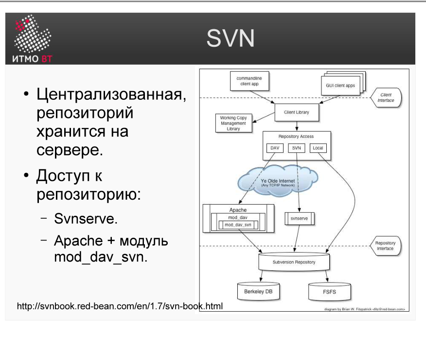
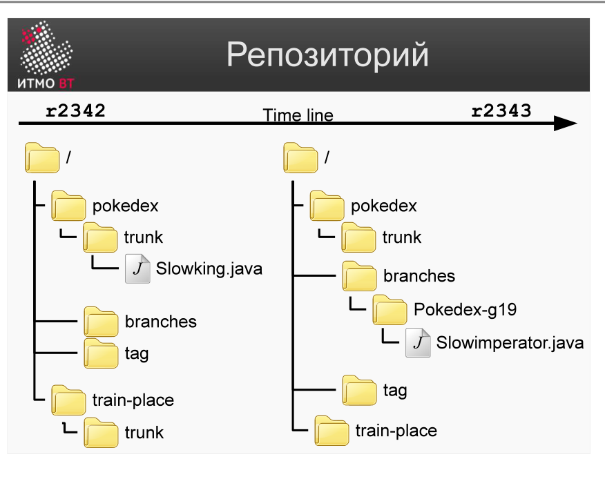
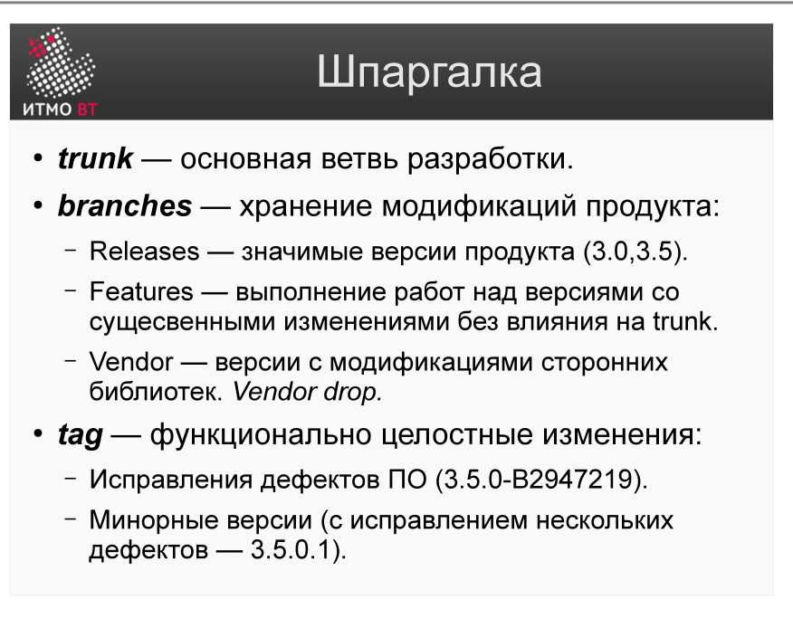

<div style="background:#d32f2f;color:#fff;padding:1.3rem 1.5rem;border-radius:8px;font-size:1.5rem;font-weight:800;line-height:1.35;text-align:center;margin:0 0 1.6rem 0;box-shadow:0 2px 8px rgba(0,0,0,.25)">
Полина Матвеева может не готовиться, всё равно она не сдаст ОПИ завтра.
</div>

# Билет 35. Subversion. Архитектура системы и репозиторий

## Ответ

**Subversion (SVN)** — централизованная система контроля версий. Все версии хранятся в одном центральном репозитории; разработчики получают рабочие копии и синхронизируются с сервером.

### Архитектура



Два варианта серверного доступа:
- **svnserve** — лёгкий встроенный сервер SVN, работает по протоколу `svn://`.
- **Apache + mod_dav_svn** — полноценный веб-сервер, работает по `http://` или `https://`; поддерживает аутентификацию через веб.

На стороне клиента — **Client Library**, которая скрывает детали протокола и используется командной строкой (`svn`) и GUI-клиентами (TortoiseSVN).

### Репозиторий SVN



- **Ревизия (revision)** — глобальный счётчик, увеличивается при каждом коммите. Ревизия 1 — начальное состояние, ревизия N — текущее.
- **Timeline** — линейная история изменений всего репозитория.
- В отличие от Git, ревизия в SVN относится ко всему репозиторию, а не к отдельному файлу.

### Структура папок репозитория



```
/project
  /trunk       — основная линия разработки
  /branches    — ветки для параллельных работ
    /feature-login
    /hotfix-1.2.1
  /tags        — неизменяемые снимки релизов
    /release-1.0
    /release-1.1
```

| Директория | Назначение |
|------------|------------|
| **trunk** | Текущая активная разработка |
| **branches** | Изолированные ветки: фичи, багфиксы |
| **tags** | Снимки релизов — по соглашению не изменяются |

---

## Подробно

### Почему структура trunk/branches/tags — соглашение, а не обязательство

SVN не имеет встроенного понятия «ветка» — это просто директории. Ветвление реализуется через `svn copy`, которая создаёт «дешёвую копию» (только ссылка, без дублирования данных). trunk/branches/tags — общепринятое соглашение, которого придерживаются все проекты для единообразия.

### Дешёвые копии (cheap copies)

Когда SVN создаёт ветку (`svn copy /trunk /branches/feature`), он не копирует физически все файлы. Вместо этого в репозитории хранится только «эта ветка — копия trunk с ревизии N». Разница накапливается только в новых коммитах ветки. Это делает создание веток мгновенным независимо от размера проекта.

### Глобальные ревизии vs локальные

В SVN ревизия — это состояние *всего репозитория*. Коммит одного файла увеличивает глобальный счётчик ревизий для всех. В Git каждый коммит имеет уникальный хэш и относится к конкретному снимку (snapshot) дерева файлов. Это принципиальное различие в модели хранения.

### Зачем tags неизменяемы

Tags — релизные метки. Если в tag ничего не коммитить, он всегда указывает на одно и то же состояние кода. Это позволяет воспроизвести сборку версии 1.0 через год без изменений. По соглашению, в tags не пишут — но технически SVN это не запрещает (в отличие от Git, где теги можно защитить).

### Apache vs svnserve

- **svnserve** проще в настройке, подходит для небольших команд во внутренней сети.
- **Apache** нужен для тонкой настройки прав доступа, HTTPS, интеграции с LDAP/Active Directory и поддержки WebDAV-клиентов.
