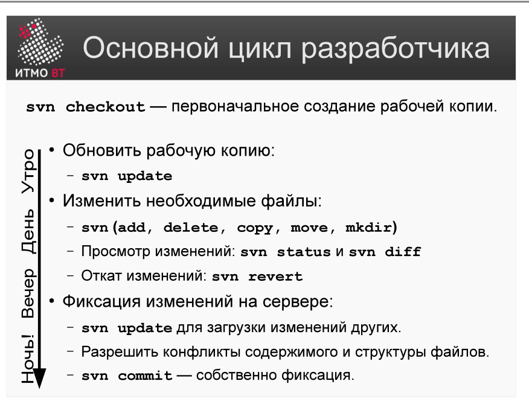

# Билет 36. Subversion: Основной цикл разработчика. Команды

## Ответ

Основной цикл работы разработчика в SVN — четыре повторяющихся шага:



```
checkout → update → modify → commit → update → modify → commit → …
```

### Команды и их назначение

| Команда | Что делает |
|---------|------------|
| `svn checkout <url>` | Получить рабочую копию из репозитория (один раз) |
| `svn update` | Обновить рабочую копию до последней ревизии с сервера |
| `svn add <файл>` | Поставить новый файл под контроль версий |
| `svn delete <файл>` | Удалить файл (физически и из VCS) |
| `svn commit -m "комментарий"` | Отправить изменения на сервер |
| `svn status` | Показать состояние рабочей копии (M — изменён, A — добавлен, ? — не отслеживается) |
| `svn diff` | Показать разницу между рабочей копией и последней ревизией |
| `svn revert <файл>` | Отменить локальные изменения (до состояния сервера) |
| `svn log` | История коммитов с комментариями |
| `svn info` | Информация о текущей рабочей копии (URL, ревизия) |

### Флаги команд

```bash
svn checkout https://repo.example.com/project/trunk myproject
svn update                          # обновить всё
svn update -r 42                    # откатиться к ревизии 42
svn commit -m "REQ-05: добавить корзину покупок"
svn diff -r 10:15                   # разница между ревизиями 10 и 15
```

---

## Подробно

### Почему update перед commit — обязательный шаг

SVN не позволит закоммитить изменения, если рабочая копия устарела. Перед коммитом всегда нужно обновиться (`svn update`), чтобы получить свежие изменения коллег и разрешить конфликты локально. Только после этого коммит пройдёт.

### Разница checkout и update

- `checkout` выполняется один раз — создаёт рабочую копию в новой директории.
- `update` выполняется перед каждым циклом работы — обновляет существующую рабочую копию.

### Что хранит рабочая копия

Рабочая копия — это не просто набор файлов. Внутри каждой директории SVN создаёт скрытую папку `.svn`, в которой хранит:
- URL репозитория и ревизию рабочей копии.
- «Чистые» версии файлов (для diff и revert без обращения к серверу).

Это позволяет работать оффлайн: `svn diff` и `svn status` работают без сети.

### Атомарность коммитов

Коммит в SVN атомарен: либо все изменения сохраняются в репозитории, либо ни одно (при ошибке). Это исключает ситуацию, когда часть изменений попала в репозиторий, а часть — нет.

### Хороший стиль коммитов

- Один коммит — одна логическая единица изменения (одна задача, один баг).
- Комментарий начинается с идентификатора задачи: `REQ-05:` или `BUG-123:`.
- Не коммитить «сломанный» код — после каждого коммита должна проходить сборка.
