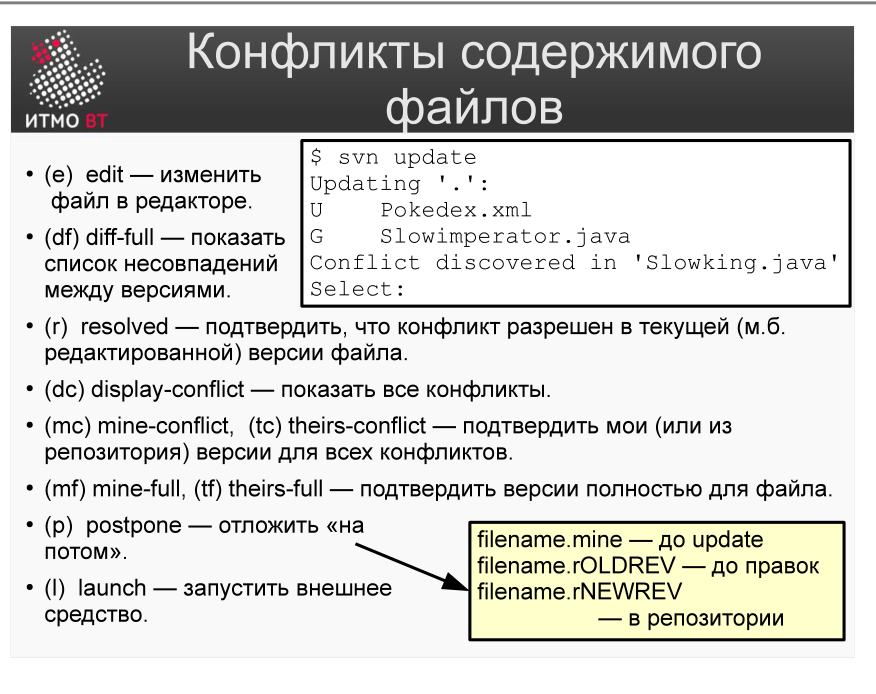
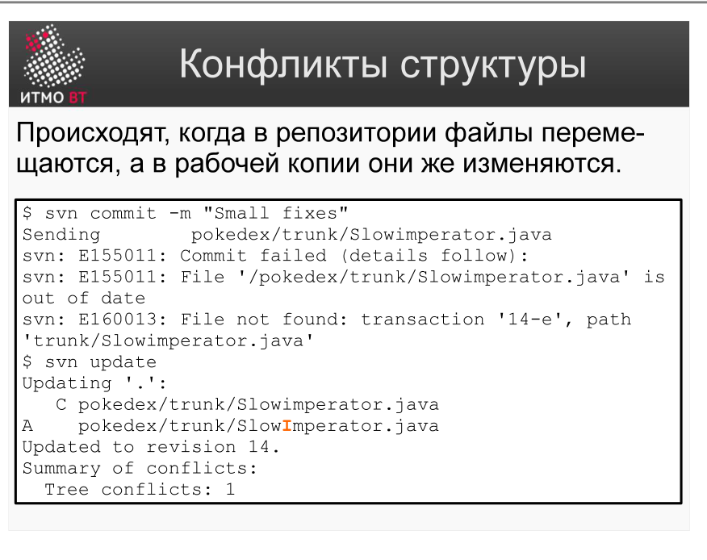
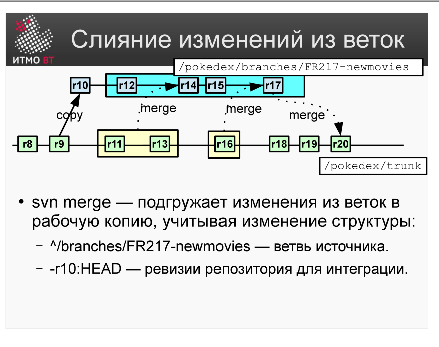

# Билет 37. Subversion: Конфликты. Слияние изменений

## Ответ

### Конфликты содержимого файлов

Конфликт возникает, когда два разработчика изменили одну и ту же строку в одном файле. При `svn update` SVN отмечает файл как конфликтный (статус `C`).



SVN создаёт три вспомогательных файла рядом с конфликтным:
- `file.txt.mine` — моя версия.
- `file.txt.rN` — версия из ревизии N (до моих изменений).
- `file.txt.rM` — версия из ревизии M (изменения коллеги с сервера).

**Команды разрешения:**

| Команда | Действие |
|---------|----------|
| `svn resolve --accept mine-full <файл>` | Взять мою версию |
| `svn resolve --accept theirs-full <файл>` | Взять версию сервера |
| `svn resolve --accept working <файл>` | Принять текущее состояние файла (после ручного редактирования) |

### Конфликты структуры (tree conflicts)

Возникают, когда операции над файлами конфликтуют (например, один разработчик удалил файл, другой его изменил).



Разрешаются командой `svn resolve` после ручного анализа ситуации.

### Слияние изменений из веток (svn merge)

Позволяет перенести изменения из одной ветки в другую (например, из feature-ветки в trunk).



```bash
# Перейти в рабочую копию trunk
cd myproject-trunk

# Влить изменения из feature-ветки
svn merge https://repo/project/branches/feature-login

# Проверить результат, разрешить конфликты
svn status

# Закоммитить слияние
svn commit -m "Merge: feature-login → trunk"
```

SVN автоматически определяет, какие ревизии ветки ещё не были влиты (tracking merge info).

---

## Подробно

### Как SVN маркирует конфликт в файле

Внутри конфликтного файла SVN расставляет маркеры:

```
<<<<<<< .mine
моя версия строки
=======
версия с сервера
>>>>>>> .r42
```

Разработчик вручную редактирует файл — оставляет нужную версию и убирает маркеры. Затем сообщает SVN, что конфликт разрешён: `svn resolve --accept working файл.txt`.

### Почему нельзя просто удалить вспомогательные файлы

SVN отслеживает факт наличия конфликта через метаданные в `.svn`. Просто удалить `file.txt.mine` и `file.txt.rN` недостаточно — SVN по-прежнему будет считать файл конфликтным. Нужно явно вызвать `svn resolve`.

### merge info

SVN хранит в свойстве `svn:mergeinfo` информацию о том, какие ревизии уже были влиты из каких веток. Это позволяет повторно вызывать `svn merge` без риска повторного применения тех же изменений (double-merge). При каждом слиянии SVN обновляет `svn:mergeinfo`.

### Типичная стратегия работы с ветками в SVN

```
trunk:  ─── r1 ─── r2 ─── r3 ──────────── r8 (merge) ──────
              \                              /
branch:        r4 ─── r5 ─── r6 ─── r7 ──
```

Разработчик создаёт ветку от trunk, работает в ней, периодически синхронизирует (`svn merge` из trunk в branch), затем вливает в trunk.
