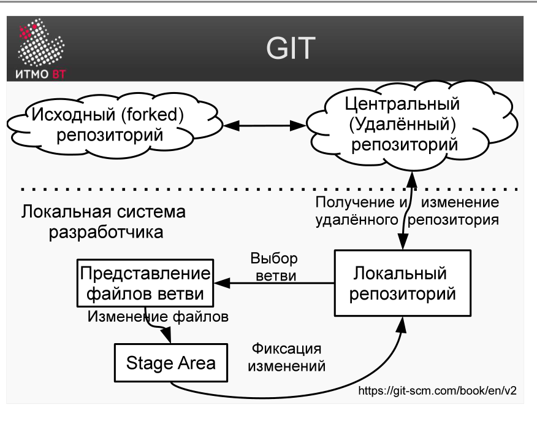
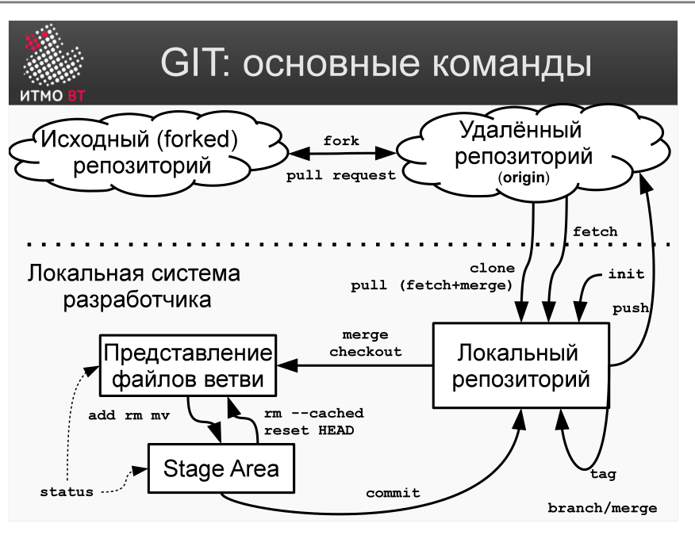
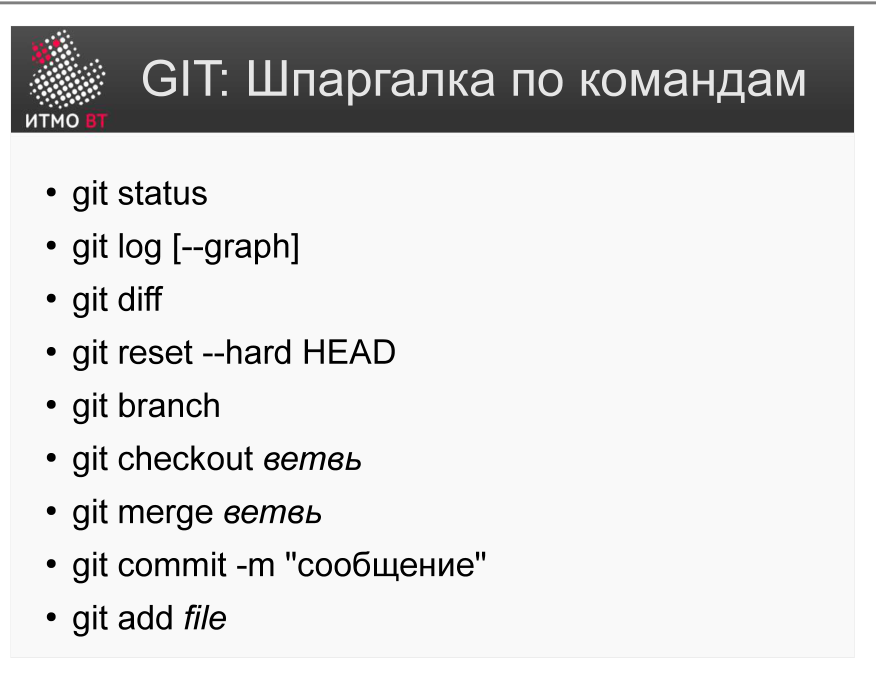

!!! danger "ВНИМАНИЕ"
    Теперь использование данного конспекта является платным. I am Michael from Microsoft support, send 5000$ to my PayPal account

# Билет 38. GIT: Архитектура и команды

## Ответ

**Git** — распределённая система контроля версий. Каждый разработчик имеет *полную* копию репозитория с полной историей — это принципиальное отличие от централизованных систем.

### Архитектура: три уровня



```
Working Directory  →  Stage Area (Index)  →  Local Repo  →  Remote Repo
(рабочая папка)       (подготовка)            (локальный)     (GitHub/GitLab)
```

- **Working Directory** — файлы на диске, с которыми работает разработчик.
- **Stage Area (Index)** — промежуточная зона: сюда добавляют изменения перед коммитом (`git add`).
- **Local Repo** — локальная история коммитов (`.git/`), полная копия всего репозитория.
- **Remote Repo** — общий сервер (GitHub, GitLab); синхронизация через push/pull.

### Рабочий процесс и команды



| Команда | Действие |
|---------|----------|
| `git clone <url>` | Скопировать удалённый репозиторий локально |
| `git add <файл>` | Добавить изменения в Stage Area |
| `git commit -m "..."` | Зафиксировать Stage Area как коммит в Local Repo |
| `git push` | Отправить локальные коммиты на Remote Repo |
| `git pull` | Получить изменения с Remote Repo и смержить в текущую ветку |
| `git fetch` | Получить изменения с Remote Repo (без мержа в рабочую ветку) |
| `git merge <ветка>` | Влить указанную ветку в текущую |
| `git status` | Показать состояние Working Directory и Stage Area |
| `git log` | История коммитов |
| `git diff` | Разница между Working Directory и Stage Area |



---

## Подробно

### Зачем нужен Stage Area

Stage Area кажется лишним шагом, но он даёт важную гибкость: можно изменить три файла, но в коммит добавить только два. Это позволяет делать атомарные коммиты — каждый коммит содержит ровно одну логическую единицу изменений, даже если в рабочей папке накоплено больше.

### Как Git хранит данные: снимки, не дельты

SVN хранит разницу (delta) между версиями файлов. Git хранит **снимки (snapshots)** всего дерева файлов при каждом коммите. Если файл не изменился — Git просто ссылается на прежний снимок. Это делает переключение веток мгновенным и позволяет работать с историей оффлайн.

### Хэши вместо ревизий

Каждый коммит в Git идентифицируется SHA-1 хэшем (40 символов), вычисляемым из содержимого. Это гарантирует целостность: невозможно изменить коммит, не изменив его хэш. Достаточно первых 7 символов для уникальной идентификации в большинстве репозиториев.

### pull vs fetch

- `git fetch` скачивает изменения с сервера в локальный репозиторий, но не трогает рабочую ветку. Можно изучить изменения (`git log origin/main`) перед слиянием.
- `git pull` = `git fetch` + `git merge`. Сразу обновляет рабочую ветку.

Правило: при командной работе лучше использовать `fetch` + ручной `merge`, чтобы понимать, что именно меняется.

### Рабочие процессы (workflows)

Git поддерживает разные стили командной работы:
- **Centralized workflow** — один репозиторий, все пушат в main (аналог SVN).
- **Feature branch workflow** — для каждой задачи отдельная ветка, мерж через pull request.
- **Fork workflow** — каждый форкает репозиторий, изменения через pull request (типично для open source).
