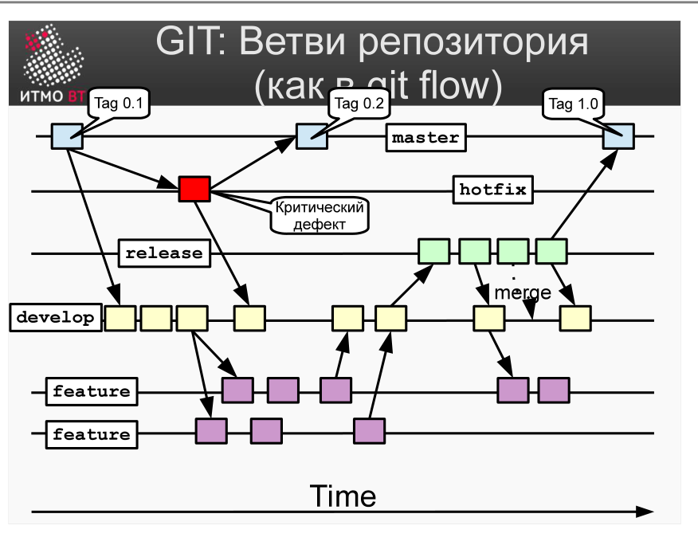

<div style="background:#d32f2f;color:#fff;padding:1.3rem 1.5rem;border-radius:8px;font-size:1.5rem;font-weight:800;line-height:1.35;text-align:center;margin:0 0 1.6rem 0;box-shadow:0 2px 8px rgba(0,0,0,.25)">
Полина Матвеева может не готовиться, всё равно она не сдаст ОПИ завтра.
</div>

# Билет 39. GIT: Организация ветвей репозитория

## Ответ

В Git принято структурировать ветки по назначению. Стандартная модель ветвления (Vincent Driessen / git-flow):



### Пять типов веток

| Ветка | Тип | Назначение |
|-------|-----|------------|
| **main** (master) | Постоянная | Стабильный код в продакшне. Каждый коммит — это релиз. |
| **develop** | Постоянная | Основная линия разработки. Интеграция завершённых фич. |
| **feature/\*** | Временная | Разработка новой функциональности. Ответвляется от develop, вливается обратно в develop. |
| **release/\*** | Временная | Подготовка релиза (тесты, багфиксы, версионирование). Из develop → вливается в main и develop. |
| **hotfix/\*** | Временная | Критические исправления в продакшне. Из main → вливается в main и develop. |

### Жизненный цикл фичи

```
develop ──────────────────────────────────→ develop
    \                                      /
     feature/login ──────────────────────
```

### Жизненный цикл релиза

```
develop ─────────────────────────→ develop
    \                             /
     release/1.2 ───────────────── → main (тег v1.2)
```

### Жизненный цикл хотфикса

```
main ──────────────────────── → main (тег v1.2.1)
    \                         /
     hotfix/1.2.1 ─────────── → develop
```

---

## Подробно

### Почему две постоянные ветки

Одна постоянная ветка (только main) означает, что разработчики коммитят напрямую в релизный код. Это рискованно: нестабильный код может попасть в продакшн. Разделение на main (только стабильный код) и develop (интеграция всех изменений) создаёт буфер безопасности.

### Ветки feature/* — изоляция работы

Каждая задача — отдельная ветка. Преимущества:
- Разработчики не мешают друг другу, пока пишут код.
- Фичу можно откатить, просто не вливая ветку в develop.
- Code review через pull request происходит до мержа.

Ветки feature именуют по задаче: `feature/user-auth`, `feature/cart-checkout`.

### Release-ветка: зачем она нужна

Когда develop готов к релизу, создаётся release-ветка. В ней разрешены только исправления багов и обновление версии — никаких новых фич. Это позволяет команде продолжать разрабатывать следующую версию в develop, пока отдел QA тестирует release/1.2.

### Hotfix — прямо в продакшн

Если в релизе обнаружен критический баг, нельзя ждать следующего релизного цикла. Hotfix создаётся из main, исправление делается там, затем вливается и в main (новый патч-релиз) и в develop (чтобы исправление не потерялось в следующей версии).

### Команды для работы с ветками

```bash
git branch                    # список веток
git branch feature/login      # создать ветку
git checkout feature/login    # переключиться на ветку
git checkout -b feature/login # создать и переключиться
git merge feature/login       # влить ветку в текущую
git branch -d feature/login   # удалить ветку
```
