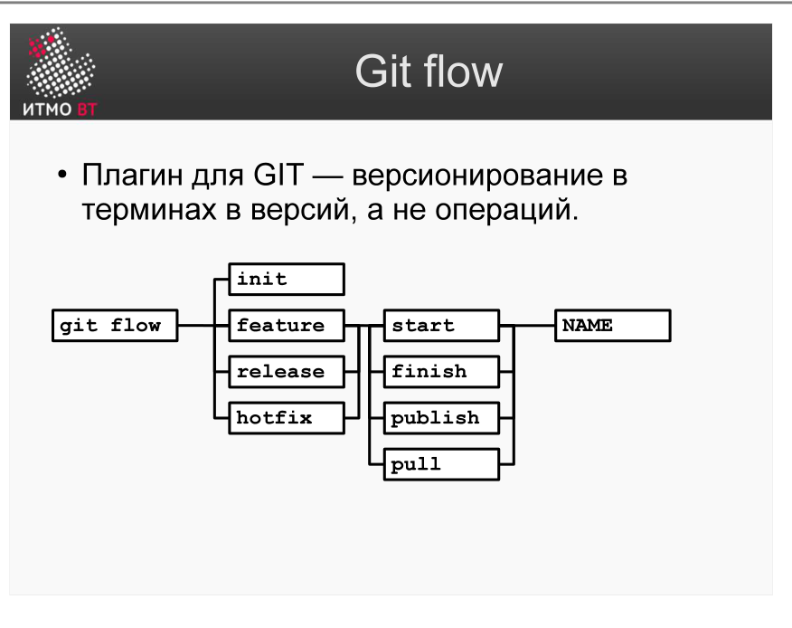

<div style="background:#d32f2f;color:#fff;padding:1.3rem 1.5rem;border-radius:8px;font-size:1.5rem;font-weight:800;line-height:1.35;text-align:center;margin:0 0 1.6rem 0;box-shadow:0 2px 8px rgba(0,0,0,.25)">
Полина Матвеева может не готовиться, всё равно она не сдаст ОПИ завтра.
</div>

# Билет 40. GIT: Плагин git-flow

## Ответ

**git-flow** — плагин для Git, который автоматизирует работу с моделью ветвления из [билета 39](39-git-branches.md). Вместо того чтобы вручную создавать ветку, переключаться, вливать и удалять, git-flow делает всё одной командой.

### Команды git-flow



#### Инициализация

```bash
git flow init
# Интерактивно спрашивает названия веток:
# main branch: main
# develop branch: develop
# feature prefix: feature/
# release prefix: release/
# hotfix prefix: hotfix/
```

#### Работа с фичами

```bash
git flow feature start login        # создать ветку feature/login от develop
# ... разработка ...
git flow feature finish login       # влить feature/login в develop, удалить ветку
git flow feature publish login      # опубликовать ветку на Remote Repo (для командной работы)
```

#### Работа с релизами

```bash
git flow release start 1.2          # создать ветку release/1.2 от develop
# ... финальные исправления, обновление версии ...
git flow release finish 1.2         # влить в main (с тегом v1.2) и в develop, удалить ветку
```

#### Работа с хотфиксами

```bash
git flow hotfix start 1.2.1         # создать ветку hotfix/1.2.1 от main
# ... исправление ...
git flow hotfix finish 1.2.1        # влить в main (с тегом v1.2.1) и в develop, удалить ветку
```

### Что делает finish под капотом

| Команда | Эквивалент в чистом Git |
|---------|------------------------|
| `feature finish X` | `checkout develop` → `merge feature/X` → `branch -d feature/X` |
| `release finish X` | `checkout main` → `merge release/X` → `tag vX` → `checkout develop` → `merge release/X` → `branch -d release/X` |
| `hotfix finish X` | То же, что release finish, но от main |

---

## Подробно

### Зачем нужен плагин, если есть git

git-flow решает проблему «а в какую ветку вливать и нужно ли удалять?». Без плагина разработчик должен помнить: feature вливается в develop; release — и в main, и в develop; hotfix — и в main, и в develop; при finish нужно удалить ветку; release и hotfix нужно тегировать. Одна ошибка — и нарушена модель ветвления.

### Тегирование релизов

`release finish` и `hotfix finish` автоматически создают тег с именем версии (например, `v1.2`). Теги в Git — постоянные ссылки на конкретные коммиты. Это позволяет в любой момент сделать `git checkout v1.2` и воспроизвести состояние кода на момент релиза.

### git-flow в CI/CD

В современных командах git-flow часто интегрирован с CI/CD:
- push в develop → автоматический деплой на staging.
- push в main → автоматический деплой в production.
- Создание тега → автоматическая сборка релизного артефакта (jar, docker image).

### Альтернативы

**GitHub Flow** — упрощённая альтернатива: только main + feature-ветки. Нет develop, нет release-веток. Подходит для проектов с непрерывной доставкой (CI/CD каждый день). Git-flow подходит для проектов с дискретными версионированными релизами.
