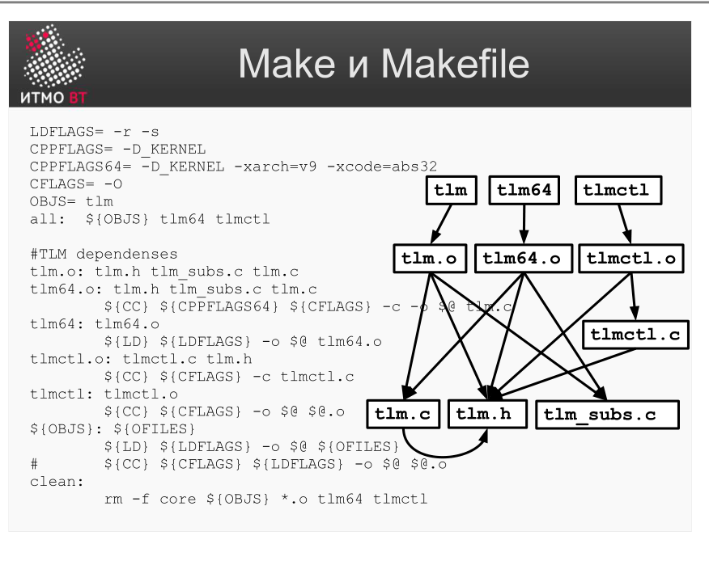

!!! danger "ВНИМАНИЕ"
    Теперь использование данного конспекта является платным. I am Michael from Microsoft support, send 5000$ to my PayPal account

# Билет 42. Системы сборки: Make и Makefile

## Ответ

**Make** — классическая система автоматической сборки. Читает файл `Makefile`, в котором описаны цели (targets), их зависимости и команды для достижения цели.

### Синтаксис Makefile



```makefile
цель: зависимость1 зависимость2
	команда1
	команда2
```

Отступы — обязательно **табуляция** (не пробелы).

### Пример Makefile

```makefile
# Сборка программы из двух файлов
program: main.o utils.o
	gcc -o program main.o utils.o

main.o: main.c
	gcc -c main.c

utils.o: utils.c utils.h
	gcc -c utils.c

clean:
	rm -f *.o program
```

**Граф зависимостей:**
```
program
  ├── main.o  ← main.c
  └── utils.o ← utils.c, utils.h
```

### Как работает Make

1. Читает Makefile.
2. Строит граф зависимостей.
3. Сравнивает время изменения цели и зависимостей.
4. Пересобирает только то, что устарело (инкрементальная сборка).

```bash
make           # собрать цель по умолчанию (первая в файле)
make program   # собрать конкретную цель
make clean     # выполнить цель clean (удалить артефакты)
```

---

## Подробно

### Инкрементальность — главная идея Make

Make не пересобирает то, что не изменилось. Если изменили `utils.c`, Make пересобирает `utils.o` и `program`, но не трогает `main.o`. Это критично для больших проектов, где полная сборка занимает часы.

Механизм прост: Make сравнивает timestamp файла-цели и файлов-зависимостей. Если зависимость новее цели — цель устарела, нужно пересобрать.

### Переменные и автоматические переменные

```makefile
CC = gcc
CFLAGS = -Wall -O2
SRCS = main.c utils.c
OBJS = $(SRCS:.c=.o)  # подстановка: main.o utils.o

program: $(OBJS)
	$(CC) $(CFLAGS) -o $@ $^

%.o: %.c
	$(CC) $(CFLAGS) -c $< -o $@
```

Специальные переменные:
- `$@` — имя текущей цели.
- `$<` — первая зависимость.
- `$^` — все зависимости.
- `%.o: %.c` — шаблонное правило: любой `.o` из соответствующего `.c`.

### Фиктивные цели (phony targets)

`clean`, `all`, `install` — не файлы, а псевдонимы для действий. Их нужно объявлять явно:

```makefile
.PHONY: clean all

clean:
	rm -f *.o program
```

Без `.PHONY`: если вдруг появится файл с именем `clean`, Make решит, что цель уже достигнута, и не выполнит команды.

### Ограничения Make

- Синтаксис с табуляциями — источник трудноуловимых ошибок.
- Плохо работает с Windows (нет встроенной поддержки).
- Не управляет зависимостями (библиотеками): только компиляция и линковка.
- Для Java сложно: Maven и Gradle справляются лучше.
