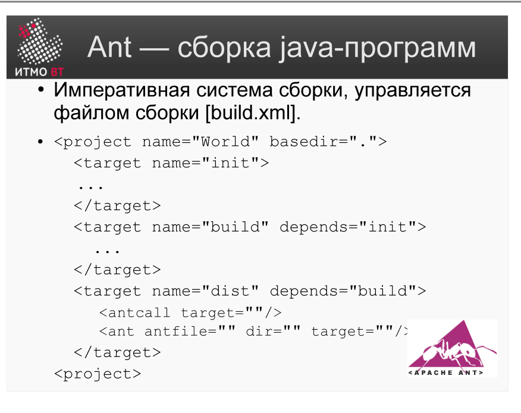
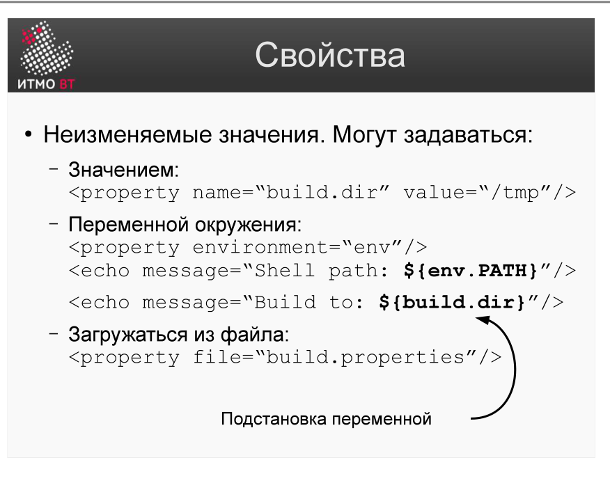
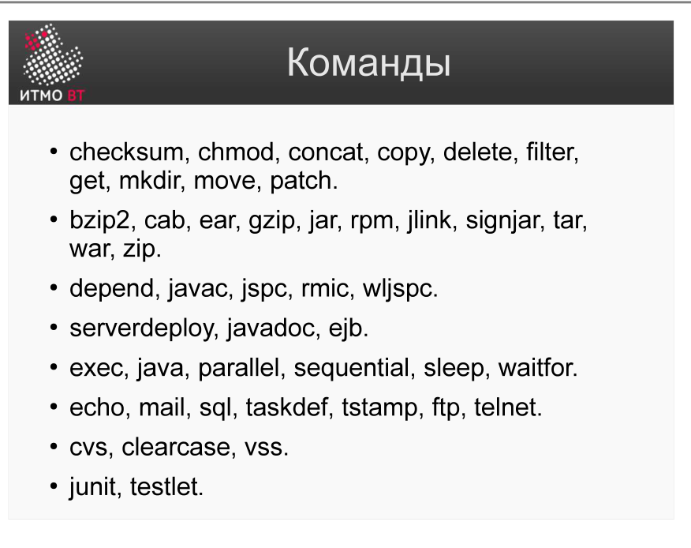

!!! danger "ВНИМАНИЕ"
    Теперь использование данного конспекта является платным. I am Michael from Microsoft support, send 5000$ to my PayPal account

# Билет 43. Системы сборки: Ant. Команды Ant

## Ответ

**Apache Ant** — система сборки для Java-проектов. Конфигурация — XML-файл `build.xml`. Ant не навязывает структуру проекта: разработчик описывает *все* шаги явно.

### Структура build.xml



```xml
<project name="MyProject" default="build" basedir=".">

    <!-- Свойства -->
    <property name="src.dir" value="src"/>
    <property name="build.dir" value="build"/>

    <!-- Цель: очистить -->
    <target name="clean">
        <delete dir="${build.dir}"/>
    </target>

    <!-- Цель: скомпилировать, зависит от clean -->
    <target name="compile" depends="clean">
        <mkdir dir="${build.dir}/classes"/>
        <javac srcdir="${src.dir}" destdir="${build.dir}/classes"/>
    </target>

    <!-- Цель: упаковать в jar -->
    <target name="build" depends="compile">
        <jar destfile="${build.dir}/app.jar" basedir="${build.dir}/classes"/>
    </target>

</project>
```

### Свойства (properties)



```xml
<!-- Из значения -->
<property name="version" value="1.0.0"/>

<!-- Из переменной окружения -->
<property environment="env"/>
<echo message="Java: ${env.JAVA_HOME}"/>

<!-- Из файла -->
<property file="build.properties"/>
```

### Основные команды (tasks)



| Task | Назначение |
|------|-----------|
| `<javac>` | Компиляция Java-кода |
| `<jar>` | Упаковка в JAR-архив |
| `<copy>` | Копирование файлов |
| `<delete>` | Удаление файлов/директорий |
| `<mkdir>` | Создание директории |
| `<exec>` | Запуск внешней программы |
| `<junit>` | Запуск JUnit-тестов |
| `<echo>` | Вывод сообщения в консоль |
| `<zip>` / `<unzip>` | Архивирование |
| `<ftp>` | Передача файлов по FTP |

```bash
ant           # выполнить default-цель
ant compile   # выполнить конкретную цель
ant -f other.xml build  # использовать другой файл сборки
```

---

## Подробно

### Ant vs Make

| Критерий | Make | Ant |
|----------|------|-----|
| Конфигурация | Makefile (свой синтаксис) | build.xml (XML) |
| Инкрементальность | Да (по timestamp файлов) | Нет (явно описывается) |
| Платформа | Unix-ориентирован | Кроссплатформенный (JVM) |
| Управление зависимостями | Нет | Нет (нужен Ant-Ivy) |
| Язык проекта | C/C++ | Java |

### Зависимости между целями

```xml
<target name="test" depends="compile">
```

Цепочка зависимостей выстраивается через атрибут `depends`. Ant выполняет цели в правильном порядке, избегая повторного выполнения одной цели дважды в рамках одного запуска.

### Условное выполнение

```xml
<target name="compile-debug" depends="init" if="debug.mode">
    <javac srcdir="${src}" debug="true" .../>
</target>
```

Атрибуты `if` и `unless` позволяют выполнять цели только при наличии (или отсутствии) заданного свойства.

### Встроенные типы данных

Ant имеет встроенные структуры для описания наборов файлов:

```xml
<fileset dir="src" includes="**/*.java" excludes="**/Test*.java"/>
<path id="classpath">
    <fileset dir="lib" includes="*.jar"/>
</path>
```

### Почему Ant устарел для новых проектов

Ant требует явно описывать каждый шаг — это гибко, но многословно. Maven и Gradle ввели конвенции («по умолчанию класть исходники в `src/main/java`») и управление зависимостями. Ant остался актуальным только в старых проектах и как исполнитель низкоуровневых задач под Maven/Gradle.
