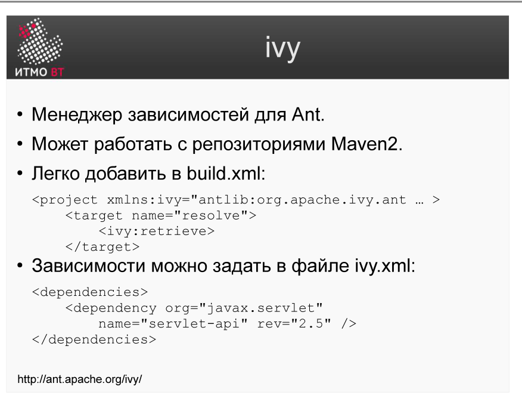

!!! danger "ВНИМАНИЕ"
    Теперь использование данного конспекта является платным. I am Michael from Microsoft support, send 5000$ to my PayPal account

# Билет 44. Системы сборки: Ant-ivy

## Ответ

**Apache Ivy** — менеджер зависимостей для Ant. Ant умеет компилировать и упаковывать, но не знает, как скачать нужные библиотеки из интернета. Ivy решает именно эту задачу.

### Как работает Ivy



Два основных действия:

1. **Resolve** — скачать нужные зависимости из удалённого репозитория в локальный кэш Ivy.
2. **Retrieve** — скопировать нужные JAR-файлы из кэша в папку проекта (`lib/`).

```
Удалённый репозиторий (Maven Central) → Локальный кэш Ivy → lib/ проекта
```

### Файл ivy.xml — декларация зависимостей

```xml
<ivy-module version="2.0">
    <info organisation="com.example" module="myapp"/>

    <dependencies>
        <dependency org="org.apache.commons" name="commons-lang3" rev="3.12.0"/>
        <dependency org="junit" name="junit" rev="4.13.2" conf="test->default"/>
    </dependencies>
</ivy-module>
```

### Интеграция с Ant (build.xml)

```xml
<!-- Загрузить задачи Ivy -->
<taskdef resource="org/apache/ivy/ant/antlib.xml"/>

<target name="resolve">
    <ivy:retrieve pattern="lib/[artifact]-[revision].[ext]"/>
</target>

<target name="compile" depends="resolve">
    <javac srcdir="src" destdir="build/classes">
        <classpath>
            <fileset dir="lib" includes="*.jar"/>
        </classpath>
    </javac>
</target>
```

---

## Подробно

### Зачем нужен менеджер зависимостей

Без Ivy разработчик вручную скачивает JAR-файлы, кладёт их в папку `lib/` и коммитит в репозиторий. Проблемы:
- JAR-файлы в репозитории раздувают его размер.
- При обновлении библиотеки нужно вручную заменить файл.
- Транзитивные зависимости (зависимости зависимостей) приходится скачивать вручную.

Ivy автоматически разрешает транзитивные зависимости: запросил `commons-lang3` — Ivy сам найдёт и скачает всё, что нужно для её работы.

### Конфигурации (conf)

Ivy поддерживает конфигурации — профили зависимостей:
- `compile` — нужны только при компиляции.
- `runtime` — нужны при запуске.
- `test` — нужны только при тестировании.

```xml
<dependency org="junit" name="junit" rev="4.13" conf="test->default"/>
```

Это значит: в конфигурацию `test` добавить зависимость junit из её конфигурации `default`.

### Репозитории

По умолчанию Ivy ищет зависимости в репозиториях, настроенных в `ivysettings.xml`. Можно подключить Maven Central, корпоративный Nexus или Artifactory.

### Ivy vs Maven

Maven объединяет управление зависимостями и сборку в одном инструменте. Ivy — только управление зависимостями, но работает с Ant. Выбор Ivy имеет смысл, если проект уже на Ant и перейти на Maven нецелесообразно.
