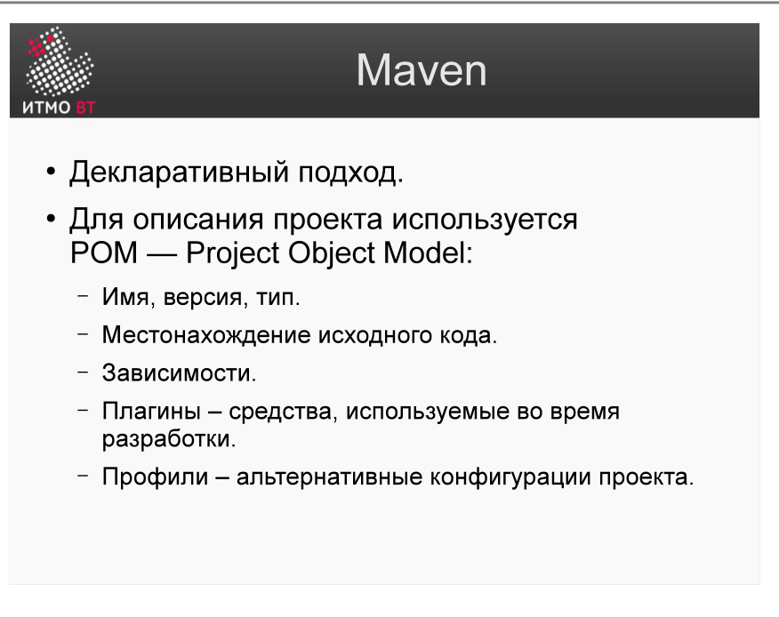
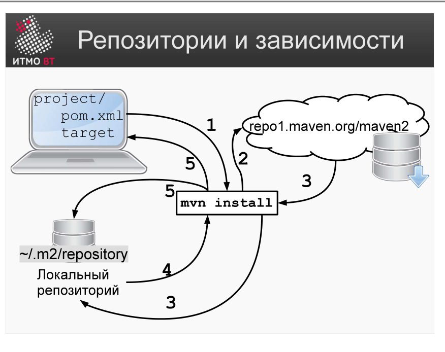

<div style="background:#d32f2f;color:#fff;padding:1.3rem 1.5rem;border-radius:8px;font-size:1.5rem;font-weight:800;line-height:1.35;text-align:center;margin:0 0 1.6rem 0;box-shadow:0 2px 8px rgba(0,0,0,.25)">
Полина Матвеева может не готовиться, всё равно она не сдаст ОПИ завтра.
</div>

# Билет 45. Системы сборки: Maven. POM. Репозитории и зависимости

## Ответ

**Maven** — система сборки и управления зависимостями для Java-проектов. Ключевое отличие от Ant: Maven использует **декларативный подход** — разработчик описывает *что* нужно сделать, а не *как*.

### POM (Project Object Model)

**POM** — файл `pom.xml`, центральный файл конфигурации Maven. Описывает проект, его зависимости и параметры сборки.



```xml
<project>
    <modelVersion>4.0.0</modelVersion>

    <!-- Координаты проекта (GAV) -->
    <groupId>com.example</groupId>
    <artifactId>myapp</artifactId>
    <version>1.0.0</version>
    <packaging>jar</packaging>

    <dependencies>
        <dependency>
            <groupId>junit</groupId>
            <artifactId>junit</artifactId>
            <version>4.13.2</version>
            <scope>test</scope>
        </dependency>
    </dependencies>
</project>
```

### Репозитории и зависимости



Maven ищет зависимости в трёх местах по порядку:

```
1. Локальный репозиторий (~/.m2/repository)  ← кэш на машине разработчика
2. Корпоративный репозиторий (Nexus/Artifactory)  ← прокси для команды
3. Maven Central (repo.maven.org)  ← главный публичный репозиторий Java-библиотек
```

Если JAR найден в локальном кэше — скачивать не нужно. Если нет — ищет выше по цепочке и кэширует.

---

## Подробно

### Декларативность vs императивность

В Ant разработчик пишет: «запусти javac с такими флагами, потом запусти jar». В Maven разработчик пишет: «у меня Java-проект, packaging=jar» — Maven сам знает, что нужно скомпилировать, протестировать и упаковать. Это возможно благодаря **Convention over Configuration** (соглашение вместо конфигурации): Maven знает, что исходники в `src/main/java`, а тесты в `src/test/java`.

### Maven Central

Maven Central — публичный репозиторий, содержащий сотни тысяч Java-библиотек с историей версий. Библиотека попадает в Maven Central после проверки качества (наличие исходников, javadoc, подпись GPG). Это делает его надёжным источником.

### Локальный репозиторий как кэш

`~/.m2/repository` — локальный кэш. После первого скачивания зависимость хранится локально и не скачивается при следующих сборках. Удалить кэш (`~/.m2/repository`) = заставить Maven перескачать всё.

### Scope зависимостей

| Scope | Когда доступна |
|-------|---------------|
| `compile` (по умолчанию) | На всех фазах: компиляция, тесты, запуск |
| `test` | Только при компиляции и запуске тестов |
| `provided` | Предоставляется контейнером (сервлет-контейнером); в финальный JAR не включается |
| `runtime` | Не нужна при компиляции, нужна при запуске |

### Транзитивные зависимости

Если проект зависит от `A`, а `A` зависит от `B` — Maven автоматически включит `B` в classpaths. Это одно из ключевых преимуществ перед ручным управлением JAR-файлами.
