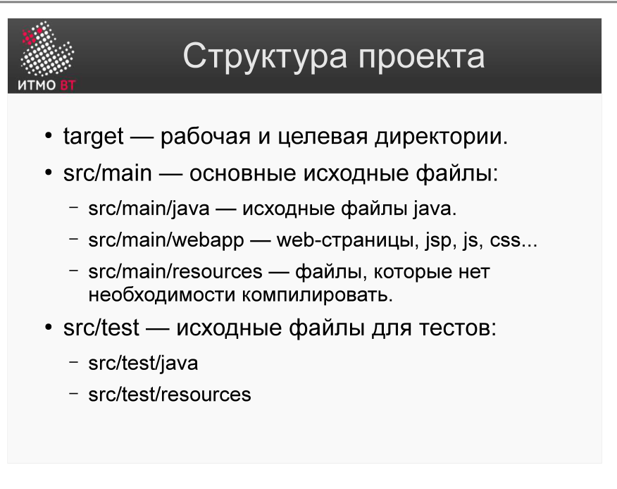
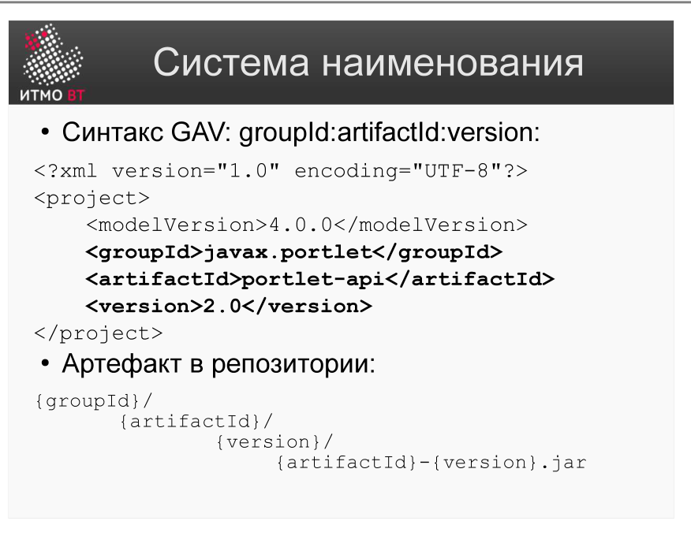

!!! danger "ВНИМАНИЕ"
    Теперь использование данного конспекта является платным. I am Michael from Microsoft support, send 5000$ to my PayPal account

# Билет 46. Maven: Структура проекта. GAV

## Ответ

### Стандартная структура проекта Maven

Maven навязывает единую структуру директорий — это и есть принцип «соглашение вместо конфигурации». Все Maven-проекты выглядят одинаково.



```
myproject/
  pom.xml                      ← конфигурация проекта
  src/
    main/
      java/                    ← исходный код приложения
        com/example/App.java
      resources/               ← конфигурационные файлы, шаблоны
        application.properties
    test/
      java/                    ← тестовый код
        com/example/AppTest.java
      resources/               ← ресурсы для тестов
  target/                      ← результаты сборки (создаётся автоматически)
    classes/                   ← скомпилированные .class файлы
    myproject-1.0.0.jar        ← финальный артефакт
    surefire-reports/          ← отчёты о тестировании
```

`target/` — в `.gitignore`: это артефакты сборки, не исходники.

### GAV — система именования

**GAV** — координаты артефакта в репозитории Maven, аббревиатура от трёх полей:



| Поле | Назначение | Пример |
|------|-----------|--------|
| **G — groupId** | Организация или группа проектов | `com.example`, `org.springframework` |
| **A — artifactId** | Имя конкретного модуля / артефакта | `myapp`, `spring-core` |
| **V — version** | Версия | `1.0.0`, `5.3.20`, `1.0.0-SNAPSHOT` |

В pom.xml:
```xml
<groupId>com.example</groupId>
<artifactId>myapp</artifactId>
<version>1.0.0</version>
```

В репозитории GAV определяет путь к артефакту:
```
~/.m2/repository/com/example/myapp/1.0.0/myapp-1.0.0.jar
```

---

## Подробно

### Почему единая структура — это хорошо

Когда все Maven-проекты имеют одинаковую структуру, новый разработчик сразу знает, где искать исходники, тесты и конфигурацию. Инструменты (IDE, CI, плагины) также знают эту структуру и не нуждаются в дополнительной настройке. Ant требует настроить пути явно; Maven работает «из коробки».

### SNAPSHOT-версии

Версия `1.0.0-SNAPSHOT` — специальная метка, означающая «нестабильная разрабатываемая версия». Maven всегда скачивает свежий SNAPSHOT с репозитория (даже если он уже есть локально), потому что SNAPSHOT меняется. Релизные версии (`1.0.0`) скачиваются один раз и не меняются.

### Multi-module проекты

Большой проект может состоять из нескольких Maven-модулей:

```
parent/
  pom.xml (packaging=pom)
  module-api/
    pom.xml
    src/
  module-impl/
    pom.xml
    src/
```

Родительский `pom.xml` объявляет дочерние модули через `<modules>`. Команда `mvn install` из корня собирает все модули в правильном порядке.

### groupId — это не пакет Java, но часто совпадает

groupId принято задавать в стиле reverse-domain-name (`com.example`), как Java-пакеты. Но это именно идентификатор *проекта*, а не пакет исходного кода. Пакет можно менять независимо.

### Как GAV используется при зависимостях

Когда проект B зависит от проекта A, он ссылается на него через GAV:

```xml
<dependency>
    <groupId>com.example</groupId>
    <artifactId>myapp</artifactId>
    <version>1.0.0</version>
</dependency>
```

Maven ищет `com/example/myapp/1.0.0/myapp-1.0.0.jar` в репозитории.
