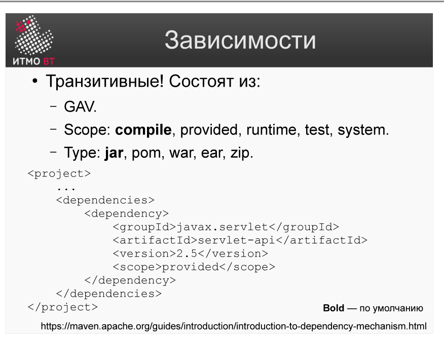
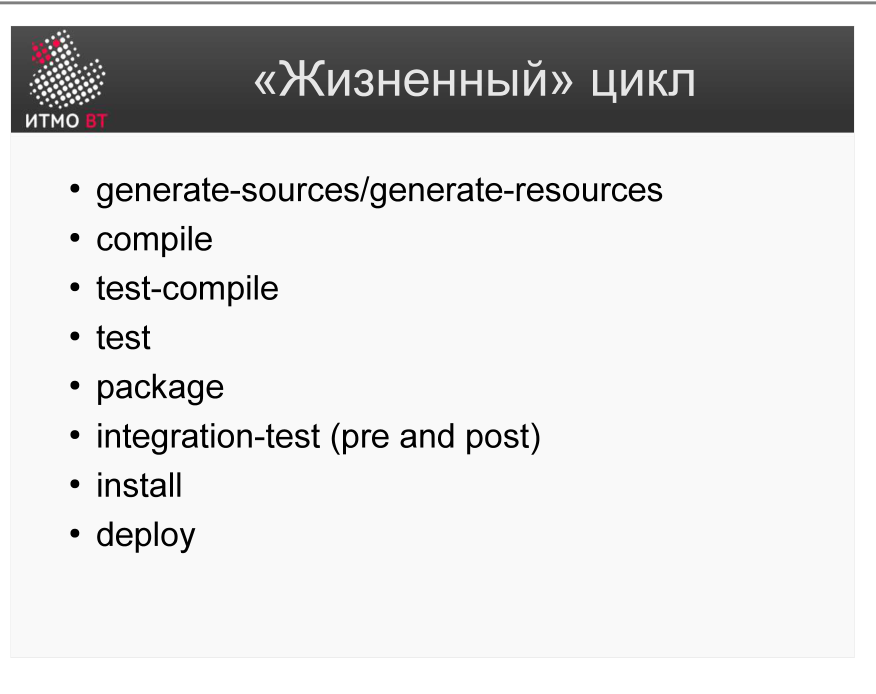
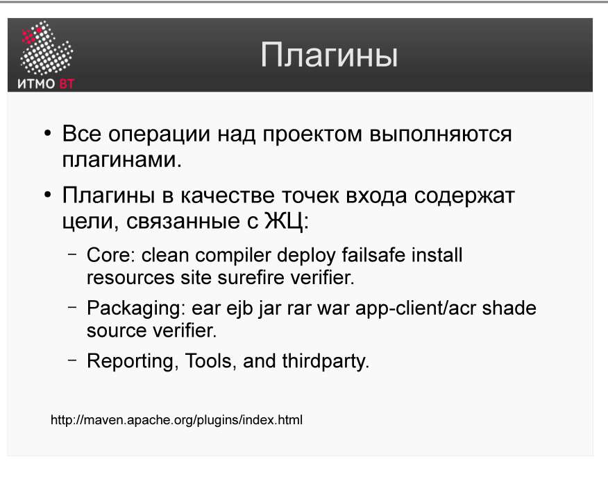

!!! danger "ВНИМАНИЕ"
    Теперь использование данного конспекта является платным. I am Michael from Microsoft support, send 5000$ to my PayPal account

# Билет 47. Maven: Зависимости. Жизненный цикл сборки. Плагины

## Ответ

### Зависимости в pom.xml



```xml
<dependencies>
    <dependency>
        <groupId>org.springframework</groupId>
        <artifactId>spring-core</artifactId>
        <version>5.3.20</version>
        <!-- scope по умолчанию: compile -->
    </dependency>
    <dependency>
        <groupId>junit</groupId>
        <artifactId>junit</artifactId>
        <version>4.13.2</version>
        <scope>test</scope>
    </dependency>
</dependencies>
```

### Жизненный цикл сборки (Build Lifecycle)

Maven имеет три встроенных жизненных цикла. Основной — **default**:



```
validate → compile → test → package → verify → install → deploy
```

| Фаза | Что происходит |
|------|---------------|
| `validate` | Проверить, что pom.xml корректен |
| `compile` | Скомпилировать исходники |
| `test` | Запустить юнит-тесты |
| `package` | Упаковать (создать JAR/WAR) |
| `verify` | Запустить интеграционные проверки |
| `install` | Установить артефакт в локальный репозиторий (~/.m2) |
| `deploy` | Опубликовать артефакт в удалённый репозиторий |

**Ключевое правило:** вызов фазы выполняет *все предшествующие* фазы. `mvn package` = validate + compile + test + package.

```bash
mvn compile        # только компиляция
mvn test           # компиляция + тесты
mvn package        # компиляция + тесты + упаковка
mvn install        # ... + установить в ~/.m2
mvn deploy         # ... + опубликовать на сервер
mvn clean          # удалить target/
mvn clean install  # очистить и пересобрать полностью
```

### Плагины



**Плагин** — расширение Maven. Каждая фаза жизненного цикла реализована плагином. Плагин состоит из **goals** (целей), которые привязаны к фазам.

```
compile  ←→  maven-compiler-plugin:compile
test     ←→  maven-surefire-plugin:test
package  ←→  maven-jar-plugin:jar
```

Настройка плагина в pom.xml:

```xml
<build>
    <plugins>
        <plugin>
            <groupId>org.apache.maven.plugins</groupId>
            <artifactId>maven-compiler-plugin</artifactId>
            <version>3.10.1</version>
            <configuration>
                <source>17</source>
                <target>17</target>
            </configuration>
        </plugin>
    </plugins>
</build>
```

---

## Подробно

### Lifecycle → Phase → Goal

Иерархия Maven-выполнения:

```
Жизненный цикл (default)
  └─ Фаза (compile)
       └─ Goal (maven-compiler-plugin:compile)
```

Goal — это конкретное действие. Плагин может иметь несколько goals. Goal привязывается к фазе, но может вызываться и напрямую: `mvn compiler:compile`.

### Зачем делать mvn clean install, а не просто mvn install

`clean` удаляет папку `target/`. Без этого Maven может использовать устаревшие `.class` файлы при инкрементальной компиляции. `clean install` — «пересобрать с нуля и установить в локальный репозиторий» — самый надёжный вариант для проверки.

### Dependency Management — управление версиями

В multi-module проектах родительский pom.xml задаёт версии зависимостей в `<dependencyManagement>`:

```xml
<dependencyManagement>
    <dependencies>
        <dependency>
            <groupId>junit</groupId>
            <artifactId>junit</artifactId>
            <version>4.13.2</version>
        </dependency>
    </dependencies>
</dependencyManagement>
```

Дочерние модули ссылаются на зависимость без версии — она наследуется от родителя. Это обеспечивает единые версии библиотек во всём проекте.

### Проблема конфликта зависимостей

Если два модуля зависят от разных версий одной библиотеки (diamond dependency), Maven применяет правило «ближайшей зависимости»: побеждает та версия, которая ближе к корню дерева зависимостей. Для контроля конфликтов используют `mvn dependency:tree`.
