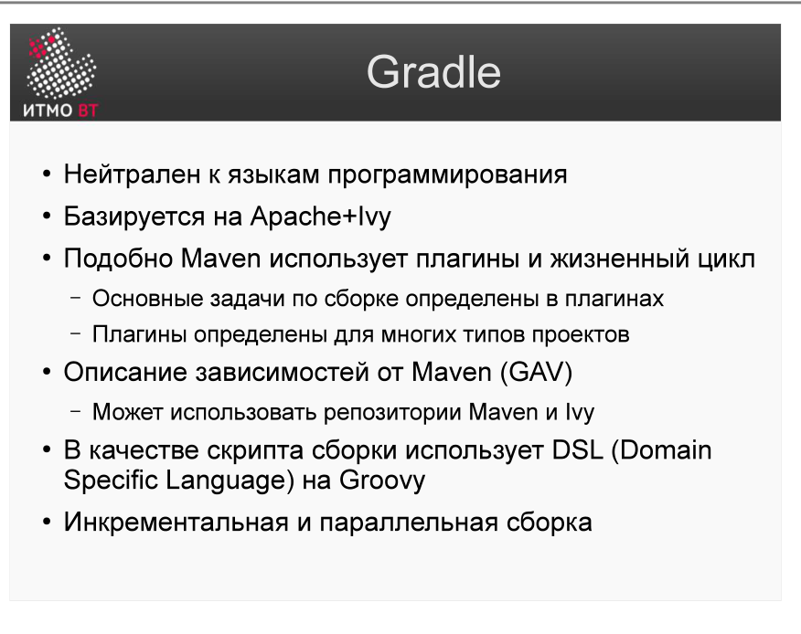
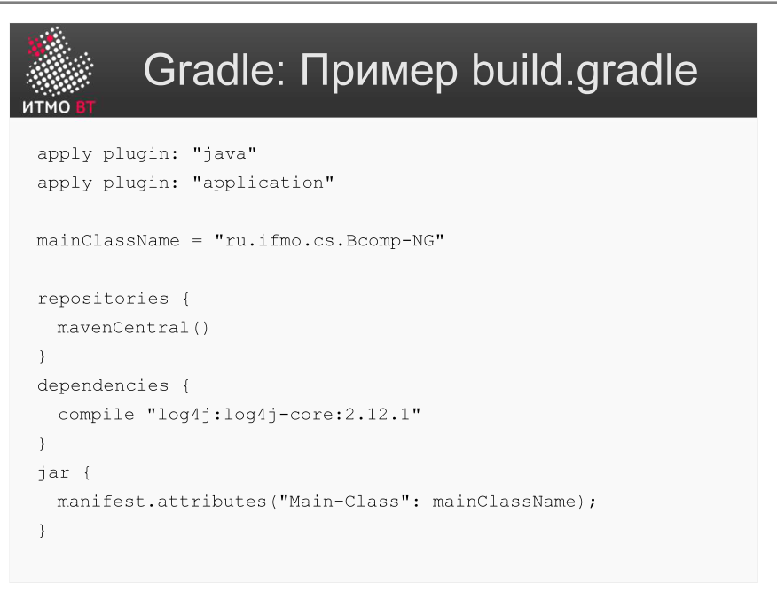

# Билет 48. Системы сборки: Gradle. Преимущества и файл сборки

## Ответ

**Gradle** — современная система сборки, объединяющая гибкость Ant и управление зависимостями Maven. Конфигурация — не XML, а код на Groovy DSL или Kotlin DSL.

### Преимущества Gradle перед Maven/Ant



| Преимущество | Суть |
|-------------|------|
| **Гибкость** | Логика сборки — это код, а не XML; можно писать условия, циклы, функции |
| **Инкрементальная сборка** | Пересобирает только изменившиеся части; умнее, чем Maven |
| **Build cache** | Кэширует результаты задач между сборками и между машинами |
| **Параллельная сборка** | Независимые задачи и модули собираются параллельно |
| **Совместимость** | Поддерживает Maven-репозитории; можно читать Maven `pom.xml` |
| **Android** | Официальная система сборки для Android (через Android Gradle Plugin) |

### Файл сборки build.gradle



```groovy
// build.gradle (Groovy DSL)
plugins {
    id 'java'
}

group = 'com.example'
version = '1.0.0'

repositories {
    mavenCentral()
}

dependencies {
    implementation 'org.springframework:spring-core:5.3.20'
    testImplementation 'junit:junit:4.13.2'
}

// Кастомная задача
task hello {
    doLast {
        println 'Hello, Gradle!'
    }
}
```

**Kotlin DSL** (`build.gradle.kts`) — то же самое, но строже типизировано:
```kotlin
plugins { java }
dependencies {
    implementation("org.springframework:spring-core:5.3.20")
    testImplementation("junit:junit:4.13.2")
}
```

### Основные команды

```bash
gradle build         # скомпилировать, протестировать, упаковать
gradle test          # запустить тесты
gradle clean         # удалить build/
gradle tasks         # список доступных задач
gradle dependencies  # дерево зависимостей
./gradlew build      # использовать Gradle Wrapper (рекомендуется)
```

---

## Подробно

### Gradle Wrapper

`gradlew` / `gradlew.bat` — скрипты в корне проекта, которые автоматически скачивают нужную версию Gradle. Это гарантирует, что все разработчики и CI используют одну и ту же версию Gradle без ручной установки.

```bash
./gradlew build   # рекомендуемый способ запуска
```

### Инкрементальность: в чём умнее Maven

Maven проверяет только время изменения файлов. Gradle отслеживает **входы и выходы** каждой задачи: если входные файлы и конфигурация задачи не изменились — задача пропускается с пометкой `UP-TO-DATE`. Это точнее и быстрее.

### Граф задач, а не цикл фаз

Maven работает через фиксированный жизненный цикл (фазы). Gradle — через **граф задач (DAG)**. Задача может зависеть от другой задачи; Gradle строит граф и выполняет задачи в правильном порядке, параллелизируя независимые.

```
compileJava → processResources → classes → test → jar → build
                                                 ↑
                                          compileTestJava
```

### Configuration vs Implementation

В современном Gradle вместо `compile` используются:
- `implementation` — зависимость нужна для компиляции и запуска, но не транзитивно (не видна потребителям библиотеки).
- `api` — транзитивная зависимость (видна потребителям).
- `testImplementation` — только для тестов.

`api` vs `implementation` влияет на то, что попадает в classpath потребителя библиотеки.
