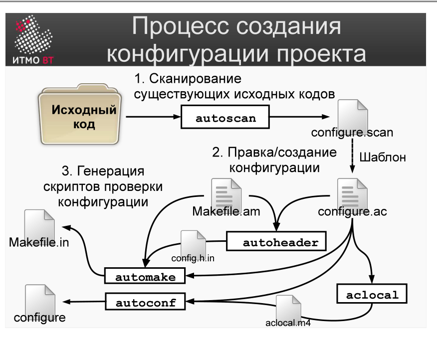

# Билет 49. Системы сборки: GNU autotools. Создание конфигурации проекта

## Ответ

**GNU autotools** — набор инструментов для создания переносимых (portable) C/C++ проектов. Цель: один и тот же исходный код должен собираться на любой Unix-подобной системе (Linux, macOS, FreeBSD) без изменений.

### Состав autotools

```
autoscan → autoconf → configure → make
```

| Инструмент | Назначение |
|-----------|-----------|
| **autoscan** | Анализирует исходники и генерирует черновик `configure.ac` |
| **autoconf** | Генерирует скрипт `configure` из `configure.ac` |
| **automake** | Генерирует `Makefile.in` из `Makefile.am` |
| **aclocal** | Собирает макросы для autoconf |

### Создание конфигурации проекта



**Шаг 1: autoscan**
```bash
autoscan    # сканирует исходники, создаёт configure.scan
mv configure.scan configure.ac
```

**Шаг 2: Редактировать configure.ac**

```m4
AC_INIT([myproject], [1.0], [author@example.com])
AM_INIT_AUTOMAKE([-Wall -Werror foreign])
AC_PROG_CC
AC_CHECK_LIB([m], [sqrt])      # проверить наличие библиотеки math
AC_OUTPUT([Makefile])
```

Основные макросы:
- `AC_INIT` — имя проекта, версия, контакт для ошибок.
- `AC_PROG_CC` — проверить наличие C-компилятора.
- `AC_CHECK_LIB` — проверить наличие библиотеки.
- `AC_CHECK_HEADERS` — проверить наличие заголовочных файлов.
- `AC_OUTPUT` — список файлов для генерации.

**Шаг 3: Создать Makefile.am**

```makefile
bin_PROGRAMS = myprogram
myprogram_SOURCES = main.c utils.c utils.h
```

**Шаг 4: Запустить инструменты**

```bash
aclocal     # обновить m4/aclocal.m4
autoconf    # создать скрипт configure
automake --add-missing  # создать Makefile.in
```

---

## Подробно

### Зачем нужна проверка окружения

C/C++ проекты компилируются под конкретную систему. Стандартная библиотека `malloc` на Linux — в `libc`, на старых BSD — иначе. Функция `strtok_r` есть не везде. Скрипт `configure` проверяет окружение *перед* компиляцией и либо адаптирует сборку, либо сообщает об отсутствующих зависимостях.

### configure.ac — это скрипт на m4

M4 — язык макропроцессора. `AC_*` и `AM_*` — это макросы, которые разворачиваются в shell-команды. Разработчику не нужно знать m4 в деталях: достаточно стандартных макросов autoconf.

### Что генерирует autoscan

`autoscan` сканирует все `.c` и `.h` файлы, ищет вызовы функций и использование заголовков. Для каждой нестандартной функции добавляет соответствующую проверку в `configure.scan`. Это черновик — его нужно отредактировать вручную.

### Разделение: autoconf vs automake

- **autoconf** занимается проверками окружения: есть ли компилятор, библиотеки, заголовки.
- **automake** занимается генерацией `Makefile` по описанию в `Makefile.am` — правилами сборки целей.

Они работают вместе: autoconf проверяет, automake описывает что собирать. Результат — пара `configure` + `Makefile.in`.
