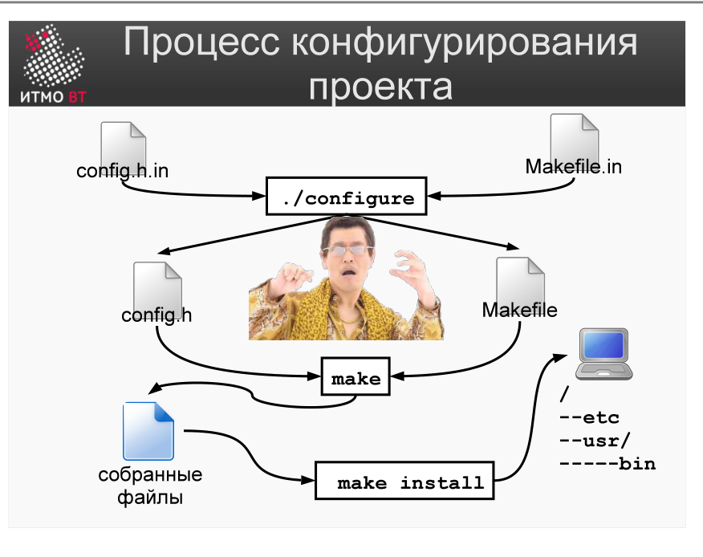

!!! danger "ВНИМАНИЕ"
    Теперь использование данного конспекта является платным. I am Michael from Microsoft support, send 5000$ to my PayPal account

# Билет 50. Системы сборки: GNU autotools. Конфигурация и сборка проекта

## Ответ

После создания конфигурации (билет [49](49-autotools-configure-ac.md)) пользователь получает исходный архив и собирает проект в три шага:

### Стандартный процесс сборки



```bash
./configure         # 1. Проверить окружение и сгенерировать Makefile
make                # 2. Скомпилировать проект
make install        # 3. Установить в систему
```

Это *классическое трио* — знакомо каждому, кто устанавливал ПО из исходников на Unix.

### Шаг 1: ./configure

Скрипт `configure` проверяет:
- Наличие компилятора C/C++.
- Наличие нужных библиотек.
- Наличие заголовочных файлов.
- Возможности текущей ОС.

На основе проверок генерирует `Makefile` (из шаблона `Makefile.in`) с параметрами, специфичными для текущей системы.

```bash
./configure --prefix=/usr/local     # куда устанавливать (по умолчанию)
./configure --prefix=/opt/myapp     # установить в нестандартное место
./configure --disable-feature-x     # отключить функцию X
./configure --with-openssl=/usr     # указать путь к OpenSSL
./configure --help                  # список всех опций
```

### Шаг 2: make

Компилирует проект по сгенерированному `Makefile`:

```bash
make              # полная сборка
make -j4          # параллельная сборка на 4 потоках (ускорение)
make clean        # удалить объектные файлы
make distclean    # удалить всё, включая Makefile (вернуть к состоянию после ./configure)
```

### Шаг 3: make install

Копирует собранные файлы в системные директории:

```
Бинарные файлы  → /usr/local/bin/
Библиотеки      → /usr/local/lib/
Заголовки       → /usr/local/include/
Документация    → /usr/local/share/man/
```

```bash
sudo make install         # установить (нужны права)
make install DESTDIR=/tmp/pkg  # установить во временную папку (для создания пакета)
```

---

## Подробно

### Зачем три шага вместо одного

Разделение configure/make/install — это разделение ответственности:
- `configure` — однократно; результат (`Makefile`) не нужно пересоздавать при перекомпиляции.
- `make` — многократно при изменениях кода.
- `make install` — выполняется только при готовности к установке.

Разработчик запускает `./configure` один раз, затем `make` при каждом изменении кода.

### DESTDIR — создание пакетов

`make install DESTDIR=/tmp/pkg` устанавливает файлы не в `/usr/local`, а в `/tmp/pkg/usr/local`. Это используют создатели пакетов `.deb` и `.rpm`: сначала «устанавливают» в временную папку, потом упаковывают в пакет.

### config.log — диагностика

Если `./configure` завершается с ошибкой (не найдена библиотека, нет компилятора), детали в файле `config.log`. Это первое место, куда смотреть при проблемах.

### config.h

`configure` генерирует `config.h` — заголовочный файл с `#define` для найденных возможностей:

```c
#define HAVE_LIBM 1          // библиотека math найдена
#define HAVE_UNISTD_H 1      // заголовок unistd.h найден
/* #undef HAVE_STRTOK_R */   // функция не найдена
```

Код использует эти `#define` для условной компиляции:

```c
#ifdef HAVE_LIBM
    result = sqrt(x);
#else
    // fallback implementation
#endif
```

### Почему autotools до сих пор актуальны

Несмотря на появление CMake и Meson, autotools остаётся стандартом для GNU-проектов (gcc, bash, glibc). Причина: скрипт `configure` — это обычный shell-скрипт, который работает на любой Unix-системе без установки дополнительных инструментов.
