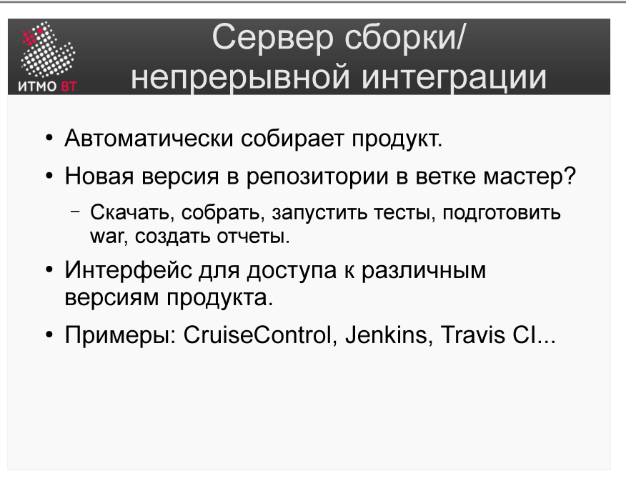

# Билет 51. Серверы сборки/непрерывной интеграции

## Ответ

**Сервер непрерывной интеграции (CI-сервер)** — инструмент, который автоматически запускает сборку и тестирование проекта при каждом изменении кода в репозитории.

### Принцип непрерывной интеграции (CI)



```
Разработчик → push в репозиторий → CI-сервер обнаруживает изменение
→ Запускает pipeline:
    1. Checkout (получить код)
    2. Build (собрать)
    3. Test (запустить тесты)
    4. Report (уведомить о результате)
→ Результат: SUCCESS или FAILURE
```

Если сборка упала — разработчик получает уведомление и исправляет проблему.

### Популярные CI-серверы

| Сервер | Особенности |
|--------|-------------|
| **Jenkins** | Открытый исходный код; большой набор плагинов; требует самостоятельного хостинга |
| **GitLab CI** | Встроен в GitLab; конфигурация в `.gitlab-ci.yml`; облако или self-hosted |
| **GitHub Actions** | Встроен в GitHub; конфигурация в `.github/workflows/*.yml` |
| **TeamCity** | JetBrains; удобная интеграция с IDE IntelliJ IDEA |

### GitLab CI — пример конфигурации

```yaml
# .gitlab-ci.yml
stages:
  - build
  - test
  - deploy

build-job:
  stage: build
  script:
    - mvn compile

test-job:
  stage: test
  script:
    - mvn test

deploy-job:
  stage: deploy
  script:
    - mvn deploy
  only:
    - main
```

### Jenkins — pipeline (Jenkinsfile)

```groovy
pipeline {
    agent any
    stages {
        stage('Build') { steps { sh 'mvn compile' } }
        stage('Test')  { steps { sh 'mvn test' } }
        stage('Deploy'){ steps { sh 'mvn deploy' } }
    }
}
```

---

## Подробно

### Зачем CI, если разработчик и так запускает тесты локально

Локальные тесты — это хорошо, но недостаточно:
- Разработчик может забыть запустить тесты перед коммитом.
- На его машине могут быть специфические настройки, скрывающие ошибку.
- CI всегда запускается на чистом окружении — воспроизводимо.
- CI видит *комбинацию* всех изменений в ветке, а не только изменения одного разработчика.

### CD — следующий шаг после CI

**CD (Continuous Delivery / Deployment)** расширяет CI:
- **Continuous Delivery** — после успешных тестов артефакт готов к деплою; деплой выполняется вручную.
- **Continuous Deployment** — деплой в production происходит автоматически при успешном прохождении всего pipeline.

### Что такое pipeline

Pipeline — последовательность (или граф) стадий обработки кода. Каждая стадия может выполняться на отдельном агенте (воркере). Стадии могут быть параллельными (тесты на разных платформах одновременно) или последовательными (сначала сборка, потом тесты).

### «Сломал сборку» — командная культура

В командах с CI принято: «сломал сборку — исправь немедленно». Пока сборка падает, команда не может интегрировать свои изменения. Это мотивирует поддерживать тесты в рабочем состоянии и не коммитить незаконченный код в основную ветку.

### Артефакты сборки

CI-сервер сохраняет результаты сборки (JAR, Docker image, отчёты о тестировании) как **артефакты**. Их можно скачать, передать в следующую стадию pipeline или опубликовать в репозиторий.
