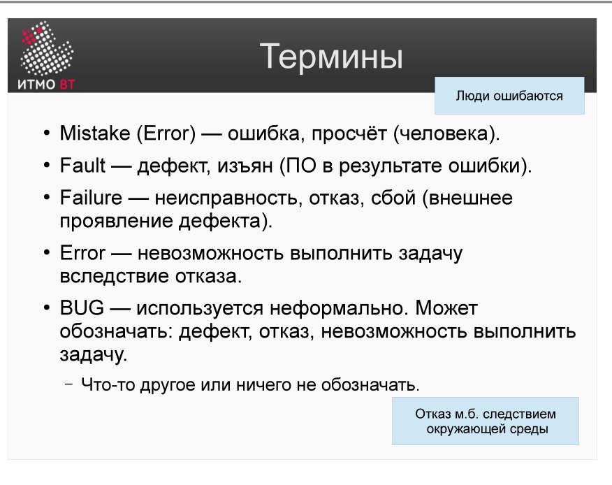
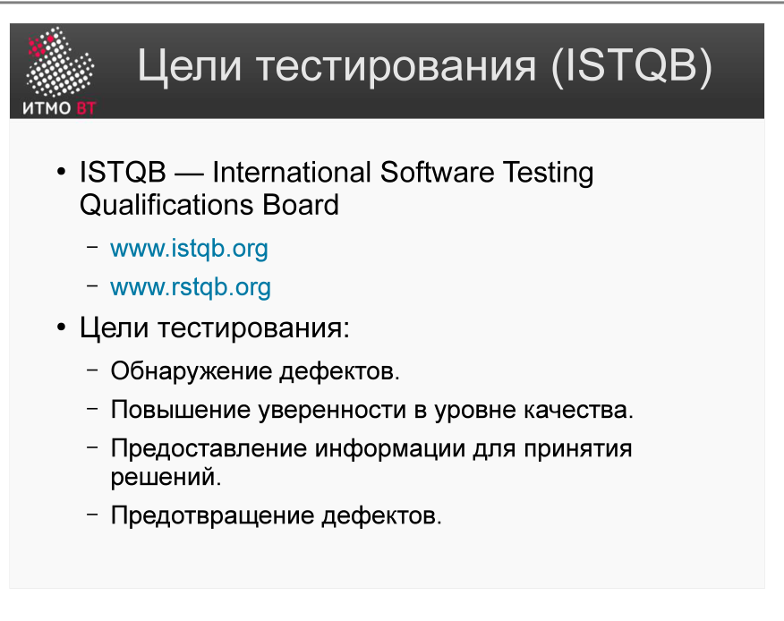

Полина Матвеева может не готовиться, всё равно она не сдаст ОПИ завтра.

# Билет 52. Основные понятия тестирования. Цели тестирования

## Ответ

**Тестирование** — процесс выполнения программы с целью обнаружения дефектов.

### Ключевые термины

| Термин | Определение | Пример |
|--------|-------------|--------|
| **Ошибка (Error)** | Неверное действие разработчика | Опечатка в коде |
| **Дефект (Defect/Fault)** | Изъян в коде, вызванный ошибкой | Неверное условие `>` вместо `>=` |
| **Сбой (Failure)** | Проявление дефекта во время выполнения | Программа вернула неверный результат |
| **Отказ (Failure/Outage)** | Система перестала выполнять функции | Сервер упал |

Цепочка: **Ошибка → Дефект → Сбой (при выполнении)**

### Цели тестирования

1. **Обнаружение дефектов** — найти как можно больше ошибок до выпуска.
2. **Верификация** — убедиться, что система реализована правильно (соответствует спецификации).
3. **Валидация** — убедиться, что реализована правильная система (отвечает реальным потребностям пользователя).
4. **Повышение уверенности** — оценить качество продукта для принятия решения о выпуске.
5. **Предотвращение дефектов** — ранее обнаружение снижает стоимость исправления.

### Важный принцип

Тестирование **обнаруживает** дефекты, но не **гарантирует** их отсутствие. Успешное прохождение тестов означает лишь то, что проверенные сценарии работают верно.

---

## Подробно

### Почему ошибка ≠ дефект ≠ сбой

Разработчик написал `if (age > 18)` вместо `if (age >= 18)` — это **ошибка** (mistake). В коде образовался **дефект** (fault). При вызове функции с `age = 18` программа вернёт неверный результат — произошёл **сбой** (failure). Если из-за этого сервис стал недоступен — это **отказ** (outage).

Важно: дефект может существовать в коде годами, не проявляясь, если никто не передаёт именно то значение, которое его активирует.

### Верификация vs Валидация

- **Верификация** (verification): «Мы правильно создаём продукт?» — сравнивает с техническим заданием.
- **Валидация** (validation): «Мы создаём правильный продукт?» — сравнивает с реальными ожиданиями пользователя.

Можно сделать систему, которая полностью соответствует ТЗ (верификация пройдена), но пользователи всё равно недовольны (валидация провалена), потому что ТЗ было написано неверно.

### Стоимость исправления растёт со временем

Дефект, найденный на этапе требований, стоит $1 исправить. Тот же дефект на этапе тестирования стоит $10, а в продакшне — $100 или дороже. Это главный экономический аргумент в пользу раннего тестирования.
