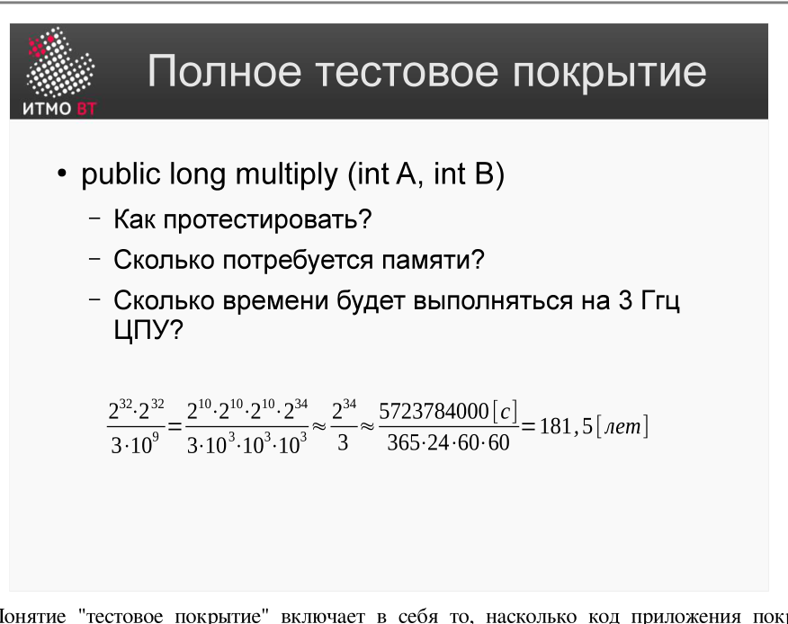
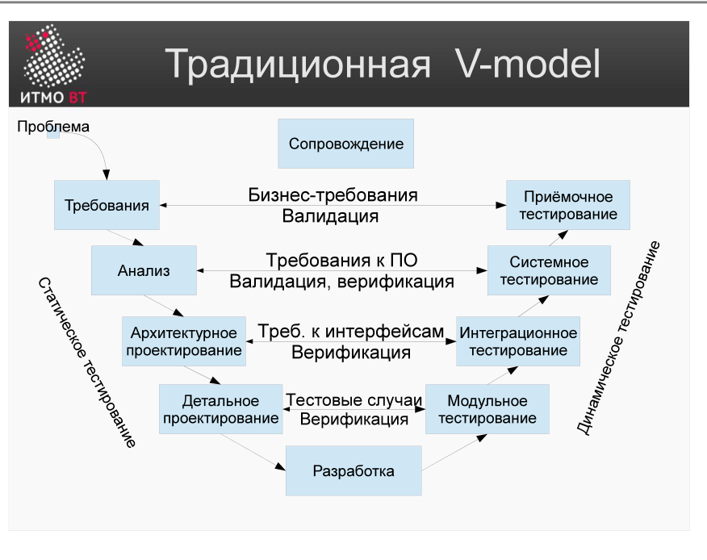

!!! danger "ВНИМАНИЕ"
    Теперь использование данного конспекта является платным. I am Michael from Microsoft support, send 5000$ to my PayPal account

# Билет 53. Понятие полного тестового покрытия и его достижимости. Пример

## Ответ

**Тестовое покрытие (test coverage)** — мера того, насколько полно тесты проверяют программу (по ветвям, строкам, условиям, сценариям использования).

**Полное тестовое покрытие** — состояние, при котором проверены все возможные входные данные и их комбинации. На практике **недостижимо**.

### Почему полное покрытие невозможно



Пример: функция `int add(int a, int b)` принимает два 32-битных целых числа.
- Вариантов для `a` = 2³² ≈ 4 млрд
- Вариантов для `b` = 2³² ≈ 4 млрд
- Всего пар: 2³² × 2³² = 2⁶⁴ ≈ **18 × 10¹⁸ тест-кейсов**

При скорости 1 млн тестов в секунду тестирование займёт более 500 000 лет.

### Уровни тестирования (V-модель)



```
Разработка              Тестирование
───────────────────────────────────────
Требования      →→→→  Приёмочное тестирование
Проектирование  →→→→  Системное тестирование
Архитектура     →→→→  Интеграционное тестирование
Код             →→→→  Модульное тестирование
```

Каждый уровень разработки сопоставлен с уровнем тестирования. Тестирование начинается со «дна» (модульного) и идёт вверх.

### Практический вывод

Вместо полного покрытия применяют **стратегию выбора тестов**: анализ эквивалентности, граничные значения, тестирование по требованиям. Цель — найти максимум дефектов минимумом тестов.

---

## Подробно

### Пример комбинаторного взрыва

Форма входа: логин (строка до 64 символов) + пароль (строка до 128 символов). Количество возможных комбинаций превышает число атомов во вселенной. Проверять всё невозможно — нужно выбрать репрезентативные классы.

### Что реально измеряют

**Покрытие строк (Line Coverage)** — доля строк кода, выполненных хотя бы одним тестом. 100% покрытие строк ≠ 100% проверок: один и тот же код может работать по-разному в зависимости от данных.

**Покрытие ветвей (Branch Coverage)** — строже: каждая ветка `if/else` должна быть пройдена и в true, и в false вариантах.

**Покрытие условий (Condition Coverage)** — ещё строже: каждое элементарное булево выражение принимает оба значения.

### Принцип Парето в тестировании

20% тестов находят 80% дефектов. Задача тест-инженера — угадать, какие именно эти 20%.

### Тестирование бесконечного числа путей

В программе с `n` условных ветвлений и `k` уровнями вложенности число путей растёт как O(2ⁿ). Даже при 10 `if`-выражениях получается 1024 пути. Статический анализ помогает найти мёртвый код (пути, которые никогда не выполняются).
