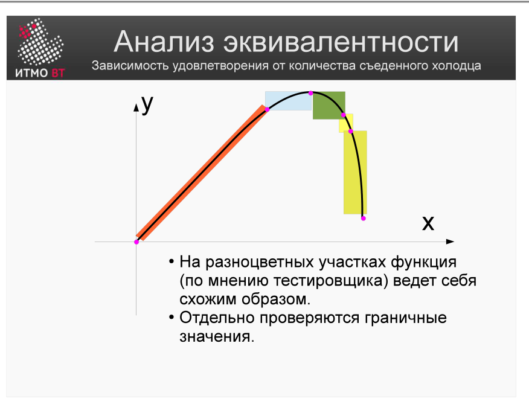

# Билет 58. Выбор тестового покрытия и количества тестов. Анализ эквивалентности

## Ответ

### Сколько тестов нужно?

Полное покрытие недостижимо (см. [билет 53](53-test-coverage.md)). Задача — выбрать **минимальный** набор тестов, который найдёт **максимальное** число дефектов.

Стратегии выбора:
1. **Анализ эквивалентности** — разбить входные данные на классы.
2. **Анализ граничных значений** — тестировать границы классов.
3. **Таблица решений** — комбинации условий.
4. **Тестирование переходов состояний** — по диаграмме состояний.

### Анализ эквивалентности (Equivalence Partitioning)



Входное пространство делится на **классы эквивалентности** — группы значений, которые ведут себя одинаково. Достаточно проверить **по одному** значению из каждого класса.

**Пример:** поле «Возраст» (допустимо: 18–65)

```
Класс 1: age < 18      (недопустимый)   → тест: age = 10
Класс 2: 18 ≤ age ≤ 65 (допустимый)    → тест: age = 35
Класс 3: age > 65      (недопустимый)   → тест: age = 70
```

Вместо 100 тестов — 3.

### Граничные значения (Boundary Value Analysis)

Дефекты чаще прячутся **на границе** классов — ошибки оператора `>` vs `>=`.

```
Граничные значения для 18–65:
  17 (перед нижней границей)
  18 (нижняя граница)
  19 (сразу после нижней)
  64 (сразу перед верхней)
  65 (верхняя граница)
  66 (после верхней границы)
```

Итого 6 дополнительных тестов покрывают наиболее уязвимые точки.

---

## Подробно

### Почему классы эквивалентности работают

Предположение: если программа верно обрабатывает одно значение из класса, она верно обработает любое другое из этого же класса. Это предположение верно для большинства реализаций, хотя и не всегда.

### Позитивные и негативные классы

- **Позитивный класс** — допустимые входные данные, которые система должна принять.
- **Негативный класс** — недопустимые данные, которые система должна отклонить с правильным сообщением об ошибке.

Всегда тестировать оба типа классов!

### Пример: поле «Количество товара» (1–99)

| Класс | Диапазон | Тест-значение |
|-------|----------|---------------|
| Недопустимый (меньше) | ≤ 0 | 0, -1 |
| Допустимый | 1–99 | 50 |
| Недопустимый (больше) | ≥ 100 | 100, 999 |
| Граничный нижний | 1 | 1 |
| Граничный верхний | 99 | 99 |

### Правило выбора покрытия

Не бывает «достаточного» покрытия в абсолютном смысле — есть экономически оправданное. Для критического ПО (медицина, авиация) покрытие ветвей 100% — обязательное требование. Для внутреннего инструмента — достаточно 60–70% покрытия строк и тестов по основным сценариям.

### Таблица решений (Decision Table)

Когда поведение зависит от **комбинации** условий:

| Условие A | Условие B | Действие |
|-----------|-----------|----------|
| True | True | X |
| True | False | Y |
| False | True | Z |
| False | False | W |

Для `n` условий — 2ⁿ строк. Таблица показывает, какие комбинации нужно протестировать.
