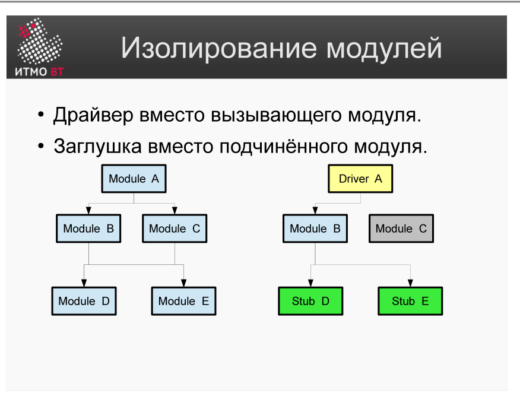
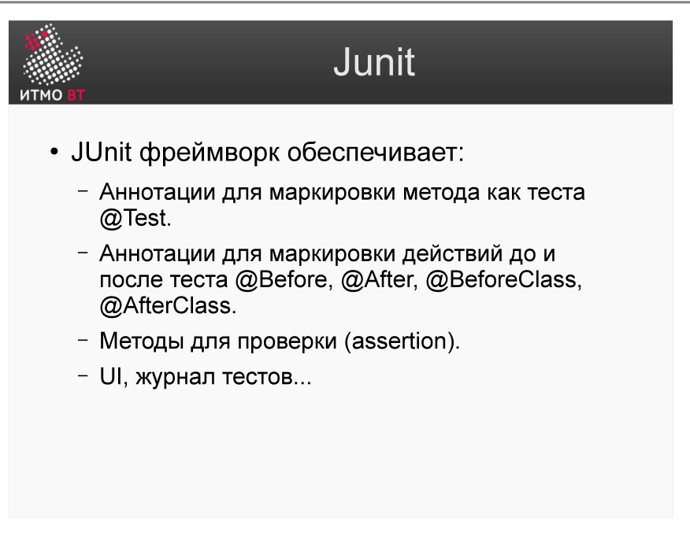

# Билет 59. Модульное тестирование. JUnit 4 с примерами

## Ответ

### Модульное тестирование

**Модульное (юнит) тестирование** — тестирование наименьшей изолируемой единицы кода (функции, метода, класса) в изоляции от остальной системы.



**Изоляция** достигается с помощью:
- **Драйвер (Driver)** — тестовый код, который вызывает тестируемый модуль.
- **Заглушка (Stub/Mock)** — замена зависимости: имитирует поведение реального модуля, которого ещё нет или который не нужен в тесте.

```
[Driver/Test] → [Тестируемый модуль] → [Stub (замена зависимостей)]
```

### JUnit 4 — основные аннотации



| Аннотация | Назначение |
|-----------|-----------|
| `@Test` | Метод является тест-кейсом |
| `@Before` | Выполняется перед каждым `@Test` |
| `@After` | Выполняется после каждого `@Test` |
| `@BeforeClass` | Выполняется один раз перед всеми тестами класса (static) |
| `@AfterClass` | Выполняется один раз после всех тестов класса (static) |
| `@Ignore` | Пропустить тест |

### Assertion-методы

```java
assertEquals(expected, actual);      // проверить равенство
assertTrue(condition);               // условие true
assertFalse(condition);              // условие false
assertNull(object);                  // объект null
assertNotNull(object);               // объект не null
assertArrayEquals(expected, actual); // массивы равны
```

### Пример теста JUnit 4

```java
import org.junit.*;
import static org.junit.Assert.*;

public class CalculatorTest {

    private Calculator calc;

    @Before
    public void setUp() {
        calc = new Calculator();  // выполняется перед каждым тестом
    }

    @Test
    public void testAdd() {
        assertEquals(5, calc.add(2, 3));
    }

    @Test
    public void testDivide() {
        assertEquals(2.0, calc.divide(10, 5), 0.001);
    }

    @Test(expected = ArithmeticException.class)
    public void testDivideByZero() {
        calc.divide(10, 0);  // должно бросить исключение
    }

    @After
    public void tearDown() {
        calc = null;
    }
}
```

---

## Подробно

### Зачем изолировать модуль

Без изоляции юнит-тест проверяет не один модуль, а весь граф зависимостей. Если тест упал — непонятно, в каком модуле ошибка. Со стабами каждый тест проверяет строго одно.

### AAA-паттерн

Структура хорошего теста:
```java
@Test
public void testWithdraw() {
    // Arrange — подготовить данные
    Account account = new Account(1000);
    
    // Act — выполнить действие
    account.withdraw(300);
    
    // Assert — проверить результат
    assertEquals(700, account.getBalance());
}
```

### Mock-объекты (Mockito)

Когда заглушке нужно проверять, что метод был вызван — используют Mock:

```java
// Mockito
UserRepository mockRepo = mock(UserRepository.class);
when(mockRepo.findById(1L)).thenReturn(new User("Alice"));

UserService service = new UserService(mockRepo);
User user = service.getUser(1L);

assertEquals("Alice", user.getName());
verify(mockRepo).findById(1L);  // проверяем, что findById был вызван
```

### @Test(expected) vs try-catch

```java
// Способ 1: аннотация (JUnit 4)
@Test(expected = IllegalArgumentException.class)
public void shouldThrowOnNegative() {
    calc.sqrt(-1);
}

// Способ 2: ExpectedException Rule
@Rule
public ExpectedException thrown = ExpectedException.none();

@Test
public void shouldThrowWithMessage() {
    thrown.expect(IllegalArgumentException.class);
    thrown.expectMessage("negative");
    calc.sqrt(-1);
}
```

### Принципы F.I.R.S.T.

Хорошие юнит-тесты должны быть:
- **Fast** — выполняться за миллисекунды
- **Isolated** — не зависеть от других тестов
- **Repeatable** — давать одинаковый результат при каждом запуске
- **Self-validating** — сами говорят PASS или FAIL
- **Timely** — писаться одновременно с кодом (или до него — TDD)
